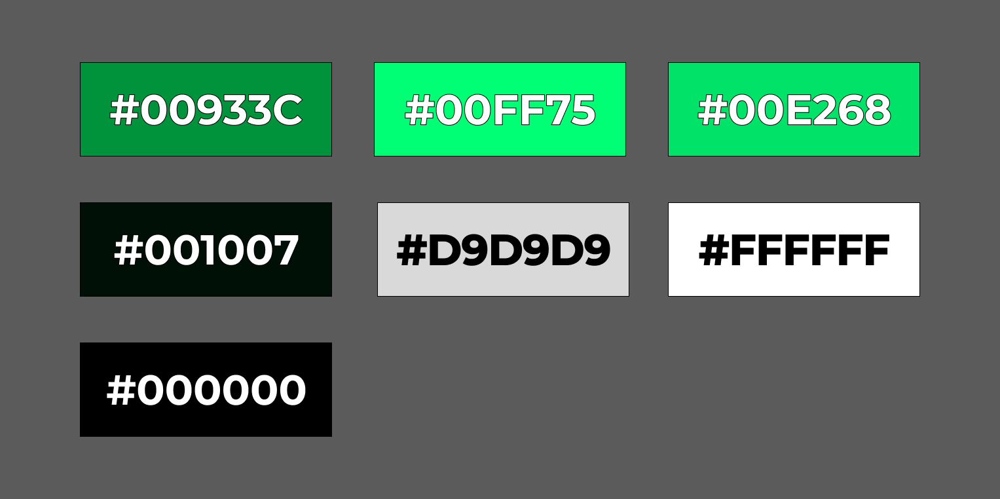

# Universidad Peruana de Ciencias Aplicadas

## 
Desarrollo de Aplicaciones Open Source

## FINAL PROJECT REPORT

**Sección:** SW53

**Profesor**: Hugo Allan Mori Paiva

**StartUp Name**: TechMove

**Producto**: LimaPaths

### Team Members:

| Member                            | Code       |
|:----------------------------------|------------|
| Santiago Mickelle Olivera Guerra  | U20201A821 |
| Roy Hernan De La Cruz Moreno                 | U202218634        |
| Omar Christian Berrocal Ramirez   | U20201B529 |
| -                                 | -          |
| Carlos Oswaldo Casimiro Fernandez | U202115412 |

 

Ingeniería de Software

Ciclo 2024-02

**Agosto del 2024**

  

# Registro de Versiones del Informe

| Versión |   Fecha   |                                                                                        Autor                                                                                         | Descripción de modificación                                                                                                                                           |
| :-----: |:---------:|:------------------------------------------------------------------------------------------------------------------------------------------------------------------------------------:| :-------------------------------------------------------------------------------------------------------------------------------------------------------------------- |
|   TB1   | 19/08/2024 | -Santiago Mickelle Olivera Guerra  -Carlos Oswaldo Casimiro Fernandez  -Omar Christian Berrocal Ramirez  |  CAPITULO I AL V|

  

# Project Report Collaboration Insights

- **TB1:** Para esta entrega, realizamos como equipo las actividades correspondientes a los capítulos asignados en el siguiente repositorio dentro de nuestra organización de grupo:

    Link del repositorio del Informe Final: --

     

    A continuación, se muestran las capturas de evidencia correspondientes al desarrollo de los siguientes capítulos:

    - Capítulo I: Introducción
    - Capítulo II: Requirements Elicitation & Analysis
    - Capítulo III: Requirements Specification
    - Capítulo IV: Product Design
    - Capítulo V: Product Implementation, Validation & Deployment

imagen de grafico de barras

 imagen de grafos

 imagen de commit

  
imagen de sprint 1

  

# Contenido

## Tabla de Contenidos

### [Registro de versiones del informe](#registro-de-versiones-del-informe)

### [Project Report Collaboration Insights](#project-report-collaboration-insights)

### [Contenido](#contenido)

### [Student Outcome](#student-outcome-1)

### [Capítulo I: Introducción](#capítulo-i-introducción)

- [1.1. Startup Profile](#11-startup-profile)
  - [1.1.1. Descripción de la Startup](#111-description-de-la-startup)
  - [1.1.2. Perfiles de integrantes del equipo](#112-perfiles-de-integrantes-del-equipo)
- [1.2. Solution Profile](#12-solution-profile)
  - [1.2.1 Antecedentes y problemática](#121-antecedentes-y-problemática)
  - [1.2.2 Lean UX Process](#122-lean-ux-process)
    - [1.2.2.1. Lean UX Problem Statements](#1221-lean-ux-problem-statements)
    - [1.2.2.2. Lean UX Assumptions](#1222-lean-ux-assumptions)
    - [1.2.2.3. Lean UX Hypothesis Statements](#1223-lean-ux-hypothesis-statements)
    - [1.2.2.4. Lean UX Canvas](#1224-lean-ux-canvas)
- [1.3. Segmentos objetivo](#13-segmentos-objetivo)

### [Capítulo II: Requirements Elicitation & Analysis](#capítulo-ii-requirements-elicitation--analysis)

- [2.1. Competidores](#21-competidores)
  - [2.1.1. Análisis competitivo](#211-análisis-competitivo)
  - [2.1.2. Estrategias y tácticas frente a competidores](#212-estrategias-y-tácticas-frente-a-competidores)
- [2.2. Entrevistas](#22-entrevistas)
  - [2.2.1. Diseño de entrevistas](#221-diseño-de-entrevistas)
  - [2.2.2. Registro de entrevistas](#222-registro-de-entrevistas)
  - [2.2.3. Análisis de entrevistas](#223-análisis-de-entrevistas)
- [2.3. Needfinding](#23-needfinding)
  - [2.3.1. User Personas](#231-user-personas)
  - [2.3.2. User Task Matrix](#232-user-task-matrix)
  - [2.3.3. User Journey Mapping](#233-user-journey-mapping)
  - [2.3.4. Empathy Mapping](#234-empathy-mapping)
  - [2.3.5. As-is Scenario Mapping](#235-as-is-scenario-mapping)

### [Capítulo III: Requirements Specification](#capítulo-iii-requirements-specification)

- [3.1. To-Be Scenario Mapping](#31-to-be-scenario-mapping)
- [3.2. User Stories](#32-user-stories)
- [3.3. Impact Mapping](#33-impact-mapping)
- [3.4. Product Backlog](#34-product-backlog)

### [Capítulo IV: Product Design](#capítulo-iv-product-design)

- [4.1. Style Guidelines](#41-style-guidelines)
  - [4.1.1. General Style Guidelines](#411-general-style-guidelines)
  - [4.1.2. Web Style Guidelines](#412-web-style-guidelines)
- [4.2. Information Architecture](#42-information-architecture)
  - [4.2.1. Organization Systems](#421-organization-systems)
  - [4.2.2. Labeling Systems](#422-labeling-systems)
  - [4.2.3. SEO Tags and Meta Tags](#423-seo-tags-and-meta-tags)
  - [4.2.4. Searching Systems](#424-searching-systems)
  - [4.2.5. Navigation Systems](#425-navigation-systems)
- [4.3. Landing Page UI Design](#43-landing-page-ui-design)
  - [4.3.1. Landing Page Wireframe](#431-landing-page-wireframe)
  - https://lh7-rt.googleusercontent.com/docsz/AD_4nXeYXAeHqEWuJN-Y5_wICyXUF58VWVMhAGiQ7Td0WXwN1C_uIy6ig8nzdswKpW6okMRC32pbz1OAzdnpPyhKs6qFQUbrAXd5_ZKoRwSCeI2yHdyKwytiyNL1roFrdPcYnUDuG__drLCX5uCfv_Xgcb0IkQrV?key=V4z4OyW-qymj93Y2Jmcmzw
  - [4.3.2. Landing Page Mock-up](#432-landing-page-mock-up)
- [4.4. Web Applications UX/UI Design](#44-web-applications-uxui-design)
  - [4.4.1. Web Applications Wireframes](#441-web-applications-wireframes)
  - [4.4.2. Web Applications Wireflow Diagrams](#442-web-applications-wireflow-diagrams)
  - [4.4.3. Web Applications Mock-ups](#443-web-applications-mock-ups)
  - [4.4.4. Web Applications User Flow Diagrams](#444-web-applications-user-flow-diagrams)
- [4.5. Web Applications Prototyping](#45-web-applications-prototyping)
- [4.6. Domain-Driven Software Architecture](#46-domain-driven-software-architecture)
  - [4.6.1. Software Architecture Context Diagram](#461-software-architecture-context-diagram)
  - [4.6.2. Software Architecture Container Diagrams](#462-software-architecture-container-diagrams)
  - [4.6.3. Software Architecture Components Diagrams](#463-software-architecture-components-diagrams)
- [4.7. Software Object-Oriented Design](#47-software-object-oriented-design)
  - [4.7.1. Class Diagrams](#471-class-diagrams)
  - [4.7.2. Class Dictionary](#472-class-dictionary)
- [4.8. Database Design](#48-database-design)
  - [4.8.1. Database Diagram](#481-database-diagram)

### [Capítulo V: Product Implementation, Validation & Deployment](#capítulo-v-product-implementation-validation--deployment)

- [Universidad Peruana de Ciencias Aplicadas](#universidad-peruana-de-ciencias-aplicadas)
  - [Desarrollo de Aplicaciones Open Source](#desarrollo-de-aplicaciones-open-source)
  - [FINAL PROJECT REPORT](#final-project-report)
    - [Team Members:](#team-members)
- [Registro de Versiones del Informe](#registro-de-versiones-del-informe)
- [Project Report Collaboration Insights](#project-report-collaboration-insights)
- [Contenido](#contenido)
  - [Tabla de Contenidos](#tabla-de-contenidos)
    - [Registro de versiones del informe](#registro-de-versiones-del-informe-1)
    - [Project Report Collaboration Insights](#project-report-collaboration-insights-1)
    - [Contenido](#contenido-1)
    - [Student Outcome](#student-outcome)
    - [Capítulo I: Introducción](#capítulo-i-introducción)
    - [Capítulo II: Requirements Elicitation \& Analysis](#capítulo-ii-requirements-elicitation--analysis)
    - [Capítulo III: Requirements Specification](#capítulo-iii-requirements-specification)
    - [Capítulo IV: Product Design](#capítulo-iv-product-design)
    - [Capítulo V: Product Implementation, Validation \& Deployment](#capítulo-v-product-implementation-validation--deployment)
    - [Conclusiones](#conclusiones)
    - [Bibliografía](#bibliografía)
    - [Anexos](#anexos)
- [Student Outcome](#student-outcome-1)
- [Capítulo I: Introducción](#capítulo-i-introducción-1)
  - [1.1. StartUp Profile](#11-startup-profile)
    - [1.1.1. Description de la StartUp](#111-description-de-la-startup)
    - [1.1.2. Perfiles de integrantes del equipo](#112-perfiles-de-integrantes-del-equipo)
  - [1.2. Solution Profile](#12-solution-profile)
    - [1.2.1. Antecedentes y problemática](#121-antecedentes-y-problemática)
    - [1.2.2. Lean UX Process](#122-lean-ux-process)
      - [1.2.2.1. Lean UX Problem Statements](#1221-lean-ux-problem-statements)
      - [1.2.2.2. Lean UX Assumptions](#1222-lean-ux-assumptions)
      - [1.2.2.3. Lean UX Hypothesis Statements](#1223-lean-ux-hypothesis-statements)
      - [1.2.2.4. Lean UX Canvas](#1224-lean-ux-canvas)
  - [1.3. Segmentos Objetivo](#13-segmentos-objetivo)
- [Capítulo II: Requirements Elicitation \& Analysis](#capítulo-ii-requirements-elicitation--analysis-1)
  - [2.1. Competidores](#21-competidores)
    - [2.1.1. Análisis competitivo](#211-análisis-competitivo)
    - [2.1.2. Estrategias y tácticas frente a competidores](#212-estrategias-y-tácticas-frente-a-competidores)
  - [2.2. Entrevistas](#22-entrevistas)
    - [2.2.1. Diseño de entrevistas](#221-diseño-de-entrevistas)
    - [2.2.2. Registro de entrevistas](#222-registro-de-entrevistas)
    - [2.2.3. Análisis de entrevistas](#223-análisis-de-entrevistas)
  - [2.3. Needfinding](#23-needfinding)
    - [2.3.1. User Personas](#231-user-personas)
    - [2.3.2. User Task Matrix](#232-user-task-matrix)
    - [2.3.3. User Journey Mapping](#233-user-journey-mapping)
    - [2.3.4. Empathy Mapping](#234-empathy-mapping)
    - [2.3.5. As-is Scenario Mapping](#235-as-is-scenario-mapping)
- [Capítulo III: Requeriments Specifications](#capítulo-iii-requeriments-specifications)
  - [3.1 To-Be Scenario Mapping](#31-to-be-scenario-mapping)
  - [3.2 User Stories](#32-user-stories)
  - [3.3 Impact Mapping](#33-impact-mapping)
  - [3.4 Product Backlog](#34-product-backlog)
- [Capítulo IV: Product Design](#capítulo-iv-product-design-1)
  - [4.1. Style Guidelines.](#41-style-guidelines)
    - [4.1.1. General Style Guidelines.](#411-general-style-guidelines)
    - [4.1.2. Web Style Guidelines](#412-web-style-guidelines)
  - [4.2. Information Architecture.](#42-information-architecture)
    - [4.2.1. Organization Systems.](#421-organization-systems)
    - [4.2.2. Labeling Systems.](#422-labeling-systems)
    - [4.2.3. SEO Tags and Meta Tags](#423-seo-tags-and-meta-tags)
    - [4.2.4. Searching Systems.](#424-searching-systems)
    - [4.2.5. Navigation Systems.](#425-navigation-systems)
  - [4.3. Landing Page UI Design.](#43-landing-page-ui-design)
    - [4.3.1. Landing Page Wireframe.](#431-landing-page-wireframe)
    - [4.3.2. Landing Page Mock-up.](#432-landing-page-mock-up)
  - [4.4. Web Applications UX/UI Design.](#44-web-applications-uxui-design)
    - [4.4.1. Web Applications Wireframes.](#441-web-applications-wireframes)
    - [4.4.2. Web Applications Wireflow Diagrams.](#442-web-applications-wireflow-diagrams)
    - [4.4.3. Web Applications Mock-ups.](#443-web-applications-mock-ups)
    - [4.4.4. Web Applications User Flow Diagrams.](#444-web-applications-user-flow-diagrams)
    - [4.5. Web Applications Prototyping.](#45-web-applications-prototyping)
  - [4.6. Domain-Driven Software Architecture.](#46-domain-driven-software-architecture)
    - [4.6.1. Software Architecture Context Diagram.](#461-software-architecture-context-diagram)
    - [4.6.2. Software Architecture Container Diagrams.](#462-software-architecture-container-diagrams)
    - [4.6.3. Software Architecture Components Diagrams.](#463-software-architecture-components-diagrams)
  - [4.7. Software Object-Oriented Design.](#47-software-object-oriented-design)
    - [4.7.1. Class Diagrams.](#471-class-diagrams)
    - [4.7.2. Class Dictionary.](#472-class-dictionary)
  - [4.8. Database Design.](#48-database-design)
    - [4.8.1. Database Diagram.](#481-database-diagram)
- [Capítulo V: Product Implementation, Validation \& Deployment](#capítulo-v-product-implementation-validation--deployment-1)
  - [5.1. Software Configuration Management.](#51-software-configuration-management)
    - [5.1.1. Software Development Environment Configuration.](#511-software-development-environment-configuration)
    - [5.1.2. Source Code Management.](#512-source-code-management)
    - [5.1.3. Source Code Style Guide \& Conventions.](#513-source-code-style-guide--conventions)
    - [5.1.4. Software Deployment Configuration.](#514-software-deployment-configuration)
  - [5.2. Landing Page, Services \& Applications Implementation.](#52-landing-page-services--applications-implementation)
    - [5.2.1. Sprint 1](#521-sprint-1)
      - [5.2.1.1. Sprint Planning 1.](#5211-sprint-planning-1)
      - [5.2.1.2. Sprint Backlog 1.](#5212-sprint-backlog-1)
      - [5.2.1.3. Development Evidence for Sprint Review.](#5213-development-evidence-for-sprint-review)
      - [5.2.1.4. Testing Suite Evidence for Sprint Review.](#5214-testing-suite-evidence-for-sprint-review)
    - [5.2.1.5. Execution Evidence for Sprint Review.](#5215-execution-evidence-for-sprint-review)
    - [5.2.1.6. Services Documentation Evidence for Sprint Review.](#5216-services-documentation-evidence-for-sprint-review)
    - [5.2.1.7. Software Deployment Evidence for Sprint Review.](#5217-software-deployment-evidence-for-sprint-review)
    - [5.2.1.8. Team Collaboration Insights during Sprint.](#5218-team-collaboration-insights-during-sprint)

  - [Conclusiones](#conclusiones-1)
  - [Bibliografía](#bibliografía-1)
  - [Anexos](#anexos-1)

### [Conclusiones](#conclusiones)

### [Bibliografía](#bibliografía)

### [Anexos](#anexos)

 

# Student Outcome

| Criterio específico  | Acciones realizadas | Conclusiones |
|:---------- | :-------------- | :------------- |
| Comunica oralmente sus ideas y/o resultados con objetividad a público de diferentes especialidades y niveles jerárquicos, en el marco del desarrollo de un proyecto en ingeniería.    | <strong>TB1</strong> |-|
| Comunica en forma escrita ideas y/o resultados con objetividad a público de diferentes especialidades y niveles jerárquicos, en el marco del desarrollo de un proyecto en ingeniería. | <strong>TB1</strong>|-|
  

# Capítulo I: Introducción

## 1.1. StartUp Profile

### 1.1.1. Description de la StartUp

"TechMove" es una startup con la principal intención de transformar la forma en que las personas se desplazan por la ciudad utilizando el transporte público. Nuestra misión es simplificar y mejorar la movilidad urbana, ofreciendo a los residentes de Lima una aplicación integral que les permita encontrar las mejores rutas de transporte público para llegar a sus destinos de manera eficiente. Nuestra aplicación no solo brinda a los usuarios la capacidad de planificar sus viajes de manera óptima, sino que también proporciona información en tiempo real sobre el estado de las rutas y la disponibilidad de los medios de transporte. Además, colaboramos estrechamente con las empresas de transporte público para que también puedan beneficiarse de esta plataforma, obteniendo una visión en tiempo real de sus clientes y mejorando la calidad de sus servicios.

### 1.1.2. Perfiles de integrantes del equipo

<table align="center"  border="1" width="70%" style="text-align:center;">
    <tr align="center">
        <td rowspan="3">
            
        </td>
        <td align="left">
            <b>Nombre y Apellido:</b>
             
            Olivera Guerra Santiago Mickelle
        </td>
    </tr>
    <tr>
        <td align="left">
        <b>Carrera:</b>
         
        Ingeniería de Software
        </td>
    </tr>
    <tr>
        <td align="left">
        <b>Acerca de:</b>
         
        Sssssss
        </td>
    </tr>
    <tr align="center">
        <td rowspan="3">
            
        </td>
        <td align="left">
            <b>Nombre y Apellido:</b>
             
            Carlos Oswaldo, Casimiro Fernández
        </td>
    </tr>
    <tr>
        <td align="left">
        <b>Carrera:</b>
         
        Ingeniería de Software
        </td>
    </tr>
    <tr>
        <td align="left">
        <b>Acerca de:</b>
         
       Tengo 20 años y soy estudiante de Ingeniería de Software de la Universidad Peruana de Ciencias Aplicadas. Me considero una persona proactiva, educada y sociable con los que me rodean. Además cuento con habilidades peculiares como la animación en 3d, edición de videos cinematográficos y conocimiento en lenguajes como c + +, Python.
        </td>
    </tr>
    <tr align="center">
        <td rowspan="3">
            
        </td>
        <td align="left">
            <b>Nombre y Apellido:</b>
             
            De La Cruz Moreno Roy Hernan
        </td>
    </tr>
    <tr>
        <td align="left">
        <b>Carrera:</b>
         
        Ingeniería de Software
        </td>
    </tr>
    <tr>
        <td align="left">
        <b>Acerca de:</b>
         
        Soy Roy De La Cruz Moreno, tengo 19 años. Estudió la carrera de Ingeniería de Software. Considero que soy una persona tranquila y atenta al escuchar las propuestas de los demás integrantes del equipo, ademas tengo conocimientos en SQL, NoSQL y C++.
        </td>
    </tr>
    <tr align="center">
        <td rowspan="3">
            
        </td>
        <td align="left">
            <b>Nombre y Apellido:</b>
             
            Cusimayta Lobo Alex Gabriel
        </td>
    </tr>
    <tr>
        <td align="left">
        <b>Carrera:</b>
         
        Ingeniería de Software
        </td>
    </tr>
    <tr>
        <td align="left">
        <b>Acerca de:</b>
         
        ssss</td>
    </tr>
    <tr align="center">
        <td rowspan="3">
            
        </td>
        <td align="left">
            <b>Nombre y Apellido:</b>
             
            Berrocal Ramirez Omar
        </td>
    </tr>
    <tr>
        <td align="left">
        <b>Carrera:</b>
         
        INGENIERIA DE SOFTWARE
        </td>
    </tr>
    <tr>
        <td align="left">
        <b>Acerca de:</b>
         
         Desde pequeño me han llamado la atención las máquinas y la tecnología, por ello es que elegí esta carrera y así satisfacer mi curiosidad sobre nuevas tecnologías. Tengo conocimientos en lenguajes de programación tales como C++, Python, y lo básico Java y C#. Además, cuento con conocimiento de Bases de Datos (SQL Server y MongoDB) y habilidades básicas HTML y CSS.
        </td>
    </tr>
<tr align="center">
        <td rowspan="3">
            
        </td>
        <td align="left">
            <b>Nombre y Apellido:</b>
             
            MM
        </td>
    </tr>
    <tr>
        <td align="left">
        <b>Carrera:</b>
         
        INGENIERIA DE SOFTWARE
        </td>
    </tr>
    <tr>
        <td align="left">
        <b>Acerca de:</b>
         
        SSS
        </td>
    </tr>
 
</table>

## 1.2. Solution Profile

En esta sección iniciaremos por un análisis de los antecedentes y problemática sobre la movilización en transporte público para identificar las raíces del problema e identificar algunas necesidades que se deban cubrir para llegar a una solución de la problemática. Asimismo, luego pasaremos por el proceso UX para poder analizar más a detalle la problemática y poder plantear una hipótesis acerca de la problemática.

### 1.2.1. Antecedentes y problemática

La movilización en transportes públicos en Lima, se ha visto influenciada por una serie de antecedentes y problemáticas a lo largo de su historia. En un contexto de rápido crecimiento poblacional y urbano, la demanda de servicios de transporte público ha ido en constante aumento. Sin embargo, varios factores han contribuido a desafiar la eficiencia y la calidad de la movilización en la ciudad. Históricamente, Lima contaba con sistemas de transporte público, como los tranvías, en el siglo XIX. Sin embargo, la falta de inversión y una planificación inadecuada llevaron al declive y eventual desaparición de estos sistemas en la segunda mitad del siglo XX. Entre las problemáticas más apremiantes se destaca la congestión del tráfico, que afecta de manera significativa a los limeños. El aumento de vehículos particulares y la infraestructura inadecuada han resultado en largos tiempos de viaje y congestión constante en las calles de la ciudad. Asimismo, el transporte público en Lima ha enfrentado dificultades, desde deficiencias en infraestructura y falta de mantenimiento hasta servicios ineficientes. Los usuarios a menudo se ven obligados a utilizar autobuses y combis en condiciones precarias, lo que afecta negativamente su experiencia de viaje. La seguridad en el transporte público también ha sido motivo de preocupación, con incidentes de robos y acoso a los pasajeros. Esto ha generado inquietudes sobre la seguridad de los usuarios en el sistema. Además, las tarifas de transporte público pueden resultar onerosas para personas de bajos ingresos, y la falta de accesibilidad adecuada para personas con discapacidad ha sido una preocupación persistente. A pesar de estos desafíos, el gobierno y las autoridades locales han implementado medidas para mejorar el transporte público en Lima, incluyendo la introducción de sistemas de transporte masivo como el Metropolitano y el Tren Eléctrico, así como esfuerzos para combatir la informalidad y elevar la calidad del servicio. Sin embargo, los retos siguen siendo considerables en una ciudad en constante crecimiento y transformación.

¿Qué?: Dificultades significativas para desplazarse por la ciudad utilizando el transporte público debido a la congestión del tráfico y la falta de información en tiempo real sobre las rutas y disponibilidad de medios de transporte.

¿Quién?: Los usuarios del transporte público en Lima, que incluyen a residentes locales y visitantes de la ciudad, son los principales actores de esta movilización. Además, las autoridades gubernamentales y las empresas de transporte público desempeñan un papel importante en la gestión y regulación de estos servicios.

¿Por qué?: Las personas utilizan el transporte público en Lima por varias razones, incluyendo la congestión del tráfico, la falta de estacionamiento, la necesidad de una opción de movilidad asequible y la preocupación por el medio ambiente. Además, muchas personas no tienen acceso a un automóvil personal y dependen del transporte público para sus desplazamientos diarios.

¿Dónde?: Esta movilización se lleva a cabo en toda la ciudad de Lima, que incluye el centro histórico, los distritos periféricos y las áreas metropolitanas circundantes. Los usuarios se desplazan tanto dentro de la ciudad como hacia y desde los suburbios.

¿Cuándo?: Comienza alrededor de las 5 de la tarde, es cuando el tráfico se vuelve más intenso y la dificultad de desplazamiento alcanza su punto máximo. Durante este período, los residentes enfrentan mayores retrasos y congestión en las rutas de transporte público, lo que dificulta aún más sus desplazamientos urbanos.

¿Cómo?: Los usuarios pueden acceder al transporte público en Lima a través de una red de paraderos y estaciones que sirven a diferentes rutas y servicios. Los sistemas de transporte masivo, como el Metropolitano y el Tren Eléctrico, ofrecen tarjetas de acceso y estaciones específicas para abordar. Los autobuses y combis tienen paraderos designados en las calles

¿Cuánto?: El costo de utilizar el transporte público en Lima varía según el tipo de servicio y la distancia recorrida. Los precios de los boletos pueden oscilar desde unos pocos centavos hasta varios soles peruanos, dependiendo de la ruta y el sistema de transporte. Los usuarios a menudo pueden optar por tarifas con descuento si utilizan tarjetas de prepago o si son estudiantes o adultos mayores.

Conclusiones de las 5W y 2H: En conclusión, la movilización en transportes públicos en Lima, Perú, es una parte fundamental de la vida cotidiana de sus residentes y visitantes. Este sistema de transporte es utilizado por una amplia variedad de personas que dependen de él para desplazarse por la ciudad debido a la congestión del tráfico, la falta de estacionamiento y la necesidad de opciones de movilidad asequibles. A pesar de las numerosas problemáticas, como la congestión, la seguridad y la falta de inversión en infraestructura, el transporte público sigue siendo esencial para mantener la movilidad en una ciudad en constante crecimiento y transformación. Los esfuerzos de las autoridades locales y gubernamentales, como la implementación de sistemas de transporte masivo y la regulación del sector, son pasos importantes hacia la mejora de la movilización en Lima.

### 1.2.2. Lean UX Process

#### 1.2.2.1. Lean UX Problem Statements

"Nuestra aplicación, TechMove, está siendo diseñada con el propósito de ayudar a las personas a planificar y realizar viajes en transporte público de manera fácil y eficiente. Con este desarrollo, buscamos reducir los costos de transporte y la congestión del tráfico. Sin embargo, anticipamos varios desafíos que podrían afectar el éxito de nuestra aplicación. Nos preocupa que la eficacia en la planificación de viajes y la actualización de la información no se logren completamente, lo que podría llevar a una experiencia insatisfactoria para nuestros futuros usuarios. Nos planteamos cómo podemos asegurar que TechMove cumpla con sus objetivos desde el principio, basándonos en criterios medibles como la precisión de las rutas, la puntualidad de la información y la reducción del tiempo de viaje. ¿Qué características y funcionalidades debemos incluir para garantizar una alta satisfacción del usuario y lograr nuestros objetivos?"

#### 1.2.2.2. Lean UX Assumptions

User Assumptions

I. ¿Quién es el usuario? TechMove está dirigido a cualquier persona que utilice el transporte público en la ciudad de Lima. Esto puede incluir a estudiantes, trabajadores, viajeros y cualquier otra persona que necesite planificar un viaje en transporte público. Además es útil para turistas y visitantes que no están familiarizados con el sistema de transporte público local y que necesitan ayuda para planificar sus viajes.

II. ¿Dónde encaja nuestro producto en su trabajo o vida?

Nuestro servicio encaja para los residentes de Lima, que dependen en gran medida del transporte público para sus desplazamientos diarios, "TechMove" puede ser una herramienta esencial. Les permite encontrar la mejor ruta de transporte público para llegar a su destino de manera eficiente, ahorrando tiempo y minimizando la incertidumbre en sus viajes. Esto se traduce en una mayor comodidad y productividad en su vida cotidiana.

III. ¿Qué problemas tiene nuestro producto? ¿Evitar?

La precisión de la información en tiempo real es fundamental para la efectividad de la aplicación. Los datos incorrectos pueden llevar a los usuarios por rutas equivocadas y generar frustración. Además, al recopilar datos de ubicación en tiempo real, es crucial garantizar la privacidad y seguridad de los usuarios. Es por ello que debemos evitar problemas de seguridad, como la exposición de datos sensibles o la posibilidad de rastreo no autorizado.

IV. ¿Cuándo y cómo es nuestro producto? ¿Usado?

Nuestro servicio podrá ser utilizado a través de dispositivos móviles, como teléfonos inteligentes o tabletas. Los usuarios pueden descargar la aplicación desde tiendas de aplicaciones móviles, como la App Store o Google Play, e instalarla en sus dispositivos. Luego, ingresan su ubicación actual y destino, y la aplicación proporciona información sobre las rutas disponibles, tiempos de viaje estimados y actualizaciones en tiempo real sobre la ubicación de los vehículos de transporte público. Esto permite a los usuarios tomar decisiones informadas sobre la mejor manera de llegar a su destino utilizando el transporte público en Lima.

V. ¿Qué características son importantes?

“TechMove" es una aplicación esencial para los usuarios de transporte público en Lima, ofreciendo una amplia gama de características cruciales, como la búsqueda de rutas, información en tiempo real sobre el transporte, notificaciones y alertas, mapas interactivos, detalles de tarifas y opciones de pago, comentarios de usuarios, historial de viajes, accesibilidad y medidas de seguridad, todo ello respaldado por una colaboración efectiva con las empresas de transporte. Esta aplicación mejora la experiencia de viaje al ayudar a los usuarios a planificar y seguir sus rutas de manera eficiente, brindando un servicio completo y personalizado que facilita la movilidad en la ciudad de Lima.

VI. ¿Cómo debe verse nuestro producto y cómo comportarse?

Nuestra plataforma tiene que interactuar con los usuarios mediante un diseño llamativo e intuitivo con la finalidad de que nuestros usuarios confíen en nosotros y tengan facilidad de lograr sus objetivos al usar la plataforma.

Business Assumptions

1. Demanda de Usuarios: Suponemos que existe una demanda significativa de una aplicación de planificación de rutas de transporte público en Lima, ya que muchas personas utilizan el transporte público en la ciudad y buscan formas de optimizar sus viajes.
2. Colaboración con Empresas de Transporte: Suponemos que las empresas de transporte público en Lima estarán dispuestas a colaborar y proporcionar datos actualizados sobre sus rutas y vehículos para integrarlos en nuestra aplicación.

3. Disponibilidad de Datos en Tiempo Real: Suponemos que podemos acceder a datos en tiempo real de los sistemas de transporte público, lo que nos permitirá proporcionar información precisa sobre la ubicación y el estado de los vehículos.

4. Aceptación de Tecnología: Suponemos que la población de Lima está dispuesta a adoptar y utilizar aplicaciones móviles para planificar sus viajes en transporte público, y que cuentan con los dispositivos y la conectividad necesarios.

5. Monetización: Suponemos que podemos generar ingresos a través de modelos de monetización como la publicidad en la aplicación, la venta de boletos de transporte o la suscripción premium para características adicionales.

6. Seguridad de Datos: Suponemos que podemos garantizar la seguridad y privacidad de los datos personales de los usuarios, lo que fomentará la confianza en nuestra aplicación.

7. Competencia: Suponemos que habrá competidores en el mercado de aplicaciones de transporte público en Lima, y debemos encontrar formas de diferenciarnos y ofrecer un valor único a los usuarios.

8. Retención de Usuarios: Suponemos que podemos mantener una base de usuarios activa y comprometida a largo plazo mediante actualizaciones regulares de la aplicación, características adicionales y un excelente servicio al cliente.

9. Regulaciones y Cumplimiento Normativo: Suponemos que podemos cumplir con todas las regulaciones y requisitos legales relacionados con la operación de una aplicación de transporte público en Lima.

10. Marketing efectivo: Suponemos que podemos llevar a cabo estrategias de marketing efectivas para aumentar la conciencia y la adopción de la aplicación entre los residentes y visitantes de Lima.

#### 1.2.2.3. Lean UX Hypothesis Statements

Creemos que existe una demanda insatisfecha de una aplicación de planificación de rutas de transporte público en Lima.
Realizaremos encuestas y análisis de mercado para evaluar el interés y la disposición de los usuarios para utilizar la aplicación.
Suponemos que las empresas de transporte público estarán dispuestas a colaborar y proporcionar datos esenciales para nuestra aplicación.
Iniciaremos conversaciones con empresas de transporte para determinar su interés y disposición para colaborar.
Creemos que la población de Lima está dispuesta a utilizar aplicaciones móviles para planificar sus viajes en transporte público.
Realizaremos encuestas de aceptación de tecnología y evaluaremos la adopción inicial de la aplicación.
Suponemos que habrá competidores en el mercado de aplicaciones de transporte público y que podemos diferenciarnos.
Realizaremos un análisis de la competencia y evaluaremos nuestra propuesta de valor única.
Suponemos que podemos generar ingresos a través de modelos de monetización como la publicidad en la aplicación y la venta de boletos.
Implementaremos estos modelos y evaluaremos la generación de ingresos y la aceptación de los usuarios.

#### 1.2.2.4. Lean UX Canvas

## 1.3. Segmentos Objetivo

Segmento objetivo 1: Pasajeros en busca de un autobús. (Pasajeros)

• Personas que viajan al trabajo o la escuela en transporte público.
• Turistas que exploran Lima y prefieren utilizar el transporte público.
• Personas que no tienen acceso a un vehículo personal y dependen del transporte público para sus desplazamientos diarios.

Segmento objetivo 2: Empresas de transporte que operan en Lima.

• Los gerentes de operaciones y logística de estas empresas.
• Empresas formalizadas y con papeles en regla.

# Capítulo II: Requirements Elicitation & Analysis

## 2.1. Competidores

Luego de haber realizado una investigación en el mercado, hemos identificado tres proyectos que consideramos como potenciales competidores para LimaPaths. Estos son:

- **Moovit:**
   Moovit es una aplicación de movilidad urbana que brinda actualizaciones en tiempo real de las rutas y los horarios del transporte público. Esta aplicación facilita a los usuarios planificar sus viajes al brindarles numerosas opciones para elegir un autobús, tren, metro o tranvía. Moovit también envía notificaciones si hay problemas en las rutas o actualizaciones en tiempo real, lo que ayuda a los usuarios a moverse de manera eficiente por la ciudad.
   
  

  
  

  
- **Citymapper:**
   
  Citymapper es una aplicación de planificación de viajes global que ofrece rutas y horarios para múltiples opciones de transporte en las ciudades del mundo. Junto con el transporte público, Citymapper también integra opciones como el uso compartido de bicicletas, scooters eléctricos y el transporte amigo. Otra función de la aplicación es informar a los usuarios sobre las tarifas por el servicio, cuánto tiempo durará su viaje y qué ruta es más corta o más interesante.
     
  

  
  

  
- **Trafi:**
   
  Trafi es una aplicación de movilidad urbana que brinda a los usuarios información detallada sobre rutas y horarios de transporte público, transporte privado y servicios compartidos, así como acceso a opciones de bicicletas públicas. Se basa en datos en tiempo real para informar a los usuarios sobre el estado de su servicio, como retrasos o cambios en las rutas. Trafi es una red global con operaciones en numerosas ciudades de todo el mundo y se centra en ofrecer a los usuarios una solución de movilidad integral.
   

  

  

### 2.1.1. Análisis competitivo

<body>
    <table border="1px">
        <thead>
            <th colspan="11">Competitive Analysis Landscepe</th>
        </thead>
        <tbody>
            <tr>
                <td rowspan="2" colspan="2">¿Por qué llevar a
                    cabo este análisis?</td>
                <td colspan="9">Escriba en el recuadro la pregunta que busca responder o el objetivo de
                    este análisis.</td>
            </tr>
            <tr>
                <td colspan="9">Este análisis se concretó teniendo como finalidad el poder identificar a nuestros potenciales competidores e idear estrategias y tácticas para diferenciarnos de ellos.</td> 
            </tr>
            <tr>
                <tr>
                    <td colspan="3">(En la cabecera colocar por cada competidor nombre y logo)</td>
                    <td colspan="2">LimaPaths  "</td>
                    <td colspan="2">Moovit </td>
                    <td colspan="2">Citymapper </td>
                    <td colspan="2">Trafi </td>
                </tr>
            </tr>
            <tr>
                <td rowspan="2" colspan="1">Perfil</td>
                <td colspan="2">Overview</td>
                <td colspan="2">Nuestra Startup ofrece a los usuarios la posibilidad de seguir el estado del transporte público en tiempo real y de pagar los pasajes desde la plataforma, lo que ayudará a la planificación de rutas para los usuarios y así tengan puntualidad y comodidad en su movimiento por la ciudad. Sumado a una asociación exitosa con empresas de transporte responsable e información adicional incluida en la versión premium, LimaPaths representa una opción atractiva para los habitantes de Lima que desean mejorar el modo de moverse por la ciudad.</td>
                <td colspan="2">Esta aplicación es conocida por su habilidad para brindar información detallada en tiempo real sobre rutas y horarios de transporte público. Con presencia en numerosos países, se destaca por ofrecer actualizaciones instantáneas sobre el estado del servicio, notificaciones de interrupciones y una comunidad activa de usuarios que aportan información útil sobre el transporte público en sus respectivas ciudades.</td>
                <td colspan="2">Una aplicación conocida de planificación de viajes que ofrece variedad en sus modos de transporte, incluidos el transporte público, bicicletas compartidas, scooters eléctricos y servicios de viaje compartido. Su diseño intuitivo y la capacidad de ofrecer opciones de rutas más rápidas o escénicas hacen de esta aplicación una opción popular entre los usuarios que buscan soluciones y flexibilidad para movilizarse por las ciudades.</td>
                <td colspan="2">Esta aplicación ofrece una solución completa para la planificación de viajes en las ciudades, con información detallada sobre rutas y horarios de transporte público, así como opciones para otros modos de transporte como bicicletas compartidas y servicios de viaje compartido. Su enfoque en ofrecer soluciones de movilidad integrales y actualizaciones en tiempo real sobre el estado del servicio lo convierten en una herramienta valiosa para los usuarios que buscan optimizar sus desplazamientos urbanos.</td>
            </tr>
            <tr>
                <td colspan="2">Ventaja
                    competitiva
                    ¿Qué valor
                    ofrece a los
                    clientes?</td>
                <td colspan="2">Ofrecemos un enfoque centrado en Lima, Perú, lo que permite una adaptación precisa a las necesidades del sistema de transporte público local. Además, su integración con las empresas de transporte público ofrece una experiencia más confiable y personalizada para los usuarios, brindando acceso a datos actualizados.</td>
                <td colspan="2">Sobresale por su disponibilidad a nivel internacional, que lo convierte en una opción confiable para usuarios que viajan entre diferentes ciudades y países. Además, sus actualizaciones en tiempo real sobre el estado del servicio y la participación activa de la comunidad de usuarios garantizan información precisa y confiable para optimizar los viajes en transporte público.</td>
                <td colspan="2">Ofrece una amplia variedad de modos de transporte, que incluyen opciones como transporte público, bicicletas compartidas y servicios de viaje compartido. Su diseño intuitivo y las opciones de rutas personalizadas hacen que la planificación de viajes sea flexible y se adapte a las preferencias de los usuarios.</td>
                <td colspan="2">Ofrece soluciones integrales de movilidad, proporcionando información detallada sobre una amplia variedad de modos de transporte. Sus actualizaciones en tiempo real sobre el estado del servicio facilita a los usuarios tomar decisiones al planificar sus rutas, adaptándose a cualquier cambio en el transporte público de manera eficiente.</td>
            </tr>
            <tr>
                <td rowspan="2" colspan="1">Perfil de Marketing</td>
                <td colspan="2">Mercado Objetivo</td>
                <td colspan="2">Residentes de Lima, Perú, que dependen del transporte público para sus desplazamientos diarios. Además, la aplicación también puede ser útil para turistas y visitantes.</td>
                <td colspan="2">Usuarios de transporte público, como viajeros y turistas, en ciudades de todo el mundo.</td>
                <td colspan="2">Personas que buscan una solución integral para planificar sus viajes utilizando una variedad de modos de transporte.</td>
                <td colspan="2">Peronas que buscan una solución completa para planificar y optimizar sus viajes utilizando diferentes modos de transporte.</td>
            </tr>
            <tr>
                <td colspan="2">Estrategia de Marketing</td>
                <td colspan="2">Publicidad dirigida en redes sociales, enfocada en residentes de Lima y colaboración con empresas de transporte público para promoción mutua.</td>
                <td colspan="2">Publicidad en plataformas online y apps de viajes. Tambien programas de referidos para usuarios existentes.</td>
                <td colspan="2">Creación de contenido educativo en video. Colaboraciones con influencers locales.</td>
                <td colspan="2">Optimización SEO para mejorar visibilidad en búsquedas. Participación en eventos de movilidad urbana.</td>
            </tr>
            <tr>
                <td rowspan="3" colspan="1">Perfil de Producto</td>
                <td colspan="2">Producto & Servicio</td>
                <td colspan="2">El producto que ofrecemos es una aplicación móvil para la planificación de rutas de transporte público en Lima.</td>
                <td colspan="2">Proporciona una aplicación móvil para la planificación de rutas y horarios de transporte público a nivel global.</td>
                <td colspan="2">El producto es una aplicación que proporciona rutas para una variedad de modos de transporte y opciones de rutas personalizadas.</td>
                <td colspan="2">El producto es una aplicación móvil que ofrece información detallada sobre rutas y horarios de transporte público, así como opciones para otros modos de transporte.</td>
            </tr>
            <tr>
                <td colspan="2">Precio & Costos  </td>
                <td colspan="2">Los ingresos provienen de la venta de la versión premium</td>
                <td colspan="2">Planes de suscripción desde S/3.99 al mes.</td>
                <td colspan="2">Plan de suscripción desde 1,49 US$ al mes.</td>
                <td colspan="2">Pago para versión sin publicidad de 0,99 € al mes.</td>
            </tr>
            <tr>
                <td colspan="2">Canalaes de distribucion (web y/o Movil)</td>
                <td colspan="2">Sitio Web y Aplicación móvil</td>
                <td colspan="2">Sitio Web y Aplicación móvil</td>
                <td colspan="2">Sitio Web y Aplicación móvil</td>
                <td colspan="2">Sitio Web y Aplicación móvil</td>
            </tr>
            <tr>
                <td rowspan="5">Analisis SWOT</td>
                <td colspan="10">Realice esto para su startup y sus competidores. Sus fortalezas deberían apoyar sus
                    oportunidades y contribuir a lo que ustedes definen como su posible ventaja
                    competitiva</td>
            </tr>
            <tr>
                <td colspan="2">Fortalezas</td>
                <td colspan="2">Enfoque localizado en Lima, integración con empresas de transporte público, versión premium con funciones adicionales.</td>
                <td colspan="2">Amplia disponibilidad internacional, actualizaciones en tiempo real, comunidad activa de usuarios.</td>
                <td colspan="2">Variedad de modos de transporte, diseño intuitivo, opciones de rutas personalizadas.</td>
                <td colspan="2">Soluciones integrales de movilidad, actualizaciones en tiempo real, enfoque en la experiencia del usuario.</td>
            </tr>
            <tr>
                <td colspan="2">Debilidades</td>
                <td colspan="2">Dependencia del desarrollo del sistema de transporte público en Lima, competencia con aplicaciones establecidas.</td>
                <td colspan="2">Dependencia de la calidad de los datos de transporte público, competencia con otras aplicaciones similares.</td>
                <td colspan="2">Dependencia de la calidad de los datos de transporte.</td>
                <td colspan="2">Dependencia de la calidad de los datos de transporte público.</td>
            </tr>
            <tr>
                <td colspan="2">Oportunidades</td>
                <td colspan="2">Crecimiento del mercado de aplicaciones de movilidad urbana en Lima, colaboración con más empresas de transporte público, expansión a otras ciudades.</td>
                <td colspan="2">Expansión a nuevos mercados, desarrollo de nuevas características y funcionalidades, colaboraciones con más empresas de transporte.</td>
                <td colspan="2">Expansión a nuevas ciudades, desarrollo de nuevas características innovadoras, colaboraciones con empresas de transporte y urbanismo.</td>
                <td colspan="2">Expansión a nuevos mercados globales, desarrollo de nuevas funciones para mejorar la experiencia del usuario, colaboraciones con empresas de transporte y gobierno. </td>
            </tr>
            <tr>
                <td colspan="2">Amenazas</td>
                <td colspan="2">Cambios en la infraestructura de transporte, entrada de competidores locales o globales..</td>
                <td colspan="2">Entrada de nuevos competidores, cambios en las políticas de datos de transporte público.</td>
                <td colspan="2">Cambios en la infraestructura de transporte, entrada de nuevos competidores con características similares.</td>
                <td colspan="2">Cambios en las políticas de transporte, entrada de nuevos competidores con enfoques similares.</td>
            </tr>
        </tbody>
    </table>
</body>

### 2.1.2. Estrategias y tácticas frente a competidores

1. **Diferenciación de Producto:**
Nuestra estrategia es mostrar cómo nuestra aplicación se destaca al integrarse con empresas de transporte público locales y brindar una versión premium con funciones exclusivas. Para ejecutar este plan, lanzaremos campañas de marketing que enfaticen las cualidades únicas de nuestra aplicación, utilizando mensajes convincentes para mostrar cómo se destaca de la competencia.

2. **Desarrollo Continuo:**
La startup está decidida a mantenerse a la vanguardia vigilando de cerca las últimas tendencias y tecnologías en el mercado de la movilidad urbana. Para que esto suceda, actualizaremos periódicamente la aplicación para mejorarla para usted, agregaremos nuevas funciones basadas en lo que le gusta y lo que hacen otros, y trabajaremos con compañías de transporte público para hacerla aún más increíble.

3. **Colaboraciones Estratégicas:**
Nos asociaremos con empresas de transporte público y otros grupos que se centran en la movilidad urbana para mejorar aún más nuestro proyecto. Para poner en marcha este plan, la startup buscará formas de trabajar junto con empresas de transporte público para mejorar sus sistemas de datos, ofrecer ofertas y descuentos especiales para las personas que utilicen la aplicación y asistir a eventos y conferencias para conocer otras organizaciones del mismo campo.

4. **Enfoque en la Experiencia del Usuario:**
Nuestro objetivo principal será asegurarnos de que nuestros usuarios estén contentos y encuentren la aplicación fácil de usar. Para asegurarnos de que nuestra estrategia funcione, pediremos a las personas que la prueben y nos den su opinión. También estaremos ahí para ayudarte si algo sale mal y darte consejos sobre cómo usarlo mejor.

5. **Análisis Competitivo Continuo:**
La startup seguirá de cerca lo que hacen sus competidores para poder mantenerse a la vanguardia. Para poner este plan en acción, controlaremos periódicamente a nuestros competidores para ver qué están haciendo, vigilaremos sus nuevos productos y lanzamientos y nos aseguraremos de que nuestra estrategia se mantenga al día con el mercado en constante cambio. Industria desafiante.

## 2.2. Entrevistas

### 2.2.1. Diseño de entrevistas

### 2.2.2. Registro de entrevistas

### 2.2.3. Análisis de entrevistas

## 2.3. Needfinding

### 2.3.1. User Personas

### 2.3.2. User Task Matrix

### 2.3.3. User Journey Mapping

### 2.3.4. Empathy Mapping

### 2.3.5. As-is Scenario Mapping

## 3.1 To-Be Scenario Mapping

Exploramos las mejoras y nuevas funcionalidades que se incorporarán a la aplicación "LimaPaths" con la herramiento del mapping de scenarios previsto. Estas mejoras están destinadas a mejorar la experiencia de los usuarios con el transporte público en Lima y brindar a la empresa de transporte una visión real de los clientes. Este proceso nos permite ver cómo la aplicación cambiará para brindar un servicio más útil y eficiente a los dos grupos de usuarios.

**Pasajeros en busca de un autobús. (Pasajeros)**

  

 

**Empresas de transporte que operan en Lima**

  

 

## 3.2 User Stories

Describiremos las diversas necesidades y requerimientos de nuestros usuarios y la empresa de transporte en
la sección de historias de usuarios. Cada historia de usuario representará un escenario o una función que se
espera que la aplicación proporcione, con el objetivo de cumplir con nuestro

El objetivo principal es ayudar a las personas a usar el transporte público de manera eficiente para navegar
por la ciudad de Lima y proporcionar a la empresa de transporte información en tiempo real sobre sus clientes.
Podremos comprender mejor cómo la aplicación satisfacerá las necesidades de ambas partes y proporcionará una
solución integral para la movilidad urbana a través de estas historias de usuario.

| **Epic / Story ID** | **Título** | **Descripción** | **Criterios de Aceptación** | **Relacionado con (Epic ID)** |
|--|--|--|--|--|
| Epic 1 | Autenticación de Usuario | Como cliente, deseo tener una cuenta en la aplicación para que mis datos personales se guarden de forma segura en ella. | | | HU01 | Registro de Usuario | Como cliente, quiero poder registrarme en la aplicación con mis datos personales (nombre, correo, teléfono, edad, etc.) para utilizar todas las funcionalidades disponibles. | Escenario: Registro del cliente en la aplicación. Dado que el cliente está en la pantalla de inicio de sesión, Y el cliente desea registrarse para usar la aplicación, Cuando el cliente complete el formulario de creación de cuenta con sus datos personales, Entonces el sistema almacenará toda la información y permitirá el acceso a las funcionalidades de la aplicación. | 1 | | HU02 | Inicio de Sesión | Como cliente, quiero iniciar sesión en la aplicación utilizando mis credenciales (correo y contraseña) para acceder a mi cuenta registrada. | Escenario: Inicio de sesión del cliente en la aplicación. Dado que el cliente está en la pantalla de inicio de sesión, Y el cliente ya tiene una cuenta, Cuando el cliente introduzca sus credenciales (correo y contraseña) en los campos correspondientes, Entonces podrá acceder a las funcionalidades de la aplicación con su cuenta. | 1 | | HU03 | Eliminación de Cuenta | Como cliente, quiero la opción de eliminar mi cuenta registrada para que mis datos sean eliminados de la base de datos de la aplicación. | Escenario: Eliminación de la cuenta por parte del cliente. Dado que el cliente está en la pantalla de ajustes de cuenta, Y desea eliminar su cuenta, Cuando el cliente seleccione la opción para eliminar la cuenta registrada, Entonces la aplicación eliminará su cuenta y datos de la base de datos. | 1 | | HU34 | Recuperación de Contraseña | Como cliente, quiero poder recuperar mi contraseña en caso de olvido o pérdida, para acceder nuevamente a mi cuenta sin problemas. | Dado que el cliente ha olvidado su contraseña, Cuando seleccione la opción de recuperación de contraseña e ingrese su correo electrónico o número de teléfono asociado, Entonces recibirá un enlace o código de verificación para restablecer su contraseña y volver a acceder a su cuenta. | 1 | | Epic 2 | Manejo de Rutas de Conductores y Pasajeros | Como cliente, quiero una opción para encontrar las mejores rutas, ahorrando tiempo y evitando el tráfico. | | | HU04 | Registro de Rutas y Buses | Como desarrollador, quiero registrar las rutas de transporte urbano en la base de datos para tener un registro de todas las rutas disponibles en Lima. | Escenario: Registro de rutas de buses por el desarrollador. Dado que el desarrollador está en la pantalla de ingreso de datos de la base de datos, Y tiene la información sobre las rutas y buses, Cuando el desarrollador ingrese los datos pertinentes, Entonces la aplicación almacenará toda la información sobre las rutas y buses en la base de datos. | 2 | | HU05 | Registro de Conductores | Como desarrollador, quiero registrar a los conductores de los buses para tener un registro completo de todos los conductores que transitan por las rutas, por motivos de seguridad. | Escenario: Registro de conductores de buses por el desarrollador. Dado que el desarrollador está en la pantalla de ingreso de datos de la base de datos, Y tiene la información sobre los conductores y las rutas, Cuando el desarrollador ingrese los datos pertinentes, Entonces la aplicación almacenará toda la información sobre los conductores y rutas en la base de datos. | 2 | | HU06 | Registro de Empresas Operadoras | Como desarrollador, quiero registrar a las empresas que operan en cada ruta de transporte urbano en buses para tener un registro de estas empresas en la base de datos de la aplicación. | Escenario: Registro de empresas operadoras por el desarrollador. Dado que el desarrollador está en la pantalla de ingreso de datos de la base de datos, Y tiene la información sobre las empresas operadoras, Cuando el desarrollador ingrese los datos pertinentes, Entonces la aplicación almacenará toda la información sobre las empresas operadoras en la base de datos. | 2 |
| HU07 | Implementación de Servicios Externos | Como desarrollador, deseo integrar servicios externos de otras empresas, como Google Maps, para añadir funcionalidades a la aplicación sin necesidad de desarrollar todo desde el inicio. | Escenario: Integración de servicios externos en la aplicación. Dado que el desarrollador está en la pantalla de integración de servicios externos, y ha recopilado el código y los requisitos necesarios para acceder al servicio externo, cuando el desarrollador implemente una funcionalidad que invoque un servicio externo, entonces la aplicación utilizará dicho servicio según sea necesario. | 2 | | HU08 | Visualización del Menú de Opciones | Como cliente, quiero poder ver el menú de opciones de la aplicación para conocer las funcionalidades disponibles en ella. | Escenario: Visualización del menú de opciones por el cliente. Dado que el cliente está en la pantalla de inicio de la aplicación, y desea explorar las funcionalidades de la aplicación, cuando el cliente seleccione el botón que abre el menú de opciones, entonces la aplicación mostrará al usuario el menú con todas las funcionalidades presentes. | 2 | | Epic 3 | Implementación de Mapa Interactivo | Como cliente, deseo tener una opción para visualizar un mapa interactivo que me permita crear y ver las mejores rutas disponibles. | | | HU09 | Configuración de Búsqueda de Ruta Personalizada | Como cliente, quiero ajustar las opciones relacionadas con la búsqueda de rutas (tiempo de viaje, distancia al paradero, ruta más rápida, etc.) para optimizar la búsqueda según mis preferencias. | Escenario: Personalización de búsqueda de rutas por el cliente. Dado que el cliente está en la pantalla de búsqueda de rutas, y desea especificar criterios personalizados para la búsqueda, cuando el cliente ajuste los criterios de búsqueda, entonces la aplicación mostrará las rutas disponibles según los filtros establecidos por el usuario. | 3 | | HU10 | Visualización del Mapa | Como cliente, quiero ver un mapa interactivo con las rutas disponibles para tener una visión más clara del trayecto que deseo tomar. | Escenario: Visualización del mapa por el cliente. Dado que el cliente está en la pantalla principal y desea ver el mapa con las rutas disponibles, cuando el cliente seleccione la opción de buscar rutas e ingrese los filtros deseados, entonces la aplicación mostrará un mapa interactivo de la zona con las posibles rutas. | 3 | | HU17 | Mapas Interactivos | Como cliente, quiero visualizar mapas interactivos que muestren la ubicación de las paradas de autobús, las rutas y la ubicación de los autobuses en tiempo real, para tomar mejores decisiones sobre qué ruta elegir. | Escenario: Visualización de mapas interactivos por el cliente. Dado que el cliente está en la pantalla principal y desea ver el mapa con las rutas disponibles, cuando el cliente seleccione la opción de buscar rutas e ingrese todos los filtros deseados, entonces la aplicación mostrará un mapa interactivo de la zona que incluya la ubicación de las paradas de autobús, las rutas y los autobuses en tiempo real. | 3 | | HU21 | Integración de API de Transporte Público | Como desarrollador, quiero integrar una API de transporte público para acceder a datos actualizados sobre rutas, horarios y paradas de transporte público en tiempo real. | Escenario: Integración de la API de transporte público. Dado que se ha establecido la conexión con la API de transporte público, cuando se realiza una solicitud de búsqueda de rutas con una ubicación de origen y destino, entonces la aplicación proporcionará datos precisos y actualizados sobre las rutas disponibles, horarios de salida y llegada, y paradas intermedias. | 3 | | HU23 | Desarrollo de Algoritmo de Ruta Óptima | Como desarrollador, quiero diseñar un algoritmo eficiente para calcular la ruta óptima entre dos puntos, considerando factores como la distancia, el tiempo y las preferencias del usuario. | Escenario: Desarrollo del algoritmo de ruta óptima. Dado que un usuario solicita una búsqueda de ruta entre dos ubicaciones, cuando el algoritmo calcule la ruta óptima basada en las preferencias del usuario y los datos de transporte disponibles, entonces la aplicación devolverá la ruta más rápida y eficiente, teniendo en cuenta la duración del viaje y el número de transbordos. | 3 | | Epic 4 | Manejo de Pasajes | Como cliente, deseo poder comprar un pasaje a través de la aplicación para utilizar el transporte público sin necesidad de llevar efectivo. | | | HU11 | Visualización de Costos del Pasaje | Como cliente, quiero ver el costo aproximado del pasaje al elegir una ruta en la aplicación para saber cuánto dinero debo tener disponible para el viaje. | Escenario: Visualización de costos del pasaje. Dado que el cliente está en la pantalla principal y desea conocer el costo de un viaje por una ruta específica, cuando el cliente seleccione la opción de buscar rutas y realice la búsqueda, entonces la aplicación mostrará el costo aproximado de cada viaje por ruta. | 4 | | HU12 | Visualización del Número de Buses a Abordar | Como cliente, quiero saber cuántos buses necesito abordar para llegar a mi destino, para determinar la mejor ruta según mi situación. | Escenario: Visualización del número de buses a abordar. Dado que el cliente está en la pantalla principal y desea saber cuántos buses debe abordar para llegar a su destino, cuando el cliente seleccione la opción de buscar rutas y realice la búsqueda, entonces la aplicación mostrará la cantidad de buses necesarios para llegar al destino. | 4 | | HU15 | Compra de Boletos | Como cliente, quiero comprar boletos para el transporte público directamente desde la aplicación para agilizar y facilitar el proceso de pago. | Escenario: Compra de boletos por el cliente. Dado que el cliente ha elegido la ruta en la que desea viajar y los buses permiten el pago de boletos a través de la aplicación, cuando el cliente seleccione la opción para pagar por la aplicación, entonces la aplicación permitirá al cliente pagar por el boleto o pasaje directamente desde la aplicación. | 4 |
| Epic 5 | Tabla de Viajes | Como cliente quiero poder visualizar los viajes que esten disponibles en el día en un solo lugar para saber los horarios sobre a que hora estarán llegando los buses a los paraderos designados | |
| HU13 | Planificación de viajes | Como cliente quiero planificar mis viajes tomando en cuenta a mi ubicación actual y al destino (se muestran los horarios de salida y de llegada de los buses, su ubicación, etc.) para organizar mejor mis tiempos. | Escenario: El cliente quiere planificar un viaje Dado que el cliente se encuentra en la pantalla principal, Y el cliente desea planificar un viaje, Cuando el cliente haya seleccionado la opción de buscar rutas y haya realizado la búsqueda de las rutas disponibles, Entonces la aplicación deberá permitirle al cliente el planificar su viaje dependiendo de los tiempos estimados del viaje hipotético. | 5 |
| HU14 | Información en tiempo real | Como cliente quiero observar la información pertinente a mi viaje en tiempo real (ubicación actual de los autobuses, su hora estimada de llegada y cualquier retraso o cambio en la ruta) para tomar mejores decisiones en el acto. | Escenario: El cliente quiere ver información de los buses en tiempo real Dado que el cliente ya eligió la ruta en la que desea viajar, Y el cliente desea ver información pertinente a su viaje en tiempo real, Cuando el cliente seleccione la opción para ver la información en tiempo real, Entonces la aplicación le tendrá que mostrar al cliente toda la información relacionada a su viaje actualizada y en tiempo real. | 5 |
| HU33 | Historial de Viajes | Como cliente, quiero poder acceder a un historial detallado de mis viajes anteriores en la aplicación para que pueda realizar un seguimiento de mis desplazamientos y gastos. | Dado que el cliente desea revisar sus viajes pasados, Cuando accede a la sección de historial de viajes, Entonces se muestra una lista cronológica de todos los viajes realizados, incluyendo detalles como fecha, hora, ruta, costo, y método de pago utilizado.| 5 |
| Epic 6 | Notificaciones de Información Relevante | Como cliente quiero poder visualizar notificaciones que me indiquen detalles sobre las últimas noticias relacionadas con el transporte público | |
| HU16 | Notificaciones personalizadas | Como cliente quiero recibir notificaciones personalizadas acerca de eventos pertinentes a mi viaje en bus (retrasos, horarios, etc.) para estar al tanto de las situaciones que pueden afectar mi futuro viaje | Escenario: El cliente quiere recibir notificaciones acerca de eventos de buses Dado que el cliente está al tanto de las notificaciones de su celular, Cuando ocurra un evento de importancia para el viaje del cliente, Entonces la aplicación emitirá una notificación, la cual el cliente puede ver o ignorar si es que lo considera necesario.| 6 |
| Epic 7 | Configuración y Accesibilidad | Como cliente quiero tener diversas opciones de configuración que me permitan utilizar con mayor facilidad la aplicación para así tener una mejor experiencia de usaurio | |
| HU19 | Accesibilidad | Como desarrollador quiero hacer la aplicación más accesible para personas con discapacidades, ofreciendo opciones de accesibilidad como la navegación por voz y el alto contraste, para ampliar la cantidad de posibles usuarios.| Escenario: El desarrollador quiere hacer la aplicación más accesible para el usuario Dado que el desarrollador se encuentra en la pantalla de implementación de servicios de accesibilidad, Y el desarrollador ha juntado el código y los requisitos necesarios para hacer uso de herramientas de accesibilidad, Cuando el desarrollador quiera crear una funcionalidad que mejore la accesibilidad de la aplicación, Entonces la aplicación integrará esta funcionalidad. | 7 |
| HU31 | Soporte y Ayuda | Como cliente, quiero tener acceso a opciones de soporte y ayuda dentro de la aplicación para que pueda resolver cualquier problema o duda que pueda surgir durante su uso. | Dado que el cliente necesita ayuda o soporte, Cuando accede a la sección de soporte y ayuda, Entonces encuentra información detallada sobre cómo contactar al servicio de atención al cliente, así como preguntas frecuentes y tutoriales útiles. | 7 | 
| HU32 | Configuración | Como cliente, quiero tener la capacidad de personalizar la configuración de mi cuenta en la aplicación para que pueda adaptarla a mis preferencias y necesidades individuales. | Dado que el cliente desea personalizar su experiencia en la aplicación, Cuando accede a la sección de configuración de la cuenta, Entonces puede ajustar preferencias como notificaciones, idioma, método de pago, etc | 7 |
| Epic 8 | Landing Page | Como visitante quiero visualizar una landing page que me indique de que trata el negocio de la empresa | |
| HU24 | sección principal de landing page | como visitante de la landing page, quiero ser recibido por una sección principal llamativa para captar mi atención y despertar mi interés en explorar más sobre la aplicación de seguimiento de rutas. | dado que ingreso a la landing page, cuando miro la sección principal, entonces encuentro un diseño visualmente atractivo con un mensaje claro y conciso que destaque las características únicas de la aplicación.| 8 |
| HU25 | información de beneficios | como visitante de la landing page, quiero encontrar una sección dedicada a los beneficios de la aplicación de seguimiento de rutas para comprender cómo puede mejorar mi experiencia de viaje. | dado que estoy interesado en la aplicación, cuando navego por la sección de beneficios, entonces encuentro información clara y convincente sobre cómo la aplicación puede ayudarme a planificar mejor mis viajes, ahorrar tiempo y optimizar mis desplazamientos diarios. | 8 |
| HU26 | conocer los aliados que respaldan la app | como visitante de la landing page, quiero ver una lista de aliados que respaldan la aplicación de seguimiento de rutas para sentir confianza en su calidad y fiabilidad. | dado que estoy interesado en la aplicación, cuando reviso la sección de aliados, entonces encuentro logotipos o testimonios de empresas, organizaciones o autoridades que respaldan y confían en la aplicación. | 8 |
| HU27 | reseñas de usuarios satisfechos | como visitante de la landing page, quiero encontrar reseñas y testimonios de usuarios satisfechos para obtener una idea de su experiencia y satisfacción con la aplicación. | dado que estoy interesado en la aplicación, cuando busco la sección de reseñas, entonces encuentro testimonios reales de usuarios que describen cómo la aplicación ha mejorado su experiencia de viaje y les ha ayudado en sus desplazamientos diarios. | 8 |
| HU28 | conocer los planes de suscripción | como visitante de la landing page, quiero encontrar información sobre los planes de suscripción disponibles para entender las opciones de pago y beneficios asociados con cada plan.| dado que estoy interesado en utilizar la aplicación de forma regular, cuando navego por la sección de planes de suscripción, entonces encuentro una descripción clara de los diferentes planes disponibles, sus precios y las características incluidas en cada uno. | 8 |
| HU29 | obtener respuestas a preguntas frecuentes  | como visitante de la landing page, quiero acceder a una sección de preguntas frecuentes para encontrar respuestas a mis dudas más comunes sobre la aplicación de seguimiento de rutas. | dado que tengo preguntas sobre la aplicación, cuando accedo a la sección de preguntas frecuentes, entonces encuentro una lista completa de preguntas comunes y sus respuestas claras y concisas, lo que me ayuda a entender mejor cómo funciona la aplicación y cómo puedo utilizarla eficazmente. | 8 |
| Epic 9 | Promociones | Como cliente quiero poder visualizar las promociones disponibles para ahorrar dinero | |
| HU30 | Promociones | Como cliente, quiero ver las promociones disponibles en la aplicación para que pueda aprovechar descuentos al utilizar el servicio de transporte público. | Dado que el cliente abre la aplicación, Cuando accede a la sección de promociones, Entonces se muestran claramente todas las promociones vigentes, incluyendo sus términos y condiciones. | 9 |
| Epic 10 | Administración de Rutas de Empresas de Transporte | Como gerente de operaciones de una empresa de transporte quiero poder darle un seguimiento a todas los buses de mi empresa para saber qué rutas están tomando y si es que están haciendo correctamente su trabajo | |
| HU35 | Integración de Funcionalidades de Seguimiento para Empresas de Transporte | Como gerente de operaciones de una empresa de transporte, quiero integrar funcionalidades de seguimiento de usuarios en la aplicación LimaPaths para recopilar datos sobre los hábitos de viaje, preferencias y comentarios de los usuarios. | Dado que soy un gerente de operaciones de una empresa de transporte, cuando implemento las funcionalidades de seguimiento de usuarios, entonces puedo rastrear la ubicación de los usuarios mientras utilizan la aplicación. Dado que necesito entender mejor los hábitos de viaje de los usuarios, cuando accedo a los datos de seguimiento de usuarios, entonces puedo ver información detallada sobre las rutas tomadas, la frecuencia de uso y las preferencias de transporte. Dado que necesito mejorar la calidad del servicio, cuando recopilo comentarios a través de las funcionalidades de seguimiento, entonces puedo identificar áreas de mejora y realizar ajustes en los servicios ofrecidos.| 10 |
|HU36 | Optimización de Rutas en Tiempo Real para Empresas de Transporte| Como gerente de operaciones de una empresa de transporte, quiero funcionalidades en la aplicación LimaPaths para optimizar las rutas en tiempo real, mejorando así la eficiencia operativa. | Dado que soy un gerente de operaciones de una empresa de transporte, cuando los usuarios planifican un viaje en la aplicación LimaPaths, entonces reciben rutas actualizadas en tiempo real que tienen en cuenta la congestión del tráfico y los retrasos del transporte público. Dado que necesito minimizar los tiempos de viaje y reducir los costos operativos, cuando las rutas se optimizan en tiempo real, entonces los conductores pueden seguir rutas más eficientes y rentables. Dado que quiero mejorar la calidad del servicio ofrecido a los usuarios, cuando las rutas se optimizan en tiempo real, entonces los usuarios experimentan tiempos de viaje más cortos y una experiencia más fluida.| 10 |
|HU37 |Sistema de Retroalimentación Instantánea para Empresas de Transporte|Como gerente de operaciones de una empresa de transporte, quiero implementar un sistema de retroalimentación instantánea en la aplicación LimaPaths para que los usuarios puedan proporcionar comentarios sobre la calidad del servicio en tiempo real.|Dado que soy un gerente de operaciones de una empresa de transporte, cuando los usuarios utilizan la aplicación LimaPaths, entonces tienen la opción de proporcionar comentarios sobre su experiencia de viaje.Dado que necesito identificar áreas de mejora y tomar medidas correctivas, cuando recibo comentarios a través del sistema de retroalimentación instantánea, entonces puedo analizar los datos y realizar ajustes en los servicios ofrecidos.Dado que quiero mejorar la satisfacción del cliente y la calidad del servicio, cuando se implementa el sistema de retroalimentación instantánea, entonces los usuarios sienten que sus opiniones son valoradas y tienen una mejor experiencia general con la empresa de transporte.| 10 |
|HU38 |Panel de Análisis de Datos para Empresas de Transporte |Como gerente de operaciones de una empresa de transporte, quiero tener acceso a un panel de análisis de datos en la aplicación LimaPath para visualizar y comprender el comportamiento de los usuarios.|Dado que soy un gerente de operaciones de una empresa de transporte, cuando inicio sesión en la aplicación como administrador, entonces veo un panel de análisis de datos en el panel de control. Dado que necesito comprender mejor el comportamiento de los usuarios, cuando accedo al panel de análisis de datos, entonces puedo ver gráficos y estadísticas sobre las rutas más utilizadas, los horarios de mayor demanda y los puntos de congestión. Dado que necesito tomar decisiones informadas para mejorar la eficiencia operativa, cuando interactúo con el panel de análisis de datos, entonces puedo filtrar y segmentar los datos según diferentes criterios, como ubicación, hora del día y preferencias de los usuarios. | 10 |

## 3.3 Impact Mapping

Las repercusiones más amplias y los objetivos estratégicos que buscamos lograr con la
implementación de esta aplicación se analizarán en la sección de Impact Mapping.
El Impact Mapping nos ayudará a comprender cómo funciona en lugar de centrarnos
en detalles técnicos o funcionalidades específicas.

Nuestro proyecto ayudará a lograr objetivos más grandes y cómo tendrá un impacto positivo
en los diversos grupos de interés. Este mapeo de impacto nos ayudará a determinar cómo las
características de la aplicación se relacionan con los resultados deseados, lo que nos
permitirá tomar decisiones informadas sobre qué aspectos priorizar y cómo medir el éxito a
largo plazo.

  

  

## 3.4 Product Backlog

|#Orden|User Story ID|Título|Descripción|Story Points|
|:----|:----|:----|:----|:----|
|1|HU07|Implementación de Servicios Externos|Como desarrollador, deseo integrar servicios externos de otras empresas, como Google Maps, para añadir la funcionalidad deseada a la aplicación sin tener que desarrollar todo desde cero.|5| 
|2|HU09|Configuración de Búsqueda de Ruta Personalizada|Como cliente, quiero ajustar ciertas opciones relacionadas con la búsqueda de rutas (como tiempo de viaje, distancia al paradero y mostrar la ruta más rápida) para optimizar la búsqueda según mis preferencias.|5| 
|3|HU10|Visualización del Mapa|Como cliente, quiero ver un mapa interactivo con las rutas disponibles para tener una visión más clara del posible camino que puedo tomar.|5| 
|4|HU11|Visualización de Costos del Pasaje|Como cliente, quiero conocer el costo aproximado del pasaje al elegir una ruta en la aplicación para saber con anticipación cuánto dinero necesitaré para el viaje.|5| 
|5|HU12|Visualización del Número de Buses a Abordar|Como cliente, quiero saber cuántos buses debo abordar para llegar a mi destino y determinar la mejor ruta según mi situación.|5| 
|6|HU13|Planificación de Viajes|Como cliente, quiero planificar mis viajes basándome en mi ubicación actual y en el destino (mostrando horarios de salida y llegada de los buses, su ubicación, etc.) para organizar mejor mis tiempos.|5| 
|7|HU14|Información en Tiempo Real|Como cliente, deseo ver información relevante sobre mi viaje en tiempo real (ubicación actual de los autobuses, hora estimada de llegada, retrasos o cambios en la ruta) para tomar decisiones informadas en el momento.|5| 
|8|HU15|Compra de Boletos|Como cliente, quiero comprar boletos para el transporte público directamente desde la aplicación para facilitar y agilizar el proceso de pago.|5| 
|9|HU17|Mapas Interactivos|Como cliente, deseo visualizar mapas interactivos que muestren la ubicación de las paradas de autobús, las rutas y la ubicación de los autobuses en tiempo real, para tomar decisiones más informadas sobre qué ruta elegir.|5| 
|10|HU18|Integración con Otros Servicios de Transporte|Como desarrollador, quiero integrar la aplicación con otros servicios de transporte público, como trenes o tranvías, para permitir a los usuarios planificar viajes intermodales.|5| 
|11|HU21|Integración de API de Transporte Público|Como desarrollador, deseo integrar una API de transporte público para obtener datos actualizados sobre rutas, horarios y paradas de transporte público en tiempo real.|5| 
|12|HU23|Desarrollo de Algoritmo de Ruta Óptima|Como desarrollador, quiero crear un algoritmo eficiente para calcular la ruta óptima entre dos puntos, considerando factores como distancia, tiempo y preferencias del usuario.|5| 
|13|HU04|Registro de Rutas y Buses|Como desarrollador, quiero registrar las rutas de transporte urbano y los buses que transitan por ellas para tener un registro completo de todas las rutas en Lima.|3| 
|14|HU05|Registro de Conductores|Como desarrollador, deseo registrar a los conductores de los buses para tener un registro de todos los conductores que operan en las rutas, por motivos de seguridad del usuario.|3| 
|15|HU06|Registro de Empresas Operadoras de Rutas|Como desarrollador, quiero registrar a las empresas que operan en cada una de las rutas de transporte urbano en buses para tener un registro completo de todas estas empresas en la base de datos de la aplicación.|3| 
|16|HU08|Visualización del Menú de Opciones|Como cliente, quiero ver el menú de opciones de la aplicación para tener una idea de las funcionalidades disponibles en ella.|3| 
|17|HU19|Accesibilidad|Como desarrollador, deseo hacer la aplicación más accesible para personas con discapacidades, ofreciendo opciones como navegación por voz y alto contraste, para ampliar la cantidad de posibles usuarios.|3| 
|18|HU20|Retroalimentación de los Usuarios|Como cliente, quiero proporcionar retroalimentación sobre mi experiencia de viaje o el uso de la aplicación para expresar mi satisfacción o insatisfacción con su funcionamiento.|3| 
|19|HU22|Implementación de Sistema de Autenticación OAuth|Como desarrollador, quiero implementar un sistema de autenticación OAuth para permitir a los usuarios iniciar sesión utilizando sus cuentas de redes sociales.|3| 
|20|HU24|Sección Principal de Landing Page|Como visitante de la landing page, quiero ser recibido por una sección principal llamativa para captar mi atención e interés en explorar más sobre la aplicación de seguimiento de rutas.|3| 
|21|HU25|Información de Beneficios|Como visitante de la landing page, quiero encontrar una sección dedicada a los beneficios de la aplicación de seguimiento de rutas para entender cómo puede mejorar mi experiencia de viaje.|3| 
|22|HU26|Conocer los Aliados que Respalda la App|Como visitante de la landing page, deseo ver una lista de aliados que respaldan la aplicación de seguimiento de rutas para sentir confianza en su calidad y fiabilidad.|3| 
|23|HU27|Reseñas de Usuarios Satisfechos|Como visitante de la landing page, quiero encontrar reseñas y testimonios de usuarios satisfechos para obtener una idea de su experiencia y satisfacción con la aplicación.|3| 
|24|HU28|Conocer los Planes de Suscripción|Como visitante de la landing page, quiero encontrar información sobre los planes de suscripción disponibles para entender las opciones de pago y beneficios asociados a cada plan.|3| 
|25|HU29|Obtener Respuestas a Preguntas Frecuentes|Como visitante de la landing page, quiero acceder a una sección de preguntas frecuentes para resolver mis dudas comunes sobre la aplicación de seguimiento de rutas.|3| 
|26|HU01|Registrar al Usuario|Como cliente, quiero registrarme con todos mis datos pertinentes (nombre, correo, edad, etc.) en la aplicación para utilizar sus funcionalidades.|2| 
|27|HU02|Inicio de Sesión en la Aplicación|Como cliente, deseo iniciar sesión en la aplicación con mis credenciales (correo y contraseña) para acceder a mi cuenta existente.|2| 
|28|HU03|Eliminar Cuenta o Usuario|Como cliente, quiero tener la opción de borrar mi cuenta para que mis datos se eliminen de la base de datos de la aplicación.|2| 
|29|HU16|Notificaciones Personalizadas|Como cliente, quiero recibir notificaciones personalizadas sobre eventos relevantes a mi viaje en bus (retrasos, horarios, etc.) para estar informado sobre situaciones que puedan afectar mi viaje.|2|

# Capítulo IV: Product Design

## 4.1. Style Guidelines.
Los conjuntos de reglas y sugerencias que se establecieron para estandarizar la presentación, el estilo y la accesibilidad de la Landing Page y las aplicaciones web se conocen como guías de estilo.
### 4.1.1. General Style Guidelines.
La paleta de colores que estamos usando en nuestra Landing Page y Web Application son los siguientes:
div

  

El verde y sus varios tonos son la base de nuestra solución porque buscamos transmitir a nuestros usuarios paz, seguridad y equilibrio. Para que nuestros usuarios no se sientan abrumados, buscamos la simplicidad y el minimalismo.

Las fuentes elegidas para la Landing Page y la aplicación web son MuseoModerno para el logotipo, los títulos y los subtitulos, ya que la tipografía simula pistas y carreteras que vemos que encajan con nuestro producto. Montserrat es la fuente elegida para los textos, el contenido informativo y los botones de la Landing Page.

  

Decidimos que el letter spacing será 1,15 para textos y contenido de la página y 2px para título y subtítulos para una visualización óptima de nuestros usuarios.

El tono de nuestra comunicación será casual, respetuoso y sereno ya que nuestro público será en su mayoría adultos.

### 4.1.2. Web Style Guidelines

Para el diseño de la aplicación web, elegimos los colores verde y blanco como colores predominantes y utilizamos la tipografía Montserrat en el 90% del diseño. Se tuvo en cuenta la simplicidad del diseño para que funcione bien en todos los tipos de dispositivos, manteniendo los principios de respuesta y usabilidad.

También utilizamos iconos para la parte del dashboard.

  

## 4.2. Information Architecture.
En esta sección explicaremos cómo organizar, estructurar y etiquetar el contenido de LimaPaths Landing Page y la aplicación web de manera que sea fácil de entender y usar para los usuarios. Nos concentramos en el diseño de sistemas de información como sitios web y sistemas de gestión de contenido con el objetivo de mejorar la usabilidad y la experiencia del usuario.

### 4.2.1. Organization Systems.
* **Forma jerarquica (visual hierarchy)**

La aplicación web de LimaPath se organiza jerarquicamente en un tablero principal que proporcionará acceso rápido a las funciones principales, como el pago de pasajes, la búsqueda de rutas por ubicación y horarios en tiempo real. En segunda instancia, los usuarios podrán ver sus pagos y promociones, así como su historial de viajes. Los usuarios en el nivel más alto de la escala podrán administrar su perfil de usuario y configurar notificaciones personalizadas, mientras que una sección de ayuda brindará ayuda y recursos adicionales. La estructura jerárquica facilita la navegación y facilita la búsqueda y gestión de información del transporte público.

* **Organización secuencial (step-by-step to accomplish)**

La organización secuencial se aplicó en la aplicación web de Lima Paths en situaciones donde los usuarios necesiten completar una serie de pasos en un orden específico para lograr un objetivo. Por ejemplo, durante el proceso de registro de un nuevo usuario, se pueden guiar a través de una secuencia de pasos que incluya la creación de una cuenta, la configuración de preferencias y la aceptación de los términos y condiciones, también lo podemos ver al momento de buscar rutas y buses y al pagar pasaje por medio de la aplicación. De esta manera, la organización secuencial ayuda a simplificar y estructurar procesos complejos, facilitando la navegación y la comprensión para los usuarios.

* **Organización matricial**

La organización matricial se utilizó en LimaPaths en situaciones donde una variedad de categorías o dimensiones se superponen y se relacionan entre sí. Por ejemplo, podemos verlo al buscar buses, donde se nos muestra un mapa con información sobre los buses y filtros que podemos usar. La organización visual de las promociones que se dan a los usuarios también lo demuestra.

### 4.2.2. Labeling Systems.
Para hacer que la aplicación sea más fácil de entender para los usuarios, hemos utilizado el siguiente sistema de etiquetado.

| Etiqueta            | Descripción                                                                                                                                    |
|:-------------------:|:----------------------------------------------------------------------------------------------------------------------------------------------:|
| Buscar Rutas        | En esta sección se le mostrará al usuario avisos por parte de la aplicación                                                                    |
| Notificaciones      | En esta sección el usuario podrá ingresar su origen y destino y visualizar sus rutas y buses, así como un mapa con información en tiempo real. |
| Pagar Pasaje        | En esta sección el usuario podrá pagar sus pasajes de su ruta de manera anticipada para ser más eficiente a la hora de abordar el bus.         |
| Promociones         | En esta sección el usuario podrá acceder a distintas promociones que brindamos a nuestros usuarios premium                                     |
| Historial de Viajes | En esta sección el usuario podrá visualizar sus viajes anteriores y pasajes pagados.                                                           |
| Soporte y Ayuda     | En esta sección el usuario accede a ayuda por parte de nuestro equipo de soporte.                                                              |
| Configuración       | En esta sección el usuario puede configurar sus preferencias y su perfil.                                                                      |

### 4.2.3. SEO Tags and Meta Tags

Los tags de optimización de motores de búsqueda (SEO) y los metatags son cruciales porque juegan un papel importante en la optimización de motores de búsqueda y en la mejora de la visibilidad y el ranking de una página web en los resultados de búsqueda. Para optimizar la búsqueda y el posicionamiento de LimaPaths, hemos establecido:

* **Landing Page:**
  Title: LimaPaths
  Description: Optimiza tu viaje y libérate del estrés
  Keywords: Tráfico, Planificador, Seguridad, Comodidad, Precisión, Horario, Buses en Lima, Rutas, Autobús, Metro, Tren, Paradas, Ubicación.
  Authors: InnovaTech

* **Web Application:**
  Title:  LimaPaths
  Description: Optimiza tu viaje y libérate del estrés
  Keywords: Metro, Tren, Paradas, Autobús, Ubicación, Tráfico, Planificador, Comodidad, Precisión, Horario, Buses en Lima, Seguridad, Rutas, Buses, Seguimiento, Mapas, Transporte, Navegación, Tiempo, Notificaciones, Promociones, Pasajes, Historial.
  Authors: InnovaTech

### 4.2.4. Searching Systems.

El sistema de búsqueda de nuestra aplicación se basa en los buses y sus rutas o paraderos. Este sistema se conectará a una base de datos que contiene información sobre autobuses y rutas, así como los precios de los pasajes. Como resultado, este sistema de búsqueda se mostrará en los apartados "Buscar Rutas", "Pagar Pasajes" e "Historial de Viajes".

### 4.2.5. Navigation Systems.

Los sistemas de navegación implementados en LimaPaths son los siguientes:

Barra de navegación en la Landing Page: El usuario podrá movilizarse a través de nuestra Landing Page y conocera nuestra aplicación y propuesta de valor.
Barra de navegación en Web Application: El usuario podrá visualizar los diferentes apartados y funcionalidades de nuestra propuesta.
Tarjetas de promociones: El usuario podrá visualizar las promociones que le ofrecemos.

## 4.3. Landing Page UI Design.

### 4.3.1. Landing Page Wireframe.

- 
- 
- 

### 4.3.2. Landing Page Mock-up.

- 
- 
- 
- 

## 4.4. Web Applications UX/UI Design.

### 4.4.1. Web Applications Wireframes.

- 
- 
- 

### 4.4.2. Web Applications Wireflow Diagrams.

- 
- 

### 4.4.3. Web Applications Mock-ups.

- 
- 
- 
- 

### 4.4.4. Web Applications User Flow Diagrams.

- 
- 

### 4.5. Web Applications Prototyping.

## 4.6. Domain-Driven Software Architecture.

### 4.6.1. Software Architecture Context Diagram.
- 

### 4.6.2. Software Architecture Container Diagrams.
- 

### 4.6.3. Software Architecture Components Diagrams.
- 

## 4.7. Software Object-Oriented Design.

### 4.7.1. Class Diagrams.
- 

### 4.7.2. Class Dictionary.

## 4.8. Database Design.

### 4.8.1. Database Diagram.

# Capítulo V: Product Implementation, Validation & Deployment

## 5.1. Software Configuration Management.

### 5.1.1. Software Development Environment Configuration.

### 5.1.2. Source Code Management.

### 5.1.3. Source Code Style Guide & Conventions.

### 5.1.4. Software Deployment Configuration.

## 5.2. Landing Page, Services & Applications Implementation.

### 5.2.1. Sprint 1

#### 5.2.1.1. Sprint Planning 1.

| Sprint 1                         | Implementación de funcionalidades y diseño de la aplicación.                                                                                    |
| -------------------------------- | ----------------------------------------------------------------------------------------------------------------------------------------------- |
| Sprint Planning Background       |
| Date                             | 29/08/2024                                                                                                                                      |
| Time                             | 17:00 horas                                                                                                                                          |
| Location                         | Reunión realizada mediante Google Meet                                                                                                              |
| Prepared By                      | Santiago Mickelle Olivera Guerra                                                                                                              |
| Attendees (to planning meeting) | De la Cruz Moreno, Roy Hernan/Casimiro Fernandez, Carlos Oswaldo /Berrocal Ramirez, Omar Christian/Cusimayta Lobo, Alez Gabriel |
| Sprint n - 1 Review              | Se creará la organización de TechMove en Github y el repositorio de la organización. Además, se implementará el single page landing page.    |
| Sprint n – 1 Retrospective       | La implementación para el landing se ha realizado mediante html y css. |
| **Sprint Goal & User Stories**   |
| Sprint 1 Goal                    | Realizar y desplegar el Landing Page                                                                                                            |
| Sprint 1 Velocity                | 5                                                                                                                                              |
| Sum of Story Points              | 21                                                                                                                                              |

#### 5.2.1.2. Sprint Backlog 1.

|**Sprint #**|**Sprint 1**| | | | | | |
|:----|:----|:----|:----|:----|:----|:----|:----|
|**User Story**| |**Task**| | | | | |
|id|Title|Id|Title|Description|Estimations(Hours)|Assigned To|Status(To-do /InProcess/ToReview/Done)|
|HU24|Sección principal de landing page|T001|Desarrollo de Header|Desarrollo e implementación de los estilos que corresponden al encabezado (Header).|3|Omar Berrocal|Done|
|HU25|Información de beneficios|T002|Desarrollo de Footer|Desarrollo e implementación de los estilos que corresponden a la sección de beneficios de la app|2|Alex Cusimayta|To-do|
|HU26|Conocer los aliados que respaldan la app|T003|Desarrollo de sección de aliados de la app.|Desarrollo e implementación de los estilos que corresponden a la seccion de aliados de la app con HTML/CSS/JS|3|Roy de la Cruz|Done|
|HU27|Reseñas de usuarios satisfechos|T004|Desarrollo de sección de reseñas de usuarios de la app|Desarrollo e implementación de los estilos que corresponden a la seccion reseñas con HTML/CSS/JS|2|Roy de la Cruz|Done|
|HU28|Conocer los planes de suscripción|T005|Desarrollo de sección de planes de suscripción|Desarrollo e implementación de los estilos que corresponden a la seccion de los planes de suscripción con HTML/CSS/JS|3|Santaigo Olivera|Done|
|HU29|Obtener respuestas a preguntas frecuentes|T006|Desarrollo de sección de preguntas frecuentes|Desarrollo e implementación de los estilos que corresponden a la seccion de preguntas frecuentes con HTML/CSS/JS|3|Carlos Oswaldo|InProcess|
|HU30|Diseño responsive de Landing Page.|T007|Desarrollo responsive de la Landing Page|Implementación de prácticas y elementos responsive para la adaptabilidad de la Landing Page para diferentes dispositivos.|3|Santiago Olivera|Done|

#### 5.2.1.3. Development Evidence for Sprint Review.

#### 5.2.1.4. Testing Suite Evidence for Sprint Review.

### 5.2.1.5. Execution Evidence for Sprint Review.

### 5.2.1.6. Services Documentation Evidence for Sprint Review.

### 5.2.1.7. Software Deployment Evidence for Sprint Review.

### 5.2.1.8. Team Collaboration Insights during Sprint.

## Conclusiones

**TB1:**

- Mediante el análisis de competidores, hemos obtenido una visión clara de nuestras fortalezas y debilidades, lo que nos permite ofrecer un producto que se adapte de manera precisa a las necesidades de nuestros usuarios. Este proceso nos ha brindado una ventaja competitiva al identificar oportunidades para mejorar y destacar en el mercado.  

- Para el desarrollo de nuestra aplicación, hemos empleado una amplia gama de herramientas, como user personas, empathy maps, user journey maps, análisis as-is y to-be, product backlog, así como la creación de diagramas y diseños de base de datos, entre otras. Esta exhaustiva metodología de trabajo garantiza que nuestra aplicación esté diseñada de manera óptima y alineada con las expectativas de nuestros usuarios.  

- Las entrevistas con los usuarios desempeñaron un papel fundamental en nuestra investigación. Estas conversaciones directas nos proporcionaron una comprensión profunda de las verdaderas necesidades de nuestros usuarios, lo que nos permitió abordarlas de manera efectiva a través de nuestra propuesta. Las voces de los usuarios han sido el motor impulsor de nuestro proceso de desarrollo.  

- La primera entrega del proyecto no solo nos permitió presentar soluciones iniciales, sino que también nos brindó la oportunidad de explorar diversas alternativas para abordar nuestra problemática. Fue un momento de reflexión en el que buscamos satisfacer las necesidades de nuestros segmentos objetivo de manera innovadora y efectiva.  

- A través del análisis de competidores y las entrevistas con los usuarios, hemos identificado los elementos cruciales que se presentarán en este informe. Hemos profundizado en una amplia variedad de aspectos, centrándonos especialmente en la problemática que nos impulsa a encontrar soluciones significativas y efectivas. Este proceso de investigación nos ha proporcionado una base sólida para la toma de decisiones informadas en el desarrollo de nuestro producto.  

## Bibliografía

Google. (s.f.). Material design guidelines. Recuperado de https://material.io/design

INEI. (2020). Encuesta Nacional de Hogares: Módulo de Transporte. Instituto Nacional de Estadística e Informática. Lima, Perú.

MDN Web Docs. (s.f.). HTML: Hypertext Markup Language. Recuperado de https://developer.mozilla.org/en-US/docs/Web/HTML

MDN Web Docs. (s.f.). CSS: Cascading Style Sheets. Recuperado de https://developer.mozilla.org/en-US/docs/Web/CSS

## Anexos

- _**Landing Page Figma:**_

- _**Wireframes y Mockups Figma:**_ 
- 
- _**Trello Sprint 1:**_ 

- _**Tech Move Landing Page:**_ 

- _**Link Video de Exposicion TB1:**_ 

