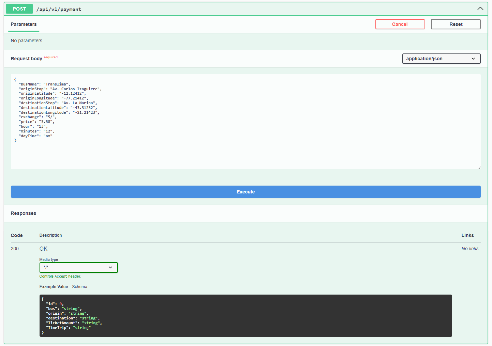

# Universidad Peruana de Ciencias Aplicadas

## 
Desarrollo de Aplicaciones Open Source

## FINAL PROJECT REPORT

**Sección:** SW53

**Profesor**: Hugo Allan Mori Paiva

**StartUp Name**: TechMove

**Producto**: LimaPaths

### Team Members:

| Member                            | Code       |
|:----------------------------------|------------|
| Santiago Mickelle Olivera Guerra  | U20201A821 |
| Roy Hernan De La Cruz Moreno       | U202218634        |
| Omar Christian Berrocal Ramirez   | U20201B529 |
| Carlos Oswaldo Casimiro Fernandez | U202115412 |

 

Ingeniería de Software

Ciclo 2024-02

**Agosto del 2024**

  

# Registro de Versiones del Informe

| Versión |   Fecha    |                                                                                       Autor                                                                                        | Descripción de modificación                                                                                                                                           |
| :-----: | :--------: | :--------------------------------------------------------------------------------------------------------------------------------------------------------------------------------: | :-------------------------------------------------------------------------------------------------------------------------------------------------------------------- |
|   TB1   | 05/09/2024 |-Santiago Mickelle Olivera Guerra  -Roy Hernan De La Cruz Moreno   -Omar Christian Berrocal Ramirez   -Cusimayta Lobo Alex Gabriel    -Carlos Oswaldo Casimiro Fernandez|  CAPITULO I AL V|
|   TP1   | 28/10/2024 |-Santiago Mickelle Olivera Guerra  -Roy Hernan De La Cruz Moreno   -Omar Christian Berrocal Ramirez   -Cusimayta Lobo Alex Gabriel    -Carlos Oswaldo Casimiro Fernandez|  Correciones del TB1, y desarrollo del Sprint 2|
| TB2 | 04/11/2024 | -Santiago Mickelle Olivera Guerra  -Roy Hernan De La Cruz Moreno   -Omar Christian Berrocal Ramirez   -Carlos Oswaldo Casimiro Fernandez | Sprint 3, correcciones de entregas TB1 y TP1 |

  

# Project Report Collaboration Insights

- **TB1:** Para esta entrega, realizamos como equipo las actividades correspondientes a los capítulos asignados en el siguiente repositorio dentro de nuestra organización de grupo:

    Link del repositorio del Informe Final: https://github.com/TechMove-OpenSource/LimaPaths-MarkDown

     

    A continuación, se muestran las capturas de evidencia correspondientes al desarrollo de los siguientes capítulos:

    - Capítulo I: Introducción
    - Capítulo II: Requirements Elicitation & Analysis
    - Capítulo III: Requirements Specification
    - Capítulo IV: Product Design
    - Capítulo V: Product Implementation, Validation & Deployment

 Gráfico de barras

 ##### imagen de grafos
 
 

 ##### imagen de commit
 
 
 

# Contenido

## Tabla de Contenidos

### [Registro de versiones del informe](#registro-de-versiones-del-informe)

### [Project Report Collaboration Insights](#project-report-collaboration-insights)

### [Contenido](#contenido)

### [Student Outcome](#student-outcome-1)

### [Capítulo I: Introducción](#capítulo-i-introducción)

- [1.1. Startup Profile](#11-startup-profile)
  - [1.1.1. Descripción de la Startup](#111-description-de-la-startup)
  - [1.1.2. Perfiles de integrantes del equipo](#112-perfiles-de-integrantes-del-equipo)
- [1.2. Solution Profile](#12-solution-profile)
  - [1.2.1 Antecedentes y problemática](#121-antecedentes-y-problemática)
  - [1.2.2 Lean UX Process](#122-lean-ux-process)
    - [1.2.2.1. Lean UX Problem Statements](#1221-lean-ux-problem-statements)
    - [1.2.2.2. Lean UX Assumptions](#1222-lean-ux-assumptions)
    - [1.2.2.3. Lean UX Hypothesis Statements](#1223-lean-ux-hypothesis-statements)
    - [1.2.2.4. Lean UX Canvas](#1224-lean-ux-canvas)
- [1.3. Segmentos objetivo](#13-segmentos-objetivo)

### [Capítulo II: Requirements Elicitation & Analysis](#capítulo-ii-requirements-elicitation--analysis)

- [2.1. Competidores](#21-competidores)
  - [2.1.1. Análisis competitivo](#211-análisis-competitivo)
  - [2.1.2. Estrategias y tácticas frente a competidores](#212-estrategias-y-tácticas-frente-a-competidores)
- [2.2. Entrevistas](#22-entrevistas)
  - [2.2.1. Diseño de entrevistas](#221-diseño-de-entrevistas)
  - [2.2.2. Registro de entrevistas](#222-registro-de-entrevistas)
  - [2.2.3. Análisis de entrevistas](#223-análisis-de-entrevistas)
- [2.3. Needfinding](#23-needfinding)
  - [2.3.1. User Personas](#231-user-personas)
  - [2.3.2. User Task Matrix](#232-user-task-matrix)
  - [2.3.3. User Journey Mapping](#233-user-journey-mapping)
  - [2.3.4. Empathy Mapping](#234-empathy-mapping)
  - [2.3.5. As-is Scenario Mapping](#235-as-is-scenario-mapping)

### [Capítulo III: Requirements Specification](#capítulo-iii-requirements-specification)

- [3.1. To-Be Scenario Mapping](#31-to-be-scenario-mapping)
- [3.2. User Stories](#32-user-stories)
- [3.3. Impact Mapping](#33-impact-mapping)
- [3.4. Product Backlog](#34-product-backlog)

### [Capítulo IV: Product Design](#capítulo-iv-product-design)

- [4.1. Style Guidelines](#41-style-guidelines)
  - [4.1.1. General Style Guidelines](#411-general-style-guidelines)
  - [4.1.2. Web Style Guidelines](#412-web-style-guidelines)
- [4.2. Information Architecture](#42-information-architecture)
  - [4.2.1. Organization Systems](#421-organization-systems)
  - [4.2.2. Labeling Systems](#422-labeling-systems)
  - [4.2.3. SEO Tags and Meta Tags](#423-seo-tags-and-meta-tags)
  - [4.2.4. Searching Systems](#424-searching-systems)
  - [4.2.5. Navigation Systems](#425-navigation-systems)
- [4.3. Landing Page UI Design](#43-landing-page-ui-design)
  - [4.3.1. Landing Page Wireframe](#431-landing-page-wireframe)
  - [4.3.2. Landing Page Mock-up](#432-landing-page-mock-up)
- [4.4. Web Applications UX/UI Design](#44-web-applications-uxui-design)
  - [4.4.1. Web Applications Wireframes](#441-web-applications-wireframes)
  - [4.4.2. Web Applications Wireflow Diagrams](#442-web-applications-wireflow-diagrams)
  - [4.4.3. Web Applications Mock-ups](#443-web-applications-mock-ups)
  - [4.4.4. Web Applications User Flow Diagrams](#444-web-applications-user-flow-diagrams)
- [4.5. Web Applications Prototyping](#45-web-applications-prototyping)
- [4.6. Domain-Driven Software Architecture](#46-domain-driven-software-architecture)
  - [4.6.1. Software Architecture Context Diagram](#461-software-architecture-context-diagram)
  - [4.6.2. Software Architecture Container Diagrams](#462-software-architecture-container-diagrams)
  - [4.6.3. Software Architecture Components Diagrams](#463-software-architecture-components-diagrams)
- [4.7. Software Object-Oriented Design](#47-software-object-oriented-design)
  - [4.7.1. Class Diagrams](#471-class-diagrams)
  - [4.7.2. Class Dictionary](#472-class-dictionary)
- [4.8. Database Design](#48-database-design)
  - [4.8.1. Database Diagram](#481-database-diagram)

### [Capítulo V: Product Implementation, Validation & Deployment](#capítulo-v-product-implementation-validation--deployment)

- [Universidad Peruana de Ciencias Aplicadas](#universidad-peruana-de-ciencias-aplicadas)
  - [Desarrollo de Aplicaciones Open Source](#desarrollo-de-aplicaciones-open-source)
  - [FINAL PROJECT REPORT](#final-project-report)
    - [Team Members:](#team-members)
- [Registro de Versiones del Informe](#registro-de-versiones-del-informe)
- [Project Report Collaboration Insights](#project-report-collaboration-insights)
- [Contenido](#contenido)
  - [Tabla de Contenidos](#tabla-de-contenidos)
    - [Registro de versiones del informe](#registro-de-versiones-del-informe-1)
    - [Project Report Collaboration Insights](#project-report-collaboration-insights-1)
    - [Contenido](#contenido-1)
    - [Student Outcome](#student-outcome)
    - [Capítulo I: Introducción](#capítulo-i-introducción)
    - [Capítulo II: Requirements Elicitation \& Analysis](#capítulo-ii-requirements-elicitation--analysis)
    - [Capítulo III: Requirements Specification](#capítulo-iii-requirements-specification)
    - [Capítulo IV: Product Design](#capítulo-iv-product-design)
    - [Capítulo V: Product Implementation, Validation \& Deployment](#capítulo-v-product-implementation-validation--deployment)
    - [Conclusiones](#conclusiones)
    - [Bibliografía](#bibliografía)
    - [Anexos](#anexos)
- [Student Outcome](#student-outcome-1)
- [Capítulo I: Introducción](#capítulo-i-introducción-1)
  - [1.1. StartUp Profile](#11-startup-profile)
    - [1.1.1. Description de la StartUp](#111-description-de-la-startup)
    - [1.1.2. Perfiles de integrantes del equipo](#112-perfiles-de-integrantes-del-equipo)
  - [1.2. Solution Profile](#12-solution-profile)
    - [1.2.1. Antecedentes y problemática](#121-antecedentes-y-problemática)
    - [1.2.2. Lean UX Process](#122-lean-ux-process)
      - [1.2.2.1. Lean UX Problem Statements](#1221-lean-ux-problem-statements)
      - [1.2.2.2. Lean UX Assumptions](#1222-lean-ux-assumptions)
      - [1.2.2.3. Lean UX Hypothesis Statements](#1223-lean-ux-hypothesis-statements)
      - [1.2.2.4. Lean UX Canvas](#1224-lean-ux-canvas)
  - [1.3. Segmentos Objetivo](#13-segmentos-objetivo)
- [Capítulo II: Requirements Elicitation \& Analysis](#capítulo-ii-requirements-elicitation--analysis-1)
  - [2.1. Competidores](#21-competidores)
    - [2.1.1. Análisis competitivo](#211-análisis-competitivo)
    - [2.1.2. Estrategias y tácticas frente a competidores](#212-estrategias-y-tácticas-frente-a-competidores)
  - [2.2. Entrevistas](#22-entrevistas)
    - [2.2.1. Diseño de entrevistas](#221-diseño-de-entrevistas)
    - [2.2.2. Registro de entrevistas](#222-registro-de-entrevistas)
    - [2.2.3. Análisis de entrevistas](#223-análisis-de-entrevistas)
  - [2.3. Needfinding](#23-needfinding)
    - [2.3.1. User Personas](#231-user-personas)
    - [2.3.2. User Task Matrix](#232-user-task-matrix)
    - [2.3.3. User Journey Mapping](#233-user-journey-mapping)
    - [2.3.4. Empathy Mapping](#234-empathy-mapping)
    - [2.3.5. As-is Scenario Mapping](#235-as-is-scenario-mapping)
- [Capítulo III: Requeriments Specifications](#capítulo-iii-requeriments-specifications)
  - [3.1 To-Be Scenario Mapping](#31-to-be-scenario-mapping)
  - [3.2 User Stories](#32-user-stories)
  - [3.3 Impact Mapping](#33-impact-mapping)
  - [3.4 Product Backlog](#34-product-backlog)
- [Capítulo IV: Product Design](#capítulo-iv-product-design-1)
  - [4.1. Style Guidelines.](#41-style-guidelines)
    - [4.1.1. General Style Guidelines.](#411-general-style-guidelines)
    - [4.1.2. Web Style Guidelines](#412-web-style-guidelines)
  - [4.2. Information Architecture.](#42-information-architecture)
    - [4.2.1. Organization Systems.](#421-organization-systems)
    - [4.2.2. Labeling Systems.](#422-labeling-systems)
    - [4.2.3. SEO Tags and Meta Tags](#423-seo-tags-and-meta-tags)
    - [4.2.4. Searching Systems.](#424-searching-systems)
    - [4.2.5. Navigation Systems.](#425-navigation-systems)
  - [4.3. Landing Page UI Design.](#43-landing-page-ui-design)
    - [4.3.1. Landing Page Wireframe.](#431-landing-page-wireframe)
    - [4.3.2. Landing Page Mock-up.](#432-landing-page-mock-up)
  - [4.4. Web Applications UX/UI Design.](#44-web-applications-uxui-design)
    - [4.4.1. Web Applications Wireframes.](#441-web-applications-wireframes)
    - [4.4.2. Web Applications Wireflow Diagrams.](#442-web-applications-wireflow-diagrams)
    - [4.4.3. Web Applications Mock-ups.](#443-web-applications-mock-ups)
    - [4.4.4. Web Applications User Flow Diagrams.](#444-web-applications-user-flow-diagrams)
    - [4.5. Web Applications Prototyping.](#45-web-applications-prototyping)
  - [4.6. Domain-Driven Software Architecture.](#46-domain-driven-software-architecture)
    - [4.6.1. Software Architecture Context Diagram.](#461-software-architecture-context-diagram)
    - [4.6.2. Software Architecture Container Diagrams.](#462-software-architecture-container-diagrams)
    - [4.6.3. Software Architecture Components Diagrams.](#463-software-architecture-components-diagrams)
  - [4.7. Software Object-Oriented Design.](#47-software-object-oriented-design)
    - [4.7.1. Class Diagrams.](#471-class-diagrams)
    - [4.7.2. Class Dictionary.](#472-class-dictionary)
  - [4.8. Database Design.](#48-database-design)
    - [4.8.1. Database Diagram.](#481-database-diagram)
- [Capítulo V: Product Implementation, Validation \& Deployment](#capítulo-v-product-implementation-validation--deployment-1)
  - [5.1. Software Configuration Management.](#51-software-configuration-management)
    - [5.1.1. Software Development Environment Configuration.](#511-software-development-environment-configuration)
    - [5.1.2. Source Code Management.](#512-source-code-management)
    - [5.1.3. Source Code Style Guide \& Conventions.](#513-source-code-style-guide--conventions)
    - [5.1.4. Software Deployment Configuration.](#514-software-deployment-configuration)
  - [5.2. Landing Page, Services \& Applications Implementation.](#52-landing-page-services--applications-implementation)
    - [5.2.1. Sprint 1](#521-sprint-1)
      - [5.2.1.1. Sprint Planning 1.](#5211-sprint-planning-1)
      - [5.2.1.2. Sprint Backlog 1.](#5212-sprint-backlog-1)
      - [5.2.1.3. Development Evidence for Sprint Review.](#5213-development-evidence-for-sprint-review)
      - [5.2.1.4. Testing Suite Evidence for Sprint Review.](#5214-testing-suite-evidence-for-sprint-review)
    - [5.2.1.5. Execution Evidence for Sprint Review.](#5215-execution-evidence-for-sprint-review)
    - [5.2.1.6. Services Documentation Evidence for Sprint Review.](#5216-services-documentation-evidence-for-sprint-review)
    - [5.2.1.7. Software Deployment Evidence for Sprint Review.](#5217-software-deployment-evidence-for-sprint-review)
    - [5.2.1.8. Team Collaboration Insights during Sprint.](#5218-team-collaboration-insights-during-sprint)
 - [5.2.2. Sprint 2](#522-sprint-2)
      - [5.2.2.1. Sprint Planning 2](#5221-sprint-planning-2)
      - [5.2.2.2. Sprint Backlog 2](#5222-sprint-backlog-2)
      - [5.2.2.3. Development Evidence for Sprint Review](#5223-development-evidence-for-sprint-review)
      - [5.2.2.4. Testing Suite Evidence for Sprint Review](#5224-testing-suite-evidence-for-sprint-review)
      - [5.2.2.5. Execution Evidence for Sprint Review](#5225-execution-evidence-for-sprint-review)
      - [5.2.2.6. Services Documentation Evidence for Sprint Review](#5226-services-documentation-evidence-for-sprint-review)
      - [5.2.2.7. Software Deployment Evidence for Sprint Review](#5227-software-deployment-evidence-for-sprint-review)
      - [5.2.2.8. Team Collaboration Insights during Sprint](#5228-team-collaboration-insights-during-sprint)
    - [5.2.3. Sprint 3](#523-sprint-3)
      - [5.2.3.1. Sprint Planning 3](#5231-sprint-planning-3)
      - [5.2.3.2. Sprint Backlog 3](#5232-sprint-backlog-3)
      - [5.2.2.3. Development Evidence for Sprint Review](#5223-development-evidence-for-sprint-review-1)
      - [5.2.3.4. Testing Suite Evidence for Sprint Review](#5234-testing-suite-evidence-for-sprint-review)
      - [5.2.3.5. Execution Evidence for Sprint Review](#5235-execution-evidence-for-sprint-review)
      - [5.2.3.6. Services Documentation Evidence for Sprint Review](#5236-services-documentation-evidence-for-sprint-review)
      - [5.2.3.7. Software Deployment Evidence for Sprint Review+](#5237-software-deployment-evidence-for-sprint-review)
      - [5.2.3.8. Team Collaboration Insights during Sprint](#5238-team-collaboration-insights-during-sprint)
    - [5.2.4. Sprint 4](#524-sprint-4)
      - [5.2.4.1. Sprint Planning 4](#5241-sprint-planning-4)
      - [5.2.4.2. Sprint Backlog 4](#5242-sprint-backlog-4)
      - [5.2.4.3. Development Evidence for Sprint Review](#5243-development-evidence-for-sprint-review)
      - [5.2.4.4. Testing Suite Evidence for Sprint Review](#5244-testing-suite-evidence-for-sprint-review)
      - [5.2.4.5. Execution Evidence for Sprint Review](#5245-execution-evidence-for-sprint-review)
      - [5.2.4.6. Services Documentation Evidence for Sprint Review](#5246-services-documentation-evidence-for-sprint-review)
      - [5.2.4.7. Software Deployment Evidence for Sprint Review+](#5247-software-deployment-evidence-for-sprint-review)
      - [5.2.4.8. Team Collaboration Insights during Sprint](#5248-team-collaboration-insights-during-sprint)
  - [5.3. Validation Interviews](#53-validation-interviews)
    - [5.3.1. Diseño de Entrevistas](#531-diseño-de-entrevistas)
    - [5.3.2. Registro de Entrevistas](#532-registro-de-entrevistas)
      - [Sheyla Patricia, 33 años.](#sheyla-patricia-33-años)
    - [5.3.3. Evaluaciones según heurísticas.](#533-evaluaciones-según-heurísticas)
        - [SITE o APP A EVALUAR:](#site-o-app-a-evaluar)
        - [TAREAS A EVALUAR:](#tareas-a-evaluar)
        - [ESCALA DE SEVERIDAD:](#escala-de-severidad)
        - [TABLA RESUMEN:](#tabla-resumen)
        - [DESCRIPCIÓN DE PROBLEMAS:](#descripción-de-problemas)
        - [PROBLEMA #1:](#problema-1)
          - [Severidad: 2](#severidad-2)
          - [Problema:](#problema)
          - [Recomendación:](#recomendación)
        - [PROBLEMA #2:](#problema-2)
          - [Severidad: 2](#severidad-2-1)
          - [Problema:](#problema-1)
          - [Recomendación:](#recomendación-1)
  - [5.4. Video About the Product.](#54-video-about-the-product)
  - [Conclusiones](#conclusiones-1)
  - [Bibliografía](#bibliografía-1)
  - [Anexos](#anexos-1)

### [Conclusiones](#conclusiones)

### [Bibliografía](#bibliografía)

### [Anexos](#anexos)

 

# Student Outcome
# Student Outcome

| **Criterio específico** | **Acciones realizadas** | **Conclusiones** |
|-------------------------|-------------------------|------------------|
| **Comunica oralmente sus ideas y/o resultados con objetividad a público de diferentes especialidades y niveles jerárquicos, en el marco del desarrollo de un proyecto en ingeniería.** | **TB1**     Santiago Mickelle Olivera Guerra: - Se hizo un análisis para poder identificar a los segmentos objetivos, y de esta manera generar soluciones innovadoras.    Carlos Oswaldo Casimiro Fernandez: - Se organizó una reunión con el equipo para coordinar el enfoque del trabajo, lo que permitió afinar su definición mediante la contribución de diferentes puntos de vista de todos los miembros.    Roy Hernan De La Cruz Moreno: - Pude comunicar mis ideas de soluciones, así como los enfoques del proyecto realizado.    Cusimayta Lobo Alex Gabriel: - Realizamos una reunión, analizamos opciones para realizar el trabajo y definimos requerimientos.    Omar Christian Berrocal Ramirez: - Se coordinó en reunión con el equipo el enfoque del trabajo para tener una mejor definición, brindando cada uno nuestros puntos de vista.    **TP:**    Santiago Mickelle Olivera Guerra: - Se tomaron en cuenta las observaciones del TB1 y se empezó con la implementación de la aplicación web.    Carlos Oswaldo Casimiro Fernandez: - Definimos las vistas del frontend a realizar y la estructura del proyecto.    Roy Hernan De La Cruz Moreno: - Realicé la parte del login y register del frontend de la web app.    Cusimayta Lobo Alex Gabriel: - Realicé parte de los requisitos funcionales de la app, así como la parte de configuración.    Omar Christian Berrocal Ramirez: - Me encargué del desarrollo del frontend del mapa interactivo de la aplicación.    **TB2**     Santiago Mickelle Olivera Guerra: - Realicé el *bounded context* de *trip* en el backend y se implementaron las *fake APIs* en la aplicación web.    Carlos Oswaldo Casimiro Fernandez: - Realicé el *bounded context* de *payment* en el backend y se implementaron las *fake APIs* en la aplicación web.    Roy Hernan De La Cruz Moreno: - Aún estoy trabajando en la implementación de un *bounded context*.    Omar Christian Berrocal Ramirez: - Aún tengo pendiente realizar la implementación del backend de *buses*. | **TB1**     Elegimos un servicio para facilitar el transporte, en el cual desarrollamos el problem statement y las hypothesis statements para dimensionar el desarrollo y solución de la problemática.    La comunicación en el equipo fue crucial para definir claramente los roles y tareas desde el inicio, lo que nos permitió avanzar de manera más organizada y eficiente.    **TP:**    La capacidad del equipo para comunicar sus ideas y resultados de manera efectiva fue fundamental para el éxito del proyecto. La integración del equipo permitió desarrollar soluciones innovadoras que abordaron las necesidades del proyecto de manera eficiente.    **TB2**     La comunicación en el equipo fue un factor diferenciador para establecer y ejecutar los objetivos de la entrega. Las reuniones constantes y las aportaciones de cada miembro facilitaron una implementación más rápida y alineada con los requerimientos del proyecto. |
| **Comunica en forma escrita ideas y/o resultados con objetividad a público de diferentes especialidades y niveles jerárquicos, en el marco del desarrollo de un proyecto en ingeniería.** | **TB1**     Santiago Mickelle Olivera Guerra: - Se investigó de los principales competidores de nuestra aplicación. Además, se realizaron distintos planteamientos y gráficos para tener unos segmentos objetivos principales.    Carlos Oswaldo Casimiro Fernandez: - Se diseñó la Landing Page, siguiendo las directrices de estilo para asegurar una mejor integración de los diseños, además de realizar las secciones que mencionan el propósito y alcance del proyecto.    Roy Hernan De La Cruz Moreno: - Se propusieron ideas para el desarrollo del proyecto, se investigaron posibles diseños, reglas para el desarrollo y también requerimientos para el proyecto que vamos a realizar. Además, colaboré en las reuniones para coordinar las futuras tareas.    Cusimayta Lobo Alex Gabriel: - Realicé un análisis de los segmentos de usuarios principales y los requerimientos iniciales del proyecto.    Omar Christian Berrocal Ramirez: - Desarrollé el diseño inicial de la arquitectura de la aplicación web, enfocándome en su modularidad.    **TP:**    Santiago Mickelle Olivera Guerra: - Se implementaron las vistas principales de la aplicación web utilizando frameworks modernos y tecnologías adecuadas.    Carlos Oswaldo Casimiro Fernandez: - Documentamos el desarrollo del frontend realizado y el despliegue en la plataforma elegida.    Roy Hernan De La Cruz Moreno: - Documenté mis vistas del frontend y las registré en el informe respectivo.    Cusimayta Lobo Alex Gabriel: - Coordiné el trabajo de los equipos para asegurar la integración efectiva de las distintas partes del proyecto.    Omar Christian Berrocal Ramirez: - Implementé los formularios y la validación de datos en el frontend.    **TB2**     Santiago Mickelle Olivera Guerra: - Se tomaron en cuenta las observaciones del TB1 y se empezó con la implementación de la aplicación web.    Carlos Oswaldo Casimiro Fernandez: - Se realizaron ajustes en los diseños de la interfaz de usuario y se comenzó a trabajar en la funcionalidad del *dashboard*.    Roy Hernan De La Cruz Moreno: - Se corrigieron errores en la integración y se añadieron nuevas secciones al frontend.    Omar Christian Berrocal Ramirez: - Trabajé en la optimización del rendimiento del frontend y en mejorar la experiencia de usuario. | **TB1**     Recopilamos información necesaria para poder afrontar a los competidores directos, y de esta manera ofrecer un servicio novedoso que solucione las dificultades de los usuarios.    Este análisis inicial nos permitió establecer una base sólida para el desarrollo de *LimaPaths*, lo que asegura que los próximos pasos se lleven a cabo de manera eficiente y efectiva.    **TP:**    La documentación clara y detallada fue esencial para el desarrollo del proyecto y la integración correcta de las funcionalidades en la web, facilitando futuras expansiones y mantenimientos.    **TB2**     La documentación y la claridad en la estructura del backend fueron cruciales para garantizar que las *fake APIs* se integraran correctamente en la aplicación web. Este enfoque colaborativo ayudó a mantener un flujo de trabajo eficiente y a preparar el proyecto para futuras expansiones y mantenimientos. |

# Capítulo I: Introducción

## 1.1. StartUp Profile

### 1.1.1. Description de la StartUp

"TechMove" es una startup con la principal intención de transformar la forma en que las personas se desplazan por la ciudad utilizando el transporte público. Nuestra misión es simplificar y mejorar la movilidad urbana, ofreciendo a los residentes de Lima una aplicación integral que les permita encontrar las mejores rutas de transporte público para llegar a sus destinos de manera eficiente. Nuestra aplicación no solo brinda a los usuarios la capacidad de planificar sus viajes de manera óptima, sino que también proporciona información en tiempo real sobre el estado de las rutas y la disponibilidad de los medios de transporte. Además, colaboramos estrechamente con las empresas de transporte público para que también puedan beneficiarse de esta plataforma, obteniendo una visión en tiempo real de sus clientes y mejorando la calidad de sus servicios.

### 1.1.2. Perfiles de integrantes del equipo

<table align="center"  border="1" width="70%" style="text-align:center;">
    <tr align="center">
        <td rowspan="3">
            
        </td>
        <td align="left">
            <b>Nombre y Apellido:</b>
             
            Olivera Guerra Santiago Mickelle
        </td>
    </tr>
    <tr>
        <td align="left">
        <b>Carrera:</b>
         
        Ingeniería de Software
        </td>
    </tr>
    <tr>
        <td align="left">
        <b>Acerca de:</b>
         
        Tengo 22 años actualmente y me considero una persona de confiar y con facilidad para organizar un proyecto como lider de grupo en anteriores trabajos, capaz de potenciar a mis compañeros y además de un fuerte compromiso propio.
        </td>
    </tr>
    <tr align="center">
        <td rowspan="3">
            
        </td>
        <td align="left">
            <b>Nombre y Apellido:</b>
             
            Carlos Oswaldo, Casimiro Fernández
        </td>
    </tr>
    <tr>
        <td align="left">
        <b>Carrera:</b>
         
        Ingeniería de Software
        </td>
    </tr>
    <tr>
        <td align="left">
        <b>Acerca de:</b>
         
       Tengo 21 años y soy estudiante de Ingeniería de Software de la Universidad Peruana de Ciencias Aplicadas. Me considero una persona proactiva, educada y sociable con los que me rodean. Además cuento con habilidades peculiares como la animación en 3d, edición de videos cinematográficos y conocimiento en lenguajes como c + +, Python.
        </td>
    </tr>
    <tr align="center">
        <td rowspan="3">
            
        </td>
        <td align="left">
            <b>Nombre y Apellido:</b>
             
            De La Cruz Moreno Roy Hernan
        </td>
    </tr>
    <tr>
        <td align="left">
        <b>Carrera:</b>
         
        Ingeniería de Software
        </td>
    </tr>
    <tr>
        <td align="left">
        <b>Acerca de:</b>
         
        Soy Roy De La Cruz Moreno, tengo 19 años. Estudió la carrera de Ingeniería de Software. Considero que soy una persona tranquila y atenta al escuchar las propuestas de los demás integrantes del equipo, ademas tengo conocimientos en SQL, NoSQL y C++.
        </td>
    </tr>
    <tr align="center">
        <td rowspan="3">
            
        </td>
        <td align="left">
            <b>Nombre y Apellido:</b>
             
            Cusimayta Lobo Alex Gabriel
        </td>
    </tr>
    <tr>
        <td align="left">
        <b>Carrera:</b>
         
        Ingeniería de Software
        </td>
    </tr>
    <tr>
        <td align="left">
        <b>Acerca de:</b>
         
        Tengo 20 años y soy estudiante de Ingeniería de Software de la Universidad Peruana de Ciencias Aplicadas. ME considero un apasionado de los videojuegos y de la programación, me gustaría desarrollar videojuegos a futuro.
    </tr>
    <tr align="center">
        <td rowspan="3">
            
        </td>
        <td align="left">
            <b>Nombre y Apellido:</b>
             
            Berrocal Ramirez Omar
        </td>
    </tr>
    <tr>
        <td align="left">
        <b>Carrera:</b>
         
        INGENIERIA DE SOFTWARE
        </td>
    </tr>
    <tr>
        <td align="left">
        <b>Acerca de:</b>
         
         Desde pequeño me han llamado la atención las máquinas y la tecnología, por ello es que elegí esta carrera y así satisfacer mi curiosidad sobre nuevas tecnologías. Tengo conocimientos en lenguajes de programación tales como C++, Python, y lo básico Java y C#. Además, cuento con conocimiento de Bases de Datos (SQL Server y MongoDB) y habilidades básicas HTML y CSS.
        </td>
    </tr>
</table>

## 1.2. Solution Profile

En esta sección iniciaremos por un análisis de los antecedentes y problemática sobre la movilización en transporte público para identificar las raíces del problema e identificar algunas necesidades que se deban cubrir para llegar a una solución de la problemática. Asimismo, luego pasaremos por el proceso UX para poder analizar más a detalle la problemática y poder plantear una hipótesis acerca de la problemática.

### 1.2.1. Antecedentes y problemática

La movilización en transportes públicos en Lima, se ha visto influenciada por una serie de antecedentes y problemáticas a lo largo de su historia. En un contexto de rápido crecimiento poblacional y urbano, la demanda de servicios de transporte público ha ido en constante aumento. Sin embargo, varios factores han contribuido a desafiar la eficiencia y la calidad de la movilización en la ciudad. Históricamente, Lima contaba con sistemas de transporte público, como los tranvías, en el siglo XIX. Sin embargo, la falta de inversión y una planificación inadecuada llevaron al declive y eventual desaparición de estos sistemas en la segunda mitad del siglo XX. Entre las problemáticas más apremiantes se destaca la congestión del tráfico, que afecta de manera significativa a los limeños. El aumento de vehículos particulares y la infraestructura inadecuada han resultado en largos tiempos de viaje y congestión constante en las calles de la ciudad. Asimismo, el transporte público en Lima ha enfrentado dificultades, desde deficiencias en infraestructura y falta de mantenimiento hasta servicios ineficientes. Los usuarios a menudo se ven obligados a utilizar autobuses y combis en condiciones precarias, lo que afecta negativamente su experiencia de viaje. La seguridad en el transporte público también ha sido motivo de preocupación, con incidentes de robos y acoso a los pasajeros. Esto ha generado inquietudes sobre la seguridad de los usuarios en el sistema. Además, las tarifas de transporte público pueden resultar onerosas para personas de bajos ingresos, y la falta de accesibilidad adecuada para personas con discapacidad ha sido una preocupación persistente. A pesar de estos desafíos, el gobierno y las autoridades locales han implementado medidas para mejorar el transporte público en Lima, incluyendo la introducción de sistemas de transporte masivo como el Metropolitano y el Tren Eléctrico, así como esfuerzos para combatir la informalidad y elevar la calidad del servicio. Sin embargo, los retos siguen siendo considerables en una ciudad en constante crecimiento y transformación.

¿Qué?: Dificultades significativas para desplazarse por la ciudad utilizando el transporte público debido a la congestión del tráfico y la falta de información en tiempo real sobre las rutas y disponibilidad de medios de transporte.

¿Quién?: Los usuarios del transporte público en Lima, que incluyen a residentes locales y visitantes de la ciudad, son los principales actores de esta movilización. Además, las autoridades gubernamentales y las empresas de transporte público desempeñan un papel importante en la gestión y regulación de estos servicios.

¿Por qué?: Las personas utilizan el transporte público en Lima por varias razones, incluyendo la congestión del tráfico, la falta de estacionamiento, la necesidad de una opción de movilidad asequible y la preocupación por el medio ambiente. Además, muchas personas no tienen acceso a un automóvil personal y dependen del transporte público para sus desplazamientos diarios.

¿Dónde?: Esta movilización se lleva a cabo en toda la ciudad de Lima, que incluye el centro histórico, los distritos periféricos y las áreas metropolitanas circundantes. Los usuarios se desplazan tanto dentro de la ciudad como hacia y desde los suburbios.

¿Cuándo?: Comienza alrededor de las 5 de la tarde, es cuando el tráfico se vuelve más intenso y la dificultad de desplazamiento alcanza su punto máximo. Durante este período, los residentes enfrentan mayores retrasos y congestión en las rutas de transporte público, lo que dificulta aún más sus desplazamientos urbanos.

¿Cómo?: Los usuarios pueden acceder al transporte público en Lima a través de una red de paraderos y estaciones que sirven a diferentes rutas y servicios. Los sistemas de transporte masivo, como el Metropolitano y el Tren Eléctrico, ofrecen tarjetas de acceso y estaciones específicas para abordar. Los autobuses y combis tienen paraderos designados en las calles

¿Cuánto?: El costo de utilizar el transporte público en Lima varía según el tipo de servicio y la distancia recorrida. Los precios de los boletos pueden oscilar desde unos pocos centavos hasta varios soles peruanos, dependiendo de la ruta y el sistema de transporte. Los usuarios a menudo pueden optar por tarifas con descuento si utilizan tarjetas de prepago o si son estudiantes o adultos mayores.

Conclusiones de las 5W y 2H: En conclusión, la movilización en transportes públicos en Lima, Perú, es una parte fundamental de la vida cotidiana de sus residentes y visitantes. Este sistema de transporte es utilizado por una amplia variedad de personas que dependen de él para desplazarse por la ciudad debido a la congestión del tráfico, la falta de estacionamiento y la necesidad de opciones de movilidad asequibles. A pesar de las numerosas problemáticas, como la congestión, la seguridad y la falta de inversión en infraestructura, el transporte público sigue siendo esencial para mantener la movilidad en una ciudad en constante crecimiento y transformación. Los esfuerzos de las autoridades locales y gubernamentales, como la implementación de sistemas de transporte masivo y la regulación del sector, son pasos importantes hacia la mejora de la movilización en Lima.

### 1.2.2. Lean UX Process

#### 1.2.2.1. Lean UX Problem Statements

"Nuestra aplicación, TechMove, está siendo diseñada con el propósito de ayudar a las personas a planificar y realizar viajes en transporte público de manera fácil y eficiente. Con este desarrollo, buscamos reducir los costos de transporte y la congestión del tráfico. Sin embargo, anticipamos varios desafíos que podrían afectar el éxito de nuestra aplicación. Nos preocupa que la eficacia en la planificación de viajes y la actualización de la información no se logren completamente, lo que podría llevar a una experiencia insatisfactoria para nuestros futuros usuarios. Nos planteamos cómo podemos asegurar que TechMove cumpla con sus objetivos desde el principio, basándonos en criterios medibles como la precisión de las rutas, la puntualidad de la información y la reducción del tiempo de viaje. ¿Qué características y funcionalidades debemos incluir para garantizar una alta satisfacción del usuario y lograr nuestros objetivos?"

#### 1.2.2.2. Lean UX Assumptions

User Assumptions

I. ¿Quién es el usuario? TechMove está dirigido a cualquier persona que utilice el transporte público en la ciudad de Lima. Esto puede incluir a estudiantes, trabajadores, viajeros y cualquier otra persona que necesite planificar un viaje en transporte público. Además es útil para turistas y visitantes que no están familiarizados con el sistema de transporte público local y que necesitan ayuda para planificar sus viajes.

II. ¿Dónde encaja nuestro producto en su trabajo o vida?

Nuestro servicio encaja para los residentes de Lima, que dependen en gran medida del transporte público para sus desplazamientos diarios, "TechMove" puede ser una herramienta esencial. Les permite encontrar la mejor ruta de transporte público para llegar a su destino de manera eficiente, ahorrando tiempo y minimizando la incertidumbre en sus viajes. Esto se traduce en una mayor comodidad y productividad en su vida cotidiana.

III. ¿Qué problemas tiene nuestro producto? ¿Evitar?

La precisión de la información en tiempo real es fundamental para la efectividad de la aplicación. Los datos incorrectos pueden llevar a los usuarios por rutas equivocadas y generar frustración. Además, al recopilar datos de ubicación en tiempo real, es crucial garantizar la privacidad y seguridad de los usuarios. Es por ello que debemos evitar problemas de seguridad, como la exposición de datos sensibles o la posibilidad de rastreo no autorizado.

IV. ¿Cuándo y cómo es nuestro producto? ¿Usado?

Nuestro servicio podrá ser utilizado a través de dispositivos móviles, como teléfonos inteligentes o tabletas. Los usuarios pueden descargar la aplicación desde tiendas de aplicaciones móviles, como la App Store o Google Play, e instalarla en sus dispositivos. Luego, ingresan su ubicación actual y destino, y la aplicación proporciona información sobre las rutas disponibles, tiempos de viaje estimados y actualizaciones en tiempo real sobre la ubicación de los vehículos de transporte público. Esto permite a los usuarios tomar decisiones informadas sobre la mejor manera de llegar a su destino utilizando el transporte público en Lima.

V. ¿Qué características son importantes?

“TechMove" es una aplicación esencial para los usuarios de transporte público en Lima, ofreciendo una amplia gama de características cruciales, como la búsqueda de rutas, información en tiempo real sobre el transporte, notificaciones y alertas, mapas interactivos, detalles de tarifas y opciones de pago, comentarios de usuarios, historial de viajes, accesibilidad y medidas de seguridad, todo ello respaldado por una colaboración efectiva con las empresas de transporte. Esta aplicación mejora la experiencia de viaje al ayudar a los usuarios a planificar y seguir sus rutas de manera eficiente, brindando un servicio completo y personalizado que facilita la movilidad en la ciudad de Lima.

VI. ¿Cómo debe verse nuestro producto y cómo comportarse?

Nuestra plataforma tiene que interactuar con los usuarios mediante un diseño llamativo e intuitivo con la finalidad de que nuestros usuarios confíen en nosotros y tengan facilidad de lograr sus objetivos al usar la plataforma.

Business Assumptions

1. Demanda de Usuarios: Suponemos que existe una demanda significativa de una aplicación de planificación de rutas de transporte público en Lima, ya que muchas personas utilizan el transporte público en la ciudad y buscan formas de optimizar sus viajes.
2. Colaboración con Empresas de Transporte: Suponemos que las empresas de transporte público en Lima estarán dispuestas a colaborar y proporcionar datos actualizados sobre sus rutas y vehículos para integrarlos en nuestra aplicación.

3. Disponibilidad de Datos en Tiempo Real: Suponemos que podemos acceder a datos en tiempo real de los sistemas de transporte público, lo que nos permitirá proporcionar información precisa sobre la ubicación y el estado de los vehículos.

4. Aceptación de Tecnología: Suponemos que la población de Lima está dispuesta a adoptar y utilizar aplicaciones móviles para planificar sus viajes en transporte público, y que cuentan con los dispositivos y la conectividad necesarios.

5. Monetización: Suponemos que podemos generar ingresos a través de modelos de monetización como la publicidad en la aplicación, la venta de boletos de transporte o la suscripción premium para características adicionales.

6. Seguridad de Datos: Suponemos que podemos garantizar la seguridad y privacidad de los datos personales de los usuarios, lo que fomentará la confianza en nuestra aplicación.

7. Competencia: Suponemos que habrá competidores en el mercado de aplicaciones de transporte público en Lima, y debemos encontrar formas de diferenciarnos y ofrecer un valor único a los usuarios.

8. Retención de Usuarios: Suponemos que podemos mantener una base de usuarios activa y comprometida a largo plazo mediante actualizaciones regulares de la aplicación, características adicionales y un excelente servicio al cliente.

9. Regulaciones y Cumplimiento Normativo: Suponemos que podemos cumplir con todas las regulaciones y requisitos legales relacionados con la operación de una aplicación de transporte público en Lima.

10. Marketing efectivo: Suponemos que podemos llevar a cabo estrategias de marketing efectivas para aumentar la conciencia y la adopción de la aplicación entre los residentes y visitantes de Lima.

#### 1.2.2.3. Lean UX Hypothesis Statements

Creemos que existe una demanda insatisfecha de una aplicación de planificación de rutas de transporte público en Lima.
Realizaremos encuestas y análisis de mercado para evaluar el interés y la disposición de los usuarios para utilizar la aplicación.
Suponemos que las empresas de transporte público estarán dispuestas a colaborar y proporcionar datos esenciales para nuestra aplicación.
Iniciaremos conversaciones con empresas de transporte para determinar su interés y disposición para colaborar.
Creemos que la población de Lima está dispuesta a utilizar aplicaciones móviles para planificar sus viajes en transporte público.
Realizaremos encuestas de aceptación de tecnología y evaluaremos la adopción inicial de la aplicación.
Suponemos que habrá competidores en el mercado de aplicaciones de transporte público y que podemos diferenciarnos.
Realizaremos un análisis de la competencia y evaluaremos nuestra propuesta de valor única.
Suponemos que podemos generar ingresos a través de modelos de monetización como la publicidad en la aplicación y la venta de boletos.
Implementaremos estos modelos y evaluaremos la generación de ingresos y la aceptación de los usuarios.

#### 1.2.2.4. Lean UX Canvas

## 1.3. Segmentos Objetivo

Segmento objetivo 1: Pasajeros en busca de un autobús. (Pasajeros)

• Personas que viajan al trabajo o la escuela en transporte público.
• Turistas que exploran Lima y prefieren utilizar el transporte público.
• Personas que no tienen acceso a un vehículo personal y dependen del transporte público para sus desplazamientos diarios.

Segmento objetivo 2: Empresas de transporte que operan en Lima.

• Los gerentes de operaciones y logística de estas empresas.
• Empresas formalizadas y con papeles en regla.

# Capítulo II: Requirements Elicitation & Analysis

## 2.1. Competidores

Luego de haber realizado una investigación en el mercado, hemos identificado tres proyectos que consideramos como potenciales competidores para LimaPaths. Estos son:

- **Moovit:**
   Moovit es una aplicación de movilidad urbana que brinda actualizaciones en tiempo real de las rutas y los horarios del transporte público. Esta aplicación facilita a los usuarios planificar sus viajes al brindarles numerosas opciones para elegir un autobús, tren, metro o tranvía. Moovit también envía notificaciones si hay problemas en las rutas o actualizaciones en tiempo real, lo que ayuda a los usuarios a moverse de manera eficiente por la ciudad.
   
  

  
  

  
- **Citymapper:**
   
  Citymapper es una aplicación de planificación de viajes global que ofrece rutas y horarios para múltiples opciones de transporte en las ciudades del mundo. Junto con el transporte público, Citymapper también integra opciones como el uso compartido de bicicletas, scooters eléctricos y el transporte amigo. Otra función de la aplicación es informar a los usuarios sobre las tarifas por el servicio, cuánto tiempo durará su viaje y qué ruta es más corta o más interesante.
     
  

  
  

  
- **Trafi:**
   
  Trafi es una aplicación de movilidad urbana que brinda a los usuarios información detallada sobre rutas y horarios de transporte público, transporte privado y servicios compartidos, así como acceso a opciones de bicicletas públicas. Se basa en datos en tiempo real para informar a los usuarios sobre el estado de su servicio, como retrasos o cambios en las rutas. Trafi es una red global con operaciones en numerosas ciudades de todo el mundo y se centra en ofrecer a los usuarios una solución de movilidad integral.
   

  

  

### 2.1.1. Análisis competitivo

<body>
    <table border="1px">
        <thead>
            <th colspan="11">Competitive Analysis Landscepe</th>
        </thead>
        <tbody>
            <tr>
                <td rowspan="2" colspan="2">¿Por qué llevar a
                    cabo este análisis?</td>
                <td colspan="9">Escriba en el recuadro la pregunta que busca responder o el objetivo de
                    este análisis.</td>
            </tr>
            <tr>
                <td colspan="9">Este análisis se concretó teniendo como finalidad el poder identificar a nuestros potenciales competidores e idear estrategias y tácticas para diferenciarnos de ellos.</td> 
            </tr>
            <tr>
                <tr>
                    <td colspan="3">(En la cabecera colocar por cada competidor nombre y logo)</td>
                    <td colspan="2">LimaPaths  "</td>
                    <td colspan="2">Moovit </td>
                    <td colspan="2">Citymapper </td>
                    <td colspan="2">Trafi </td>
                </tr>
            </tr>
            <tr>
                <td rowspan="2" colspan="1">Perfil</td>
                <td colspan="2">Overview</td>
                <td colspan="2">Nuestra Startup ofrece a los usuarios la posibilidad de seguir el estado del transporte público en tiempo real y de pagar los pasajes desde la plataforma, lo que ayudará a la planificación de rutas para los usuarios y así tengan puntualidad y comodidad en su movimiento por la ciudad. Sumado a una asociación exitosa con empresas de transporte responsable e información adicional incluida en la versión premium, LimaPaths representa una opción atractiva para los habitantes de Lima que desean mejorar el modo de moverse por la ciudad.</td>
                <td colspan="2">Esta aplicación es conocida por su habilidad para brindar información detallada en tiempo real sobre rutas y horarios de transporte público. Con presencia en numerosos países, se destaca por ofrecer actualizaciones instantáneas sobre el estado del servicio, notificaciones de interrupciones y una comunidad activa de usuarios que aportan información útil sobre el transporte público en sus respectivas ciudades.</td>
                <td colspan="2">Una aplicación conocida de planificación de viajes que ofrece variedad en sus modos de transporte, incluidos el transporte público, bicicletas compartidas, scooters eléctricos y servicios de viaje compartido. Su diseño intuitivo y la capacidad de ofrecer opciones de rutas más rápidas o escénicas hacen de esta aplicación una opción popular entre los usuarios que buscan soluciones y flexibilidad para movilizarse por las ciudades.</td>
                <td colspan="2">Esta aplicación ofrece una solución completa para la planificación de viajes en las ciudades, con información detallada sobre rutas y horarios de transporte público, así como opciones para otros modos de transporte como bicicletas compartidas y servicios de viaje compartido. Su enfoque en ofrecer soluciones de movilidad integrales y actualizaciones en tiempo real sobre el estado del servicio lo convierten en una herramienta valiosa para los usuarios que buscan optimizar sus desplazamientos urbanos.</td>
            </tr>
            <tr>
                <td colspan="2">Ventaja
                    competitiva
                    ¿Qué valor
                    ofrece a los
                    clientes?</td>
                <td colspan="2">Ofrecemos un enfoque centrado en Lima, Perú, lo que permite una adaptación precisa a las necesidades del sistema de transporte público local. Además, su integración con las empresas de transporte público ofrece una experiencia más confiable y personalizada para los usuarios, brindando acceso a datos actualizados.</td>
                <td colspan="2">Sobresale por su disponibilidad a nivel internacional, que lo convierte en una opción confiable para usuarios que viajan entre diferentes ciudades y países. Además, sus actualizaciones en tiempo real sobre el estado del servicio y la participación activa de la comunidad de usuarios garantizan información precisa y confiable para optimizar los viajes en transporte público.</td>
                <td colspan="2">Ofrece una amplia variedad de modos de transporte, que incluyen opciones como transporte público, bicicletas compartidas y servicios de viaje compartido. Su diseño intuitivo y las opciones de rutas personalizadas hacen que la planificación de viajes sea flexible y se adapte a las preferencias de los usuarios.</td>
                <td colspan="2">Ofrece soluciones integrales de movilidad, proporcionando información detallada sobre una amplia variedad de modos de transporte. Sus actualizaciones en tiempo real sobre el estado del servicio facilita a los usuarios tomar decisiones al planificar sus rutas, adaptándose a cualquier cambio en el transporte público de manera eficiente.</td>
            </tr>
            <tr>
                <td rowspan="2" colspan="1">Perfil de Marketing</td>
                <td colspan="2">Mercado Objetivo</td>
                <td colspan="2">Residentes de Lima, Perú, que dependen del transporte público para sus desplazamientos diarios. Además, la aplicación también puede ser útil para turistas y visitantes.</td>
                <td colspan="2">Usuarios de transporte público, como viajeros y turistas, en ciudades de todo el mundo.</td>
                <td colspan="2">Personas que buscan una solución integral para planificar sus viajes utilizando una variedad de modos de transporte.</td>
                <td colspan="2">Peronas que buscan una solución completa para planificar y optimizar sus viajes utilizando diferentes modos de transporte.</td>
            </tr>
            <tr>
                <td colspan="2">Estrategia de Marketing</td>
                <td colspan="2">Publicidad dirigida en redes sociales, enfocada en residentes de Lima y colaboración con empresas de transporte público para promoción mutua.</td>
                <td colspan="2">Publicidad en plataformas online y apps de viajes. Tambien programas de referidos para usuarios existentes.</td>
                <td colspan="2">Creación de contenido educativo en video. Colaboraciones con influencers locales.</td>
                <td colspan="2">Optimización SEO para mejorar visibilidad en búsquedas. Participación en eventos de movilidad urbana.</td>
            </tr>
            <tr>
                <td rowspan="3" colspan="1">Perfil de Producto</td>
                <td colspan="2">Producto & Servicio</td>
                <td colspan="2">El producto que ofrecemos es una aplicación móvil para la planificación de rutas de transporte público en Lima.</td>
                <td colspan="2">Proporciona una aplicación móvil para la planificación de rutas y horarios de transporte público a nivel global.</td>
                <td colspan="2">El producto es una aplicación que proporciona rutas para una variedad de modos de transporte y opciones de rutas personalizadas.</td>
                <td colspan="2">El producto es una aplicación móvil que ofrece información detallada sobre rutas y horarios de transporte público, así como opciones para otros modos de transporte.</td>
            </tr>
            <tr>
                <td colspan="2">Precio & Costos  </td>
                <td colspan="2">Los ingresos provienen de la venta de la versión premium</td>
                <td colspan="2">Planes de suscripción desde S/3.99 al mes.</td>
                <td colspan="2">Plan de suscripción desde 1,49 US$ al mes.</td>
                <td colspan="2">Pago para versión sin publicidad de 0,99 € al mes.</td>
            </tr>
            <tr>
                <td colspan="2">Canalaes de distribucion (web y/o Movil)</td>
                <td colspan="2">Sitio Web y Aplicación móvil</td>
                <td colspan="2">Sitio Web y Aplicación móvil</td>
                <td colspan="2">Sitio Web y Aplicación móvil</td>
                <td colspan="2">Sitio Web y Aplicación móvil</td>
            </tr>
            <tr>
                <td rowspan="5">Analisis SWOT</td>
                <td colspan="10">Realice esto para su startup y sus competidores. Sus fortalezas deberían apoyar sus
                    oportunidades y contribuir a lo que ustedes definen como su posible ventaja
                    competitiva</td>
            </tr>
            <tr>
                <td colspan="2">Fortalezas</td>
                <td colspan="2">Enfoque localizado en Lima, integración con empresas de transporte público, versión premium con funciones adicionales.</td>
                <td colspan="2">Amplia disponibilidad internacional, actualizaciones en tiempo real, comunidad activa de usuarios.</td>
                <td colspan="2">Variedad de modos de transporte, diseño intuitivo, opciones de rutas personalizadas.</td>
                <td colspan="2">Soluciones integrales de movilidad, actualizaciones en tiempo real, enfoque en la experiencia del usuario.</td>
            </tr>
            <tr>
                <td colspan="2">Debilidades</td>
                <td colspan="2">Dependencia del desarrollo del sistema de transporte público en Lima, competencia con aplicaciones establecidas.</td>
                <td colspan="2">Dependencia de la calidad de los datos de transporte público, competencia con otras aplicaciones similares.</td>
                <td colspan="2">Dependencia de la calidad de los datos de transporte.</td>
                <td colspan="2">Dependencia de la calidad de los datos de transporte público.</td>
            </tr>
            <tr>
                <td colspan="2">Oportunidades</td>
                <td colspan="2">Crecimiento del mercado de aplicaciones de movilidad urbana en Lima, colaboración con más empresas de transporte público, expansión a otras ciudades.</td>
                <td colspan="2">Expansión a nuevos mercados, desarrollo de nuevas características y funcionalidades, colaboraciones con más empresas de transporte.</td>
                <td colspan="2">Expansión a nuevas ciudades, desarrollo de nuevas características innovadoras, colaboraciones con empresas de transporte y urbanismo.</td>
                <td colspan="2">Expansión a nuevos mercados globales, desarrollo de nuevas funciones para mejorar la experiencia del usuario, colaboraciones con empresas de transporte y gobierno. </td>
            </tr>
            <tr>
                <td colspan="2">Amenazas</td>
                <td colspan="2">Cambios en la infraestructura de transporte, entrada de competidores locales o globales..</td>
                <td colspan="2">Entrada de nuevos competidores, cambios en las políticas de datos de transporte público.</td>
                <td colspan="2">Cambios en la infraestructura de transporte, entrada de nuevos competidores con características similares.</td>
                <td colspan="2">Cambios en las políticas de transporte, entrada de nuevos competidores con enfoques similares.</td>
            </tr>
        </tbody>
    </table>
</body>

### 2.1.2. Estrategias y tácticas frente a competidores

1. **Diferenciación de Producto:**
Nuestra estrategia es mostrar cómo nuestra aplicación se destaca al integrarse con empresas de transporte público locales y brindar una versión premium con funciones exclusivas. Para ejecutar este plan, lanzaremos campañas de marketing que enfaticen las cualidades únicas de nuestra aplicación, utilizando mensajes convincentes para mostrar cómo se destaca de la competencia.

2. **Desarrollo Continuo:**
La startup está decidida a mantenerse a la vanguardia vigilando de cerca las últimas tendencias y tecnologías en el mercado de la movilidad urbana. Para que esto suceda, actualizaremos periódicamente la aplicación para mejorarla para usted, agregaremos nuevas funciones basadas en lo que le gusta y lo que hacen otros, y trabajaremos con compañías de transporte público para hacerla aún más increíble.

3. **Colaboraciones Estratégicas:**
Nos asociaremos con empresas de transporte público y otros grupos que se centran en la movilidad urbana para mejorar aún más nuestro proyecto. Para poner en marcha este plan, la startup buscará formas de trabajar junto con empresas de transporte público para mejorar sus sistemas de datos, ofrecer ofertas y descuentos especiales para las personas que utilicen la aplicación y asistir a eventos y conferencias para conocer otras organizaciones del mismo campo.

4. **Enfoque en la Experiencia del Usuario:**
Nuestro objetivo principal será asegurarnos de que nuestros usuarios estén contentos y encuentren la aplicación fácil de usar. Para asegurarnos de que nuestra estrategia funcione, pediremos a las personas que la prueben y nos den su opinión. También estaremos ahí para ayudarte si algo sale mal y darte consejos sobre cómo usarlo mejor.

5. **Análisis Competitivo Continuo:**
La startup seguirá de cerca lo que hacen sus competidores para poder mantenerse a la vanguardia. Para poner este plan en acción, controlaremos periódicamente a nuestros competidores para ver qué están haciendo, vigilaremos sus nuevos productos y lanzamientos y nos aseguraremos de que nuestra estrategia se mantenga al día con el mercado en constante cambio. Industria desafiante.

## 2.2. Entrevistas

### 2.2.1. Diseño de entrevistas

En esta sección se han definido una cierta cantidad de preguntas para nuestros segmentos objetivos. Esta información se usará en el desarrollo de nuestra solución.

**Adquisición de información general**

**Segmento 1: Pasajeros en busca de un autobús. (Pasajeros):**

1. ¿Cómo te llamas?
2. ¿Cuántos años tienes?
3. ¿Cuál es tu ocupación?
4. ¿Qué tan a menudo utilizas el transporte público en Lima para tus desplazamientos diarios?
5. ¿Qué aspectos consideras más importantes al planificar tus viajes en transporte público?
6. ¿En qué distrito resides?
7. ¿Tienes algún dispositivo de preferencia para acceder a aplicaciones móviles?
8. ¿Qué canales digitales utilizas con mayor frecuencia para interactuar con información relacionada con el transporte público?
9. ¿Cuáles son tus principales objetivos al utilizar el transporte público en Lima y cuáles son las frustraciones más comunes que experimentas?
10. ¿Qué aplicaciones o herramientas utilizas actualmente para planificar tus viajes en transporte público?
11. ¿Qué características te gustaría ver en una aplicación de planificación de rutas de transporte público?
12. ¿Estarías dispuesto a pagar por una versión premium de una aplicación que ofreciera características adicionales para mejorar tu experiencia de viaje en transporte público?
13. ¿Cuáles son las funcionalidades más importantes que consideras al elegir una aplicación de transporte público?
14. ¿Qué aspectos valoras más en términos de usabilidad y diseño de la aplicación?
15. ¿Cómo prefieres recibir información en la aplicación: a través de notificaciones push, mensajes de texto, correos electrónicos, u otros medios?
16. ¿Qué opiniones o comentarios tienes sobre aplicaciones similares que has utilizado previamente?

**Segmento 2: Empresas de transporte que operan en Lima.:**

1. ¿Cuál es el nombre de su empresa de transporte público?
2. ¿Cuál es su rol dentro de la empresa?
3. ¿Podría describir brevemente las principales operaciones y servicios de transporte que ofrece su empresa en Lima?
4. ¿Qué desafíos enfrenta actualmente su empresa en términos de operaciones de transporte y atención al cliente?
5. ¿Está su empresa utilizando alguna aplicación o plataforma tecnológica para gestionar sus servicios de transporte?
6. ¿Qué características o funcionalidades consideraría más útiles en una aplicación destinada a empresas de transporte público como la suya?
7. ¿Cómo cree que una aplicación de este tipo podría mejorar la eficiencia y la calidad de los servicios de transporte que ofrece su empresa?
8. ¿Qué aspectos consideraría más importantes al evaluar y seleccionar una aplicación para su empresa?
9. ¿Cuál sería su principal preocupación o requisito al considerar la adopción de una nueva aplicación o plataforma tecnológica para su empresa de transporte público?
10. ¿Tiene alguna experiencia previa en la implementación o uso de aplicaciones similares en su empresa o en la industria del transporte público en general?

### 2.2.2. Registro de entrevistas

**Entrevista 01**
Entrevistado 1:

Nombre y apellidos: Fabio Horna

Edad: 24 años

Ubicación: Lima

Evidencia de la reunión:

Inicio: 00:04

Fin: 02:57

**Enlace de entrevista:** https://upcedupe-my.sharepoint.com/:v:/g/personal/u202018894_upc_edu_pe/EddQn8WabOhChWfh2viP_c8BR0u5fm4qwyeLOcOZLOEE1g?nav=eyJyZWZlcnJhbEluZm8iOnsicmVmZXJyYWxBcHAiOiJTdHJlYW1XZWJBcHAiLCJyZWZlcnJhbFZpZXciOiJTaGFyZURpYWxvZy1MaW5rIiwicmVmZXJyYWxBcHBQbGF0Zm9ybSI6IldlYiIsInJlZmVycmFsTW9kZSI6InZpZXcifX0%3D&e=FSKONJ

**Resumen de la entrevista:**
Nuestro entrevistado fue Fabio Horna, un joven de 24 años que trabaja en una empresa de transporte público, discutió varios aspectos de su rol como auditor y las operaciones de la empresa en Lima. Explicó los servicios de transporte que ofrece la empresa, identificando los desafíos actuales en operaciones y atención al cliente, como la eficiencia y la satisfacción del usuario. Además, mencionó que su empresa desea incorporar tecnología para mejorar la gestión de los servicios, y destacó las funcionalidades importantes que debería tener una aplicación para optimizar estos procesos. Fabio valoró características como la usabilidad y la integración de datos al seleccionar tecnología y expresó preocupaciones sobre la implementación efectiva de nuevas plataformas. También compartió experiencias previas con tecnologías similares en el sector del transporte público.

**Entrevista 02**
Entrevistado 2:

Nombre y apellidos: Jean Pierre Morin Fuentes

Edad: 23 años

Ubicación: Lima

Evidencia de la reunión:

Inicio: 00:04

Fin: 03:40

**Enlace de entrevista:** https://upcedupe-my.sharepoint.com/:v:/g/personal/u202115412_upc_edu_pe/EfRdlU1NcfpDuWvEzpw5I8kBA4o1PFR8LWkjRvppdi5rgQ?nav=eyJyZWZlcnJhbEluZm8iOnsicmVmZXJyYWxBcHAiOiJPbmVEcml2ZUZvckJ1c2luZXNzIiwicmVmZXJyYWxBcHBQbGF0Zm9ybSI6IldlYiIsInJlZmVycmFsTW9kZSI6InZpZXciLCJyZWZlcnJhbFZpZXciOiJNeUZpbGVzTGlua0NvcHkifX0&e=QFhBXJ

**Resumen de la entrevista:**
Nuestro entrevistado fue Jean Pierre Morin Fuentes, un joven de 23 años que trabaja en ETULSA, una empresa de transporte público en Lima que enfrenta desafíos como la optimización de rutas, gestión de tráfico, puntualidad y modernización de la flota. Actualmente, utilizan un sistema tradicional de gestión, pero están explorando plataformas avanzadas que incluyan seguimiento en tiempo real, notificaciones, pago electrónico, y sistemas integrados para quejas y sugerencias, con el fin de mejorar la eficiencia operativa y la experiencia del usuario. Fuentes destacó la importancia de la facilidad de uso, integración con sistemas existentes, costos y seguridad de datos, mencionando que la principal preocupación es minimizar interrupciones durante la implementación y garantizar estabilidad en situaciones de alta demanda. Aunque aún no han adoptado nuevas tecnologías, están interesados en hacerlo para mejorar su gestión y la interacción con los usuarios.

**Entrevista 03**
Entrevistado 3:

Nombre y apellidos: Diego Acuña

Edad: 20 años

Ubicación: Lima

Evidencia de la reunión:

Inicio: 00:04

Fin: 07:48

**Enlace de entrevista:** https://upcedupe-my.sharepoint.com/:v:/g/personal/u202115412_upc_edu_pe/EdzX9iTWhe1LgmT-MWOxz8IBds59WsM_JyZw3jAq9Ue0Hg?nav=eyJyZWZlcnJhbEluZm8iOnsicmVmZXJyYWxBcHAiOiJPbmVEcml2ZUZvckJ1c2luZXNzIiwicmVmZXJyYWxBcHBQbGF0Zm9ybSI6IldlYiIsInJlZmVycmFsTW9kZSI6InZpZXciLCJyZWZlcnJhbFZpZXciOiJNeUZpbGVzTGlua0NvcHkifX0&e=utvUXd

**Resumen de la entrevista:**
La entrevista fue con Diego Acuña, quien utiliza el transporte público en Lima algunos días a la semana principalmente por razones económicas, especialmente los lunes, miércoles y jueves para ir a la universidad. Aunque ha experimentado retrasos ocasionales, en general no encuentra mayores problemas. Describe la seguridad del transporte público en Lima como buena, sin haber tenido experiencias negativas. Está satisfecho con la accesibilidad en términos de paradas y rutas, pero sugiere mejorar la comodidad de los asientos. Utiliza la app Ruta Simplificada para planificar sus rutas y califica nuestra aplicación de transporte público como buena, proponiendo mejoras como información en tiempo real y la opción de seleccionar ubicaciones de casa. También sugiere añadir la capacidad de calcular costos de viaje y acceso automático a la información de ubicaci

**Entrevista 04**
Entrevistado 4:

Nombre y apellidos: Romina Lopa

Edad: 20

Ubicacion: Lima

Evidencia de la reunion:

Inicio: 00:04

Fin: 04:22

**Enlace de entrevista:** https://drive.google.com/file/d/1CQv7zoRAfoWdhNFb6tsHW9J7Z8RH4LqL/view?usp=sharing

**Resumen de la entrevista:**
La entrevistada fue Romina Lopa, ella utiliza el transporte publico todas las mañanas de lunes a viernes de camino de su casa a la universidad, primero usa el tren y luego el bus, el recorrido en total le dura cerca de 2 horas. Considera que un aspecto importante al escoger es saber que tan rapido va a llegar al destino teniendo en cuenta las aradas del bus y la informacion del trafico que escucha por la radio. Algunas frustraciones por las que pasa es el trafico en algunos lugares y la informalidad. Romina no usa aplicativos de rutas pero esta interesada en usar alguna que le permita ver el trafico en tiempo real, ademas nu plataforma sementada y sencilla de usar, ademas del precio de los planes ya que estaria dispuesta a pagar alguna version premiun para obtener mejores experiencias al usar transporte publico usando una app.

**Entrevista 05**
Entrevistado 5:

Nombre y apellidos: Rony Colos Alarcon

Edad: 19

Ubicacion: Lima

Evidencia de la reunion: 

Inicio: 00:02

Fin: 04:38

**Enlace de entrevista:** [https://drive.google.com/file/d/1CQv7zoRAfoWdhNFb6tsHW9J7Z8RH4LqL/view?usp=sharing](https://1drv.ms/v/c/a4fac2a283bcaa83/EU59QSlJRxRIlLkef3fjaIUB7LEvAj37CiLr8k8vKOUzMg?e=HjQMZY)

**Resumen de la entrevista:**
Nuestro entrevistado fue Rony Frank Colos Alarcón, estudiante de Ingeniería de Sistemas en la Universidad Tecnológica del Perú (UTP), quien se desplaza a su centro educativo utilizando principalmente el transporte público. Hasta el momento, no ha tenido experiencias negativas significativas en este medio de transporte, salvo la creciente preocupación por la inseguridad que afecta a las empresas de transporte en el país. Rony utiliza principalmente Google Maps para planificar sus rutas y la aplicación Turuta para identificar los buses que debe tomar para llegar a su destino. Sin embargo, considera que sería muy útil que nuestra aplicación incorporara opciones para visualizar el estado del tráfico en tiempo real, además de sugerir rutas alternativas que le permitan llegar más rápido a su destino en caso de congestión u otros imprevistos. Además, expresó que le gustaría que la aplicación fuera más intuitiva y estuviera libre de anuncios, ya que esto facilitaría su uso y permitiría una experiencia más fluida y eficiente durante sus desplazamientos diarios.

### 2.2.3. Análisis de entrevistas

**Análisis de las Entrevistas: Empresas de transporte que operan en Lima.**

Las empresas de transporte público en Lima han señalado la necesidad de una aplicación que facilite la optimización de la gestión de sus flotas, la coordinación de horarios y la mejora de la eficiencia operativa. Buscan una herramienta fácil de usar que ofrezca información precisa y actualizada sobre las rutas, horarios y ubicaciones de las paradas. Además, valoran funciones adicionales como la gestión eficiente de flotas, la generación de informes de rendimiento y la integración con sistemas de pago electrónico. La fiabilidad y consistencia en el funcionamiento de la aplicación son esenciales para estas empresas, que requieren una herramienta confiable para sus operaciones diarias. Están dispuestas a colaborar estrechamente con los desarrolladores para adaptar la aplicación a sus necesidades específicas y asegurar una implementación exitosa.

## 2.3. Needfinding

### 2.3.1. User Personas

Los User Personas son necesarios para la formación de este proyecto, ya que brindan una perspectiva completa de los usuarios clave. Estos perfiles detallados permiten a la startup diseñar una plataforma y experiencia enfocada y personalizada, abordando de manera efectiva los desafíos específicos de cada segmento objetivo:

**User Persona del segmento:  Pasajeros en busca de un autobús. (Pasajeros)**

  

**User Persona del segmento: Empresas de transporte que operan en Lima.**

  

 

### 2.3.2. User Task Matrix
En esta seccion, se describen las tareas típicas que realizan los dos segmentos objetivos. Se evalúa la frecuencia y la severidad de cada tarea de los user persona, lo que ayuda a priorizar y entender cuáles son las áreas clave en las que el producto podría influir.

|                               Tarea                               |  Pasajeros (Frecuencia / Importancia)  | Empresas de transporte (Frecuencia / Importancia) |
| :---------------------------------------------------------------: | :----------: | :-------: |
|          Buscar rutas de autobús        | Alta / Alta |   Baja / Media   |
|               Ver horarios de autobuses           | Alta / Alta |  Baja / Baja     |
|         Obtener información sobre el estado del tráfico y las rutas        |  Alta / Alta   |   Media / Alta    |
|             Planificar viajes            |   Alta / Alta |   Baja / Media   |
|  Acceder a información en tiempo real sobre la disponibilidad de autobuses  | Alta / Alta |   Media / Alta   |
|    Analizar datos de rendimiento de las rutas   |   Baja / Baja    |   Alta / Alta   |
|          Comunicarse con conductores         |   Baja / Baja    |  Alta / Media  |
| Gestionar flotas de autobuses  |   Baja / Baja    |   Alta / Alta   |
|Obtener información sobre tarifas y descuentos |   Media / Media    |   Baja / Media   |
| Reportar problemas o incidentes relacionados con el transporte público  |   Media / Alta    |  Media / Alta   |
|Configurar notificaciones personalizadas |  Baja / Media    |   Media / Alta  |

### 2.3.3. User Journey Mapping

**User Journey Mapping del segmento:  Pasajeros en busca de un autobús. (Pasajeros)**

  

**User Journey Mapping del segmento: Empresas de transporte que operan en Lima.**

  

### 2.3.4. Empathy Mapping

**Pasajeros en busca de un autobús. (Pasajeros)**

  

**Empresas de transporte que operan en Lima**

  

### 2.3.5. As-is Scenario Mapping

**Pasajeros en busca de un autobús. (Pasajeros)**

  

 

**Empresas de transporte que operan en Lima**

  

## 3.1 To-Be Scenario Mapping

Exploramos las mejoras y nuevas funcionalidades que se incorporarán a la aplicación "LimaPaths" con la herramiento del mapping de scenarios previsto. Estas mejoras están destinadas a mejorar la experiencia de los usuarios con el transporte público en Lima y brindar a la empresa de transporte una visión real de los clientes. Este proceso nos permite ver cómo la aplicación cambiará para brindar un servicio más útil y eficiente a los dos grupos de usuarios.

**Pasajeros en busca de un autobús. (Pasajeros)**

  

 

**Empresas de transporte que operan en Lima**

  

 

## 3.2 User Stories

Describiremos las diversas necesidades y requerimientos de nuestros usuarios y la empresa de transporte en
la sección de historias de usuarios. Cada historia de usuario representará un escenario o una función que se
espera que la aplicación proporcione, con el objetivo de cumplir con nuestro

El objetivo principal es ayudar a las personas a usar el transporte público de manera eficiente para navegar
por la ciudad de Lima y proporcionar a la empresa de transporte información en tiempo real sobre sus clientes.
Podremos comprender mejor cómo la aplicación satisfacerá las necesidades de ambas partes y proporcionará una
solución integral para la movilidad urbana a través de estas historias de usuario.

| **Epic / Story ID** | **Título**                                      | **Descripción**                                                                                                                                                                                                    | **Criterios de Aceptación**                                                                                                                                                                                                                                                                                                                                                                                                                                                          | **Relacionado con (Epic ID)** |
|---------------------|-------------------------------------------------|--------------------------------------------------------------------------------------------------------------------------------------------------------------------------------------------------------------------|--------------------------------------------------------------------------------------------------------------------------------------------------------------------------------------------------------------------------------------------------------------------------------------------------------------------------------------------------------------------------------------------------------------------------------------------------------------------------------------|-------------------------------|
| HU01                | Registrar al usuario                            | Como cliente quiero registrarme con todos mis datos pertinentes (nombre, correo, edad, etc.) en la aplicación para poder hacer uso de sus funcionalidades.                                                         | Escenario: El cliente se registra en la aplicación. Dado que el cliente se encuentra en la pantalla de inicio de sesión,Y el cliente quiere registrarse para usar la aplicación,Cuando el cliente rellena un formulario de creación de una cuenta nueva con todos sus datos personales pertinentes,Entonces el sistema guardará todos sus datos y le permitirá acceder a las funcionalidades de la aplicación.                                                                       | HU02                          |
| HU02                | Inicio de sesión en la aplicación               | Como cliente quiero iniciar sesión en la aplicación con mis credenciales (correo y contraseña) para poder entrar a la aplicación con mi cuenta existente                                                           | Escenario: El cliente quiere iniciar sesión en la aplicación Dado que el cliente se encuentra en la pantalla de inicio de sesión,Y el usuario ya tiene una cuenta existente,Cuando el cliente rellena los campos de la pantalla de inicio de sesión con sus credenciales (correo y contraseña) correctamente,Entonces el cliente podrá acceder a las funcionalidades de la aplicación con su cuenta existente.                                                                       | HU01                          |
| HU03                | Eliminar cuenta o usuario                       | Como cliente quiero tener la posibilidad de borrar mi cuenta para que mis datos ya no permanezcan en la base de datos de la aplicación.                                                                            | Escenario: El cliente quiere eliminar una cuenta o usuario Dado que el cliente se encuentra en la pantalla de ajustes de la cuenta,Y el cliente tiene la intención de borrar su cuenta,Cuando el cliente selecciona la opción de borrar su cuenta en la aplicación,Entonces la aplicación eliminará su cuenta y los datos personales del cliente de la base de datos.                                                                                                                | HU01,HU02                     |
| HU04                | Registro de rutas y buses                       | Como desarrollador quiero registrar a las rutas de transporte urbano y a los buses que transitan por estas para así tener un registro de todas las que se encuentren en Lima.                                      | Escenario: el desarrollador quiere registrar las rutas de los buses. Dado que el desarrollador se encuentra en la pantalla de ingreso de datos en la base de datos,Y el desarrollador tiene a la mano los datos de las rutas y los buses,Cuando el desarrollador quiera insertar los datos pertinentes,Entonces la aplicación guardará en la base de datos todos los datos relacionados con las rutas y los buses                                                                    | HU05, HU06                    |
| HU05                | Registro de conductores                         | Como desarrollador quiero registrar a los conductores de los buses para así tener un registro de todos los conductores que transitan por las rutas por motivos de seguridad al usuario.                            | Escenario: El desarrollador quiere registrar a los conductores de los buses. Dado que el desarrollador se encuentra en la pantalla de ingreso de datos en la base de datos,Y el desarrollador tiene a la mano los datos de las rutas y los buses,Cuando el desarrollador quiera insertar los datos pertinentes,Entonces la aplicación guardará en la base de datos todos los datos relacionados con las rutas y los buses.                                                           | HU04, HU06                    |
| HU06                | Registro de las empresas operadoras de rutas    | Como desarrollador quiero registrar a las empresas que operan en cada una de las rutas de transporte urbano en buses para así tener un registro de todas estas empresas en la base de datos de la aplicación       | Escenario: El desarrollador quiere registrar a las empresas operadoras de rutas. Dado que el desarrollador se encuentra en la pantalla de ingreso de datos en la base de datos,Y el desarrollador tiene a la mano los datos de las empresas operadoras de las rutas de transporte de buses,Cuando el desarrollador quiera insertar los datos pertinentes, Entonces la aplicación guardará en la base de datos todos los datos relacionados con las empresas operadoras de las rutas. | HU04, HU05                    |
| HU07                | Implementación de servicios externos            | Como desarrollador quiero implementar servicios externos de otras empresas como Google Maps para así poder darle la funcionalidad deseada a la aplicación sin tener que desarrollar todo desde cero                | Escenario: El desarrollador quiere implementar servicios externos a la app.Dado que el desarrollador se encuentra en la pantalla de implementación de servicios externos,Y el desarrollador ha juntado el código y los requisitos necesarios para llamar al servicio externo,Cuando el desarrollador quiera crear una funcionalidad que llame a un servicio externo de otra empresa,Entonces la aplicación hará uso de este servicio cuando lo requiera.                             | HU06                          |
| HU08                | Visualización del menú de opciones              | Como cliente quiero ver el menú de opciones de la aplicación para así tener una idea de las funcionalidades que están presentes en esta.                                                                           | Escenario: El cliente quiere ver las funciones de la aplicación.Dado que el cliente se encuentra en la pantalla de inicio de la aplicación,Y el cliente quiere ver qué puede ser la aplicación,Cuando el cliente selecciona el botón que abre el menú de opciones,Entonces la aplicación deberá mostrarle al usuario el menú de opciones con todas las funcionalidades presentes.                                                                                                    | HU10                          |
| HU09                | Configuración de búsqueda de ruta personalizada | Como cliente quiero modificar ciertas opciones relacionadas a la búsqueda de rutas (tiempo de viaje, distancia al paradero, mostrar la ruta más rápida, etc.) para optimizar esta búsqueda según mis preferencias. | Escenario: El cliente quiere realizar una búsqueda personalizada.Dado que el cliente se encuentra en la pantalla de búsqueda de rutas,Y el cliente quiere especificar las condiciones de búsqueda según su parecer,Cuando el cliente modifique los criterios de búsqueda,Entonces la aplicación le mostrará las rutas disponibles según los filtros de búsqueda establecidos por el usuario.                                                                                         | HU10                          |
| HU10 | Visualización del mapa                        | Como cliente quiero ver un mapa interactivo con las rutas presentes para tener una idea más clara del posible camino por el que quiera viajar.                                                                                                      | Escenario: El cliente quiere ver el mapa. Dado que el cliente se encuentra en la pantalla principal, Y el cliente desea visualizar el mapa  con las rutas disponibles, Cuando el cliente seleccione la opción  de buscar rutas e ingrese todos los filtros que desee, Entonces la aplicación deberá mostrar  un mapa interactivo de la zona con las posibles rutas.                                                                                                                                                   | HU12       |
| HU11 | Visualización de costos del pasaje            | Como cliente quiero ver el costo del pasaje aproximado al elegir una ruta en la aplicación para saber con anticipación cuánto dinero debo tener para costear el viaje                                                                               | Escenario: El cliente quiere ver los costos de pasaje. Dado que el cliente se encuentra en la pantalla principal, Y el cliente desea ver cuánto le costaría realizar un viaje por cierta ruta, Cuando el cliente haya seleccionado  la opción de buscar rutas y haya  realizado la búsqueda de las rutas  disponibles, Entonces la aplicación deberá mostrar el costo aproximado de cada viaje por ruta.                                                                                                              | HU12       |
| HU12 | Visualización del número de buses a abordar   | Como cliente quiero ver cuántos buses se tiene que abordar para llegar al destino para determinar qué ruta sería la mejor conforme a la situación en la que me encuentre.                                                                           | Escenario: El cliente quiere ver cuántos buses puede abordar Dado que el cliente se encuentra en la pantalla principal, Y el cliente desea saber cuántos buses debe abordar para llegar a cierto lugar, Cuando el cliente haya seleccionado la opción de buscar rutas y haya realizado la búsqueda de las rutas disponibles, Entonces la aplicación deberá mostrar la cantidad de buses que se deberá abordar para llegar al destino.                                                                                 | HU14       |
| HU13 | Planificación de viajes                       | Como cliente quiero planificar mis viajes en función a mi ubicación actual y al destino (se muestran los horarios de salida y de llegada de los buses, su ubicación, etc.) para organizar mejor mis tiempos.                                        | Escenario: El cliente quiere planificar un viaje Dado que el cliente se encuentra en la pantalla principal, Y el cliente desea planificar un viaje, Cuando el cliente haya seleccionado la opción de buscar rutas y haya realizado la búsqueda de las rutas disponibles, Entonces la aplicación deberá permitirle al cliente el planificar su viaje dependiendo de los tiempos estimados del viaje hipotético.                                                                                                        | HU15       |
| HU14 | Información en tiempo real                    | Como cliente quiero observar la información pertinente a mi viaje en tiempo real (ubicación actual de los autobuses, su hora estimada de llegada y cualquier retraso o cambio en la ruta) para tomar mejores decisiones en el acto.                 | Escenario: El cliente quiere ver información de los buses en tiempo real Dado que el cliente ya eligió la ruta en la que desea viajar, Y el cliente desea ver información pertinente a su viaje en tiempo real, Cuando el cliente seleccione la opción para ver la información en tiempo real, Entonces la aplicación le tendrá que mostrar al cliente toda la información relacionada a su viaje actualizada y en tiempo real.                                                                                       | HU17       |
| HU15 | Compra de boletos                             | Como cliente quiero comprar boletos para el transporte público directamente desde la aplicación para agilizar y facilitar el proceso de pago por los boletos o pasajes.                                                                             | Escenario: El cliente quiere comprar un boleto anticipadamente Dado que el cliente ya eligió la ruta en la que desea viajar, Y los buses en los cuales el cliente va a viajar tienen el pago de pasajes por la aplicación disponible, Cuando el cliente le de a la opción para pagar por la aplicación, Entonces la aplicación le permitirá al cliente pagar por el boleto o pasaje desde esta.                                                                                                                       | HU13       |
| HU16 | Notificaciones personalizadas                 | Como cliente quiero recibir notificaciones personalizadas acerca de eventos pertinentes a mi viaje en bus (retrasos, horarios, etc.) para estar al tanto de las situaciones que pueden afectar mi futuro viaje                                      | Escenario: El cliente quiere recibir notificaciones acerca de eventos de buses Dado que el cliente está al tanto de las notificaciones de su celular, Cuando ocurra un evento de importancia para el viaje del cliente, Entonces la aplicación emitirá una notificación, la cual el cliente puede ver o ignorar si es que lo considera necesario.                                                                                                                                                                     | HU14       |
| HU17 | Mapas interactivos                            | Como cliente quiero visualizar mapas interactivos en los que pueda ver la ubicación de las paradas de autobús, la ruta y la ubicación de los autobuses en tiempo real, para así poder tomar mejores decisiones en el momento sobre qué ruta elegir. | Escenario: El cliente quiere visualizar mapas interactivos Dado que el cliente se encuentra en la pantalla principal, Y el cliente desea visualizar el mapa con las rutas disponibles, Cuando el cliente seleccione la opción de buscar rutas e ingrese todos los filtros que desee, Entonces la aplicación deberá mostrar un mapa interactivo de la zona donde se puede ver la ubicación de las paradas de autobús, la ruta y la ubicación de los autobuses en tiempo real.                                          | HU10, HU14 |
| HU18 | Integración con otros servicios de transporte | Como desarrollador quiero integrar la aplicación con otros servicios de transporte público, como trenes o tranvías, para permitir a los usuarios planificar viajes intermodales.                                                                    | Escenario: El desarrollador quiere implementar otros servicios de transporte Dado que el desarrollador se encuentra en la pantalla de implementación de servicios externos, Y el desarrollador ha juntado el código y los requisitos necesarios para incluir a otro servicio de transporte público, Cuando el desarrollador quiera crear una funcionalidad que se integre con otro servicio, Entonces la aplicación hará uso de esta función para permitirles a los clientes la planificación de viajes intermodales. | HU04       |
| HU19 | Accesibilidad                                 | Como desarrollador quiero hacer la aplicación más accesible para personas con discapacidades, ofreciendo opciones de accesibilidad como la navegación por voz y el alto contraste, para ampliar la cantidad de posibles usuarios.                   | Escenario: El desarrollador quiere hacer la aplicación más accesible para el usuario Dado que el desarrollador se encuentra en la pantalla de implementación de servicios de accesibilidad, Y el desarrollador ha juntado el código y los requisitos necesarios para hacer uso de herramientas de accesibilidad, Cuando el desarrollador quiera crear una funcionalidad que mejore la accesibilidad de la aplicación, Entonces la aplicación integrará esta funcionalidad.                                            | HU20       |
| HU20 | Retroalimentación de los usuarios             | Como cliente quiero dar una retroalimentación sobre mi experiencia de viaje o al utilizar la aplicación para dar a conocer mi agrado o mi malestar con respecto al funcionamiento de esta.                                                          | Escenario: El cliente quiere dar una retroalimentación sobre la app. Dado que el cliente está en la pantalla principal de la aplicación, Y el cliente desee dar una retroalimentación sobre su experiencia, Cuando el cliente seleccione la opción para dar una retroalimentación, Entonces la aplicación le deberá dar la posibilidad al cliente de dar una retroalimentación tanto sobre su viaje en el bus, la ruta o la funcionalidad de la aplicación en general.                                                | HU19       |
| HU21 | integración de api de transporte público         | como desarrollador, quiero integrar una api de transporte público para acceder a datos actualizados sobre rutas, horarios y paradas de transporte público en tiempo real.                               | dado que se ha establecido la conexión con la api de transporte público, cuando realizo una solicitud de búsqueda de rutas con una ubicación de origen y destino, entonces la aplicación devuelve datos precisos y actualizados sobre las rutas disponibles, horarios de salida y llegada, y paradas intermedias.                             | HU12, HU14 |
| HU22 | implementación de sistema de autenticación oauth | como desarrollador, quiero implementar un sistema de autenticación oauth para permitir que los usuarios inicien sesión utilizando sus cuentas de redes sociales.                                        | dado que un usuario intenta iniciar sesión en la aplicación utilizando oauth, cuando selecciona la opción de inicio de sesión con una plataforma de redes sociales, entonces la aplicación redirige al usuario al sitio web de la plataforma de redes sociales para autorizar el acceso.                                                      | HU01, HU02 |
| HU23 | desarrollo de algoritmo de ruta óptima           | como desarrollador, quiero diseñar un algoritmo eficiente para calcular la ruta óptima entre dos puntos dados, teniendo en cuenta factores como la distancia, el tiempo y las preferencias del usuario. | dado que un usuario solicita una búsqueda de ruta entre dos ubicaciones, cuando el algoritmo calcula la ruta óptima basada en las preferencias del usuario y los datos de transporte disponibles, entonces la aplicación devuelve la ruta más rápida y eficiente, considerando factores como la duración del viaje y el número de trasbordos. | HU13       |
| HU24 | sección principal de landing page                | como visitante de la landing page, quiero ser recibido por una sección principal llamativa para captar mi atención y despertar mi interés en explorar más sobre la aplicación de seguimiento de rutas.  | dado que ingreso a la landing page, cuando miro la sección principal, entonces encuentro un diseño visualmente atractivo con un mensaje claro y conciso que destaque las características únicas de la aplicación.                                                                                                                             |            |
| HU25 | información de beneficios                        | como visitante de la landing page, quiero encontrar una sección dedicada a los beneficios de la aplicación de seguimiento de rutas para comprender cómo puede mejorar mi experiencia de viaje.          | dado que estoy interesado en la aplicación, cuando navego por la sección de beneficios, entonces encuentro información clara y convincente sobre cómo la aplicación puede ayudarme a planificar mejor mis viajes, ahorrar tiempo y optimizar mis desplazamientos diarios.                                                                     |            |
| HU26 | conocer los aliados que respaldan la app         | como visitante de la landing page, quiero ver una lista de aliados que respaldan la aplicación de seguimiento de rutas para sentir confianza en su calidad y fiabilidad.                                | dado que estoy interesado en la aplicación, cuando reviso la sección de aliados, entonces encuentro logotipos o testimonios de empresas, organizaciones o autoridades que respaldan y confían en la aplicación.                                                                                                                               |            |
| HU27 | reseñas de usuarios satisfechos                  | como visitante de la landing page, quiero encontrar reseñas y testimonios de usuarios satisfechos para obtener una idea de su experiencia y satisfacción con la aplicación.                             | dado que estoy interesado en la aplicación, cuando busco la sección de reseñas, entonces encuentro testimonios reales de usuarios que describen cómo la aplicación ha mejorado su experiencia de viaje y les ha ayudado en sus desplazamientos diarios.                                                                                       |            |
| HU28 | conocer los planes de suscripción                | como visitante de la landing page, quiero encontrar información sobre los planes de suscripción disponibles para entender las opciones de pago y beneficios asociados con cada plan.                    | dado que estoy interesado en utilizar la aplicación de forma regular, cuando navego por la sección de planes de suscripción, entonces encuentro una descripción clara de los diferentes planes disponibles, sus precios y las características incluidas en cada uno.                                                                          |            |
| HU29 | obtener respuestas a preguntas frecuentes        | como visitante de la landing page, quiero acceder a una sección de preguntas frecuentes para encontrar respuestas a mis dudas más comunes sobre la aplicación de seguimiento de rutas.                  | dado que tengo preguntas sobre la aplicación, cuando accedo a la sección de preguntas frecuentes, entonces encuentro una lista completa de preguntas comunes y sus respuestas claras y concisas, lo que me ayuda a entender mejor cómo funciona la aplicación y cómo puedo utilizarla eficazmente.                                            |            |
|HU30 | Promociones | Como cliente, quiero ver las promociones disponibles en la aplicación para que pueda aprovechar descuentos al utilizar el servicio de transporte público. | Dado que el cliente abre la aplicación, Cuando accede a la sección de promociones, Entonces se muestran claramente todas las promociones vigentes, incluyendo sus términos y condiciones. |
|HU31 | Soporte y Ayuda | Como cliente, quiero tener acceso a opciones de soporte y ayuda dentro de la aplicación para que pueda resolver cualquier problema o duda que pueda surgir durante su uso. | Dado que el cliente necesita ayuda o soporte, Cuando accede a la sección de soporte y ayuda, Entonces encuentra información detallada sobre cómo contactar al servicio de atención al cliente, así como preguntas frecuentes y tutoriales útiles. | 
|HU32 | Configuración | Como cliente, quiero tener la capacidad de personalizar la configuración de mi cuenta en la aplicación para que pueda adaptarla a mis preferencias y necesidades individuales. | Dado que el cliente desea personalizar su experiencia en la aplicación, Cuando accede a la sección de configuración de la cuenta, Entonces puede ajustar preferencias como notificaciones, idioma, método de pago, etc|
|HU33 | Historial de Viajes | Como cliente, quiero poder acceder a un historial detallado de mis viajes anteriores en la aplicación para que pueda realizar un seguimiento de mis desplazamientos y gastos. | Dado que el cliente desea revisar sus viajes pasados, Cuando accede a la sección de historial de viajes, Entonces se muestra una lista cronológica de todos los viajes realizados, incluyendo detalles como fecha, hora, ruta, costo, y método de pago utilizado.|
|HU34 | Recuperación de Contraseña | Como cliente, quiero tener la opción de recuperar mi contraseña en caso de olvido o pérdida para que pueda volver a acceder a mi cuenta sin problemas. | Dado que el cliente ha olvidado su contraseña, Cuando selecciona la opción de recuperación de contraseña e ingresa su dirección de correo electrónico o número de teléfono asociado a la cuenta, Entonces recibe un enlace o código de verificación que le permite restablecer su contraseña y acceder nuevamente a su cuenta.|

## 3.3 Impact Mapping

Las repercusiones más amplias y los objetivos estratégicos que buscamos lograr con la
implementación de esta aplicación se analizarán en la sección de Impact Mapping.
El Impact Mapping nos ayudará a comprender cómo funciona en lugar de centrarnos
en detalles técnicos o funcionalidades específicas.

Nuestro proyecto ayudará a lograr objetivos más grandes y cómo tendrá un impacto positivo
en los diversos grupos de interés. Este mapeo de impacto nos ayudará a determinar cómo las
características de la aplicación se relacionan con los resultados deseados, lo que nos
permitirá tomar decisiones informadas sobre qué aspectos priorizar y cómo medir el éxito a
largo plazo.

  

  

## 3.4 Product Backlog

|#Orden|User Story ID|Título|Descripción|Story Points|
|:----|:----|:----|:----|:----|
|1|HU07|Implementación de Servicios Externos|Como desarrollador, deseo integrar servicios externos de otras empresas, como Google Maps, para añadir la funcionalidad deseada a la aplicación sin tener que desarrollar todo desde cero.|5| 
|2|HU09|Configuración de Búsqueda de Ruta Personalizada|Como cliente, quiero ajustar ciertas opciones relacionadas con la búsqueda de rutas (como tiempo de viaje, distancia al paradero y mostrar la ruta más rápida) para optimizar la búsqueda según mis preferencias.|5| 
|3|HU10|Visualización del Mapa|Como cliente, quiero ver un mapa interactivo con las rutas disponibles para tener una visión más clara del posible camino que puedo tomar.|5| 
|4|HU11|Visualización de Costos del Pasaje|Como cliente, quiero conocer el costo aproximado del pasaje al elegir una ruta en la aplicación para saber con anticipación cuánto dinero necesitaré para el viaje.|5| 
|5|HU12|Visualización del Número de Buses a Abordar|Como cliente, quiero saber cuántos buses debo abordar para llegar a mi destino y determinar la mejor ruta según mi situación.|5| 
|6|HU13|Planificación de Viajes|Como cliente, quiero planificar mis viajes basándome en mi ubicación actual y en el destino (mostrando horarios de salida y llegada de los buses, su ubicación, etc.) para organizar mejor mis tiempos.|5| 
|7|HU14|Información en Tiempo Real|Como cliente, deseo ver información relevante sobre mi viaje en tiempo real (ubicación actual de los autobuses, hora estimada de llegada, retrasos o cambios en la ruta) para tomar decisiones informadas en el momento.|5| 
|8|HU15|Compra de Boletos|Como cliente, quiero comprar boletos para el transporte público directamente desde la aplicación para facilitar y agilizar el proceso de pago.|5| 
|9|HU17|Mapas Interactivos|Como cliente, deseo visualizar mapas interactivos que muestren la ubicación de las paradas de autobús, las rutas y la ubicación de los autobuses en tiempo real, para tomar decisiones más informadas sobre qué ruta elegir.|5| 
|10|HU18|Integración con Otros Servicios de Transporte|Como desarrollador, quiero integrar la aplicación con otros servicios de transporte público, como trenes o tranvías, para permitir a los usuarios planificar viajes intermodales.|5| 
|11|HU21|Integración de API de Transporte Público|Como desarrollador, deseo integrar una API de transporte público para obtener datos actualizados sobre rutas, horarios y paradas de transporte público en tiempo real.|5| 
|12|HU23|Desarrollo de Algoritmo de Ruta Óptima|Como desarrollador, quiero crear un algoritmo eficiente para calcular la ruta óptima entre dos puntos, considerando factores como distancia, tiempo y preferencias del usuario.|5| 
|13|HU04|Registro de Rutas y Buses|Como desarrollador, quiero registrar las rutas de transporte urbano y los buses que transitan por ellas para tener un registro completo de todas las rutas en Lima.|3| 
|14|HU05|Registro de Conductores|Como desarrollador, deseo registrar a los conductores de los buses para tener un registro de todos los conductores que operan en las rutas, por motivos de seguridad del usuario.|3| 
|15|HU06|Registro de Empresas Operadoras de Rutas|Como desarrollador, quiero registrar a las empresas que operan en cada una de las rutas de transporte urbano en buses para tener un registro completo de todas estas empresas en la base de datos de la aplicación.|3| 
|16|HU08|Visualización del Menú de Opciones|Como cliente, quiero ver el menú de opciones de la aplicación para tener una idea de las funcionalidades disponibles en ella.|3| 
|17|HU19|Accesibilidad|Como desarrollador, deseo hacer la aplicación más accesible para personas con discapacidades, ofreciendo opciones como navegación por voz y alto contraste, para ampliar la cantidad de posibles usuarios.|3| 
|18|HU20|Retroalimentación de los Usuarios|Como cliente, quiero proporcionar retroalimentación sobre mi experiencia de viaje o el uso de la aplicación para expresar mi satisfacción o insatisfacción con su funcionamiento.|3| 
|19|HU22|Implementación de Sistema de Autenticación OAuth|Como desarrollador, quiero implementar un sistema de autenticación OAuth para permitir a los usuarios iniciar sesión utilizando sus cuentas de redes sociales.|3| 
|20|HU24|Sección Principal de Landing Page|Como visitante de la landing page, quiero ser recibido por una sección principal llamativa para captar mi atención e interés en explorar más sobre la aplicación de seguimiento de rutas.|3| 
|21|HU25|Información de Beneficios|Como visitante de la landing page, quiero encontrar una sección dedicada a los beneficios de la aplicación de seguimiento de rutas para entender cómo puede mejorar mi experiencia de viaje.|3| 
|22|HU26|Conocer los Aliados que Respalda la App|Como visitante de la landing page, deseo ver una lista de aliados que respaldan la aplicación de seguimiento de rutas para sentir confianza en su calidad y fiabilidad.|3| 
|23|HU27|Reseñas de Usuarios Satisfechos|Como visitante de la landing page, quiero encontrar reseñas y testimonios de usuarios satisfechos para obtener una idea de su experiencia y satisfacción con la aplicación.|3| 
|24|HU28|Conocer los Planes de Suscripción|Como visitante de la landing page, quiero encontrar información sobre los planes de suscripción disponibles para entender las opciones de pago y beneficios asociados a cada plan.|3| 
|25|HU29|Obtener Respuestas a Preguntas Frecuentes|Como visitante de la landing page, quiero acceder a una sección de preguntas frecuentes para resolver mis dudas comunes sobre la aplicación de seguimiento de rutas.|3| 
|26|HU01|Registrar al Usuario|Como cliente, quiero registrarme con todos mis datos pertinentes (nombre, correo, edad, etc.) en la aplicación para utilizar sus funcionalidades.|2| 
|27|HU02|Inicio de Sesión en la Aplicación|Como cliente, deseo iniciar sesión en la aplicación con mis credenciales (correo y contraseña) para acceder a mi cuenta existente.|2| 
|28|HU03|Eliminar Cuenta o Usuario|Como cliente, quiero tener la opción de borrar mi cuenta para que mis datos se eliminen de la base de datos de la aplicación.|2| 
|29|HU16|Notificaciones Personalizadas|Como cliente, quiero recibir notificaciones personalizadas sobre eventos relevantes a mi viaje en bus (retrasos, horarios, etc.) para estar informado sobre situaciones que puedan afectar mi viaje.|2|

# Capítulo IV: Product Design

## 4.1. Style Guidelines.
Los conjuntos de reglas y sugerencias que se establecieron para estandarizar la presentación, el estilo y la accesibilidad de la Landing Page y las aplicaciones web se conocen como guías de estilo.
### 4.1.1. General Style Guidelines.
La paleta de colores que estamos usando en nuestra Landing Page y Web Application son los siguientes:
div

  

El verde y sus varios tonos son la base de nuestra solución porque buscamos transmitir a nuestros usuarios paz, seguridad y equilibrio. Para que nuestros usuarios no se sientan abrumados, buscamos la simplicidad y el minimalismo.

Las fuentes elegidas para la Landing Page y la aplicación web son MuseoModerno para el logotipo, los títulos y los subtitulos, ya que la tipografía simula pistas y carreteras que vemos que encajan con nuestro producto. Montserrat es la fuente elegida para los textos, el contenido informativo y los botones de la Landing Page.

  

Decidimos que el letter spacing será 1,15 para textos y contenido de la página y 2px para título y subtítulos para una visualización óptima de nuestros usuarios.

El tono de nuestra comunicación será casual, respetuoso y sereno ya que nuestro público será en su mayoría adultos.

### 4.1.2. Web Style Guidelines

Para el diseño de la aplicación web, elegimos los colores verde y blanco como colores predominantes y utilizamos la tipografía Montserrat en el 90% del diseño. Se tuvo en cuenta la simplicidad del diseño para que funcione bien en todos los tipos de dispositivos, manteniendo los principios de respuesta y usabilidad.

También utilizamos iconos para la parte del dashboard.

  

## 4.2. Information Architecture.
En esta sección explicaremos cómo organizar, estructurar y etiquetar el contenido de LimaPaths Landing Page y la aplicación web de manera que sea fácil de entender y usar para los usuarios. Nos concentramos en el diseño de sistemas de información como sitios web y sistemas de gestión de contenido con el objetivo de mejorar la usabilidad y la experiencia del usuario.

### 4.2.1. Organization Systems.
* **Forma jerarquica (visual hierarchy)**

La aplicación web de LimaPath se organiza jerarquicamente en un tablero principal que proporcionará acceso rápido a las funciones principales, como el pago de pasajes, la búsqueda de rutas por ubicación y horarios en tiempo real. En segunda instancia, los usuarios podrán ver sus pagos y promociones, así como su historial de viajes. Los usuarios en el nivel más alto de la escala podrán administrar su perfil de usuario y configurar notificaciones personalizadas, mientras que una sección de ayuda brindará ayuda y recursos adicionales. La estructura jerárquica facilita la navegación y facilita la búsqueda y gestión de información del transporte público.

* **Organización secuencial (step-by-step to accomplish)**

La organización secuencial se aplicó en la aplicación web de Lima Paths en situaciones donde los usuarios necesiten completar una serie de pasos en un orden específico para lograr un objetivo. Por ejemplo, durante el proceso de registro de un nuevo usuario, se pueden guiar a través de una secuencia de pasos que incluya la creación de una cuenta, la configuración de preferencias y la aceptación de los términos y condiciones, también lo podemos ver al momento de buscar rutas y buses y al pagar pasaje por medio de la aplicación. De esta manera, la organización secuencial ayuda a simplificar y estructurar procesos complejos, facilitando la navegación y la comprensión para los usuarios.

* **Organización matricial**

La organización matricial se utilizó en LimaPaths en situaciones donde una variedad de categorías o dimensiones se superponen y se relacionan entre sí. Por ejemplo, podemos verlo al buscar buses, donde se nos muestra un mapa con información sobre los buses y filtros que podemos usar. La organización visual de las promociones que se dan a los usuarios también lo demuestra.

### 4.2.2. Labeling Systems.
Para hacer que la aplicación sea más fácil de entender para los usuarios, hemos utilizado el siguiente sistema de etiquetado.

| Etiqueta            | Descripción                                                                                                                                    |
|:-------------------:|:----------------------------------------------------------------------------------------------------------------------------------------------:|
| Buscar Rutas        | En esta sección se le mostrará al usuario avisos por parte de la aplicación                                                                    |
| Notificaciones      | En esta sección el usuario podrá ingresar su origen y destino y visualizar sus rutas y buses, así como un mapa con información en tiempo real. |
| Pagar Pasaje        | En esta sección el usuario podrá pagar sus pasajes de su ruta de manera anticipada para ser más eficiente a la hora de abordar el bus.         |
| Promociones         | En esta sección el usuario podrá acceder a distintas promociones que brindamos a nuestros usuarios premium                                     |
| Historial de Viajes | En esta sección el usuario podrá visualizar sus viajes anteriores y pasajes pagados.                                                           |
| Soporte y Ayuda     | En esta sección el usuario accede a ayuda por parte de nuestro equipo de soporte.                                                              |
| Configuración       | En esta sección el usuario puede configurar sus preferencias y su perfil.                                                                      |

### 4.2.3. SEO Tags and Meta Tags

Los tags de optimización de motores de búsqueda (SEO) y los metatags son cruciales porque juegan un papel importante en la optimización de motores de búsqueda y en la mejora de la visibilidad y el ranking de una página web en los resultados de búsqueda. Para optimizar la búsqueda y el posicionamiento de LimaPaths, hemos establecido:

* **Landing Page:**
  Title: LimaPaths
  Description: Optimiza tu viaje y libérate del estrés
  Keywords: Tráfico, Planificador, Seguridad, Comodidad, Precisión, Horario, Buses en Lima, Rutas, Autobús, Metro, Tren, Paradas, Ubicación.
  Authors: InnovaTech

* **Web Application:**
  Title:  LimaPaths
  Description: Optimiza tu viaje y libérate del estrés
  Keywords: Metro, Tren, Paradas, Autobús, Ubicación, Tráfico, Planificador, Comodidad, Precisión, Horario, Buses en Lima, Seguridad, Rutas, Buses, Seguimiento, Mapas, Transporte, Navegación, Tiempo, Notificaciones, Promociones, Pasajes, Historial.
  Authors: InnovaTech

### 4.2.4. Searching Systems.

El sistema de búsqueda de nuestra aplicación se basa en los buses y sus rutas o paraderos. Este sistema se conectará a una base de datos que contiene información sobre autobuses y rutas, así como los precios de los pasajes. Como resultado, este sistema de búsqueda se mostrará en los apartados "Buscar Rutas", "Pagar Pasajes" e "Historial de Viajes".

### 4.2.5. Navigation Systems.

Los sistemas de navegación implementados en LimaPaths son los siguientes:

Barra de navegación en la Landing Page: El usuario podrá movilizarse a través de nuestra Landing Page y conocera nuestra aplicación y propuesta de valor.
Barra de navegación en Web Application: El usuario podrá visualizar los diferentes apartados y funcionalidades de nuestra propuesta.
Tarjetas de promociones: El usuario podrá visualizar las promociones que le ofrecemos.

## 4.3. Landing Page UI Design.

### 4.3.1. Landing Page Wireframe.

- 
- 
- 

### 4.3.2. Landing Page Mock-up.

- 
- 
- 
- 

## 4.4. Web Applications UX/UI Design.

### 4.4.1. Web Applications Wireframes.

- 
- 

### 4.4.2. Web Applications Wireflow Diagrams.

- 
- 

### 4.4.3. Web Applications Mock-ups.

- 
- 
- 

### 4.4.4. Web Applications User Flow Diagrams.

- 
- 
- 
- 
- 
- 
- 
- 
- 
- 

### 4.5. Web Applications Prototyping.
[Diseño en Figma](https://www.figma.com/design/6jW2GekC3ZdkY0HtpFkmqZ/LimaPaths-UI?node-id=0-1&t=67kRUlPQBXcKcSu6-1)
## 4.6. Domain-Driven Software Architecture.

### 4.6.1. Software Architecture Context Diagram.
- 

### 4.6.2. Software Architecture Container Diagrams.
- 

### 4.6.3. Software Architecture Components Diagrams.
- 

## 4.7. Software Object-Oriented Design.

### 4.7.1. Class Diagrams.

- 
### 4.7.2. Class Dictionary.
| **CLASE**     | **ATRIBUTOS**                                                                                                          | **MÉTODOS**                                                                             |
|---------------|------------------------------------------------------------------------------------------------------------------------|-----------------------------------------------------------------------------------------|
| **Usuario**   | id:int -> id del usuario correo:string -> correo electrónico del usuario contrasenia:string -> contraseña del usuario | registrarUsuario() -> Permite registrar una nueva cuenta iniciarSesion() -> Permite iniciar sesión en el sistema salirSesion() -> Permite salir sesión en el sistema editarPerfil()->Permite al usuario editar su perfil |
| **Pasajero**  | id:int -> id del pasajero nombre:string -> nombre del pasajero apellidos:string -> apellidos del pasajero celular:string -> celular del pasajero | reservarViaje() -> Reserva un nuevo viaje para el pasajero obtenerHistorialViajes()-> Obtiene una lista de los viajes pasados |
| **Empresa**   | id:int -> id de la empresa ruc:string -> número de ruc de la empresa razon_social:string -> razón social de la empresa | agregarBus() -> Permite que la empresa pueda agregar buses eliminarBus() -> Permite que la empresa pueda eliminar buses |
| **Bus**       | id:int -> id del bus placa:string -> número de placa del bus                                                         | agregarRuta() -> Permite que el bus pueda agregar rutas modificarRuta() -> Permite que el bus pueda modificar rutas eliminarRuta() -> Permite que el bus pueda eliminar rutas |
| **Modelo**    | id:int -> id del modelo de bus nombre:string -> nombre del modelo del bus                                            |                                                                                         |
| **Marca**     | id:int -> id de la marca de bus nombre:string -> nombre de la marca del bus                                          |                                                                                         |
| **Ruta**      | id:int -> id de la ruta distancia:float -> distancia en km de la ruta                                                | agregarParadero() -> Permite que la ruta pueda agregar paraderos eliminarParadero() -> Permite que la ruta pueda eliminar paraderos |
| **Notificacion** | id:int -> id de la notificación mensaje:string -> detalle del mensaje de la notificación                            | enviar() -> Permite hacer el envío de notificaciones a los pasajeros marcarComoLeido() -> Permite marcar como leído las notificaciones |
| **Promocion** | id:int -> id de la promoción c_viajes:int -> número de viajes c_cupon:string -> código de cupón beneficio:string -> descripción del beneficio | aplicarPromocio() -> Permite aplicar la promoción a un usuario por cierto viaje           |
| **Viaje**     | id:int -> id del viaje fecha_hora_inicio -> hora y fecha del inicio del viaje fecha_hora_fin -> hora y fecha del fin del viaje |                                                                                         |
| **Paradero**  | id:int -> id del paradero latitud:string -> coordenada latitud del paradero longitud:string -> coordenada longitud del paradero |                                                                                         |
| **Distrito**  | id:int -> id del distrito nombre:string -> nombre del distrito                                                      |                                                                                         |
| **Tarifa**    | id:int -> id de la tarifa precio:float -> precio de la tarifa                                                        |                                                                                         |

## 4.8. Database Design.

### 4.8.1. Database Diagram.
- 

# Capítulo V: Product Implementation, Validation & Deployment

## 5.1. Software Configuration Management.

### 5.1.1. Software Development Environment Configuration.

**Requirements Management**

1. Trello: Es una herramienta utilizada para gestionar el flujo de trabajo de proyectos principalmente basados en marcos detrabajos ágiles. Será empleado para visualizar y actualizar el estado actual de las tareas e historias de usuariopertenecientes al sprint a desarrollar. Ruta de referencia https://trello.com/es
2. Google docs: Google Docs es una suite de aplicaciones de procesamiento de texto, hojas de cálculo y presentaciones en línea. Aunque no es específicamente una herramienta de gestión de requisitos, se puede utilizar para documentar y colaborar en la definición y seguimiento de requisitos de proyectos. docs.google.com

**Product UX/UI Design**

1. Figma: Plataforma de elaboración de prototipos y edición gráfica, principalmente utilizado para el diseño digital. En elcaso del proyecto, será utilizado para el prototipado de la aplicación y sus versiones de Desktop y Mobile Web Browser.Ruta de referencia https://www.figma.com
2. UXPressia: UXPressia es una herramienta especializada en la creación de mapas de experiencia de usuario, perfiles de clientes y otros elementos relacionados con el diseño de UX. Ayuda a visualizar y comprender la experiencia del usuario en un producto o servicio. https://uxpressia.com

**Software Testing**

1. Gherkin:  El lenguaje Gherkin es un lenguaje de dominio específico utilizado para escribir pruebas de aceptación en un formato legible por humanos. Se utiliza junto con herramientas de prueba de comportamiento, como Cucumber, para automatizar pruebas funcionales. https://cucumber.io/docs/gherkin/

**Software Development**

1. WebStorm: Entorno de desarrollo integrado elegido para la elaboración y compilación del código por motivos dedominio por parte de los integrantes del equipo de trabajo. Utilizar este IDE supone de valor para el desarrollo del proyecto puesto que incluye la posibilidad de agregar extensiones de utilidad, soporte de edición de texto en múltipleslenguajes de programación, disponibilidades en múltiples sistemas operativos, entre otros beneficios. Ruta de referencia https://www.jetbrains.com/webstorm/
2. HTML5: HyperText Markup Language, o por sus siglas HTML, es un lenguaje de etiquetado para páginas web. Seráempleado en el desarrollo del proyecto para la presentación del contenido en la aplicación. Ruta de referencia https://www.w3schools.com/html/html5_syntax.asp
3. CSS: Cascading Style Sheets es un lenguaje que maneja el diseño y presentación de las páginas web, el cual va de la manocon HTML. Ruta de referencia https://google.github.io/styleguide/htmlcssguide.html
4. JavaScript: Es un lenguaje de programación interpretado y orientado a objetos. Se utilizará para elaborar la interfaz deusuario dentro de la aplicación. Ruta de referencia https://developer.mozilla.org/es/docs/Web/JavaScript
5. Angular: Angular es un framework de desarrollo de aplicaciones web de código abierto y basado en TypeScript, mantenido por Google y una comunidad de desarrolladores. Es utilizado para crear aplicaciones web de una sola página (SPA) y aplicaciones web dinámicas. Angular proporciona un conjunto de herramientas y bibliotecas que simplifican el desarrollo de aplicaciones web complejas al seguir el patrón de arquitectura Modelo-Vista-Controlador (MVC) y ofrecer funcionalidades como enlace de datos bidireccional, inyección de dependencias, rutas, formularios reactivos, animaciones y mucho más https://angular.io/

**Software Deployment**

1. Git: Herramienta de control de versiones que permite registrar y gestionar las diferentes versiones del programa. Seutilizará para mantener un historial de cambios y simplificar la corrección de errores. Los miembros del equipo accederána través de la línea de comandos en sus sistemas locales. Ruta de referencia https://git-scm.com/

**Software Documentation and Project Management**

1. Github: GitHub es una plataforma de desarrollo colaborativo que utiliza el sistema de control de versiones Git. Se utiliza para alojar, revisar y colaborar en proyectos de desarrollo de software, lo que facilita la colaboración entre desarrolladores. Ruta de referencia https://github.com/

### 5.1.2. Source Code Management.

Para mantener el orden al desarrollar una solución y evitar conflictos o superposiciones de información, los proyectos se trabajaron en un organización de GitHub y dentro de esta se encuentran los diferentes repositorios para cada proyecto cuyos enlaces de los repositorios son los siguientes:

**Liks del repositorio de GitHub**:

- Link de la organización: https://github.com/TechMove-OpenSource
- Link de la landing page: https://github.com/TechMove-OpenSource/LimaPaths-landing-page
- Link del informe: https://github.com/TechMove-OpenSource/LimaPaths-MarkDown

Estrucutra de las ramas:

- **Main Branch:** Esta rama es la principal de la aplicación. Donde se encontrarán las versiones más estables del desarrollo. Solo se admiten cambios que hayan sido probados en otras ramas.
- **Develop Branch:** Esta rama es donde se realizarán los avances del proyecto y desarollo.
- **Feature Branch:** Esta rama es donde se implementarán nuevas características de la aplicación, para luego ser enviada a la rama de desarrollo.
- **Release Branch:** Esta rama es una instancia de la rama Develop, para posteriormente ser enviada a la rama Main.
- **Hotfix Branch:** Estas ramas son creadas con la finalidad de corregir errores puntuales que puedan estar perjudicando al usuario en su experiencia de uso de la aplicación.

### 5.1.3. Source Code Style Guide & Conventions.

**HTML**: Unas de las prácticas que hemos seguido para alcanzar un código limpio, conciso, coherente, legible y escalable son las siguientes:

- Se usan elementos HTML que tengan un significado claro y preciso para el contenido que se está marcando. Por ejemplo, utiliza header, nav, main, article, section, aside, footer, entre otros, para estructurar la landing page de forma semántica.
- Aunque HTML5 permite algunas etiquetas sin cierre (como "img" y "input"), utilizamos la buena práctica de cerrar todas las etiquetas correctamente para evitar problemas de renderizado. Por ejemplo: `
 Código claro y legible.
`
- Para mejorar la accesibilidad, siempre incluye el atributo alt en las etiquetas "img" para describir brevemente el contenido de la imagen. Por ejemplo: ``
- HTML permite combinar mayúsculas y minúsculas en los nombres de los elementos y atributos, pero limitamos dar
  al uso de solo minúsculas para preservar el orden y asegurar la legibilidad del código.
- No omitir las etiquetas `<html>`, `<body>` y `<header>`.
- Escribir en una línea los comentarios cortos.

**CSS**: Entre las prácticas se mencionan:

- Los nombres de clases son intuitivos, legibles y autodescriptivos.
- Separar las declaraciones y selectores en nuevas líneas para agilizar la legibilidad.
- Usar comentarios para explicar el código.
- Aplicar sangría a todo el contenido de un bloque.

**JavaScript**: Principales prácticas aplicadas:

- Uso de camelCase para nombrar variables y funciones. Por ejemplo, `myVariable` y `myFunction`.
- Uso de PascalCase para nombrar clases y constructores.Por ejemplo, `myClass`.
- Evitar el uso de nombres de variables genéricos o ambiguos.
- Uso general de comentarios para explicar el propósito y funcionalidad de la porción del código.
- Uso de punto y coma al final de cada declaración.
- Uso de comillas simples ('') o comillas dobles ("") de forma consistente para las cadenas de texto.
- Organización del código en bloques lógicos separados por líneas en blanco para mejorar la legibilidad.
- Uso de el operador ternario `(condición ? resultadoTrue : resultadoFalse)` de manera adecuada y legible.
- Evitar el uso de funciones obsoletas o en desuso.
- Uso de try-catch para manejar y gestionar errores de manera adecuada.

**Gherking Language:** Lenguaje de dominio específico utilizado en Behavior Driven Development (BDD), se enfoca en facilitar la comunicación entre los equipos de negocios y técnicos al abordar los problemas concretos. Para mejorar la legibilidad y la organización de nuestrosd escenarios, se emplean saltos de línea y palabras clave como "Given", "When", "Then" y "And". Estas prácticas nos ayudan a estructurar de manera clara y efectiva los diferentes tipos de escenarios en BDD.

### 5.1.4. Software Deployment Configuration.

  Para la implementación de la aplicación LimaPaths, se utilizará la plataforma de Github Pages y Github Actions para la implementación y despliegue de la aplicación.
  Donde en cada cambio que se realice en nuestra rama pricipal (main), se desplegará automáticamente en la plataforma de Github Pages.

- Paso uno: Asegurarnos de que el repositorio de GitHub contenga todos los archivos necesarios para el sitio web.

- Paso dos: Ir a la configuración del repositorio en GitHub y habilitar GitHub Pages, seleccionando la rama principal (main) y la carpeta desde la que se desea publicar el sitio web.
  

- Paso tres: Verificar que se haya desplegado correctamente en la plataforma de Github Pages.
  

## 5.2. Landing Page, Services & Applications Implementation.

### 5.2.1. Sprint 1

#### 5.2.1.1. Sprint Planning 1.

| Sprint 1                         | Implementación de funcionalidades y diseño de la aplicación.                                                                                    |
| -------------------------------- | ----------------------------------------------------------------------------------------------------------------------------------------------- |
| Sprint Planning Background       |
| Date                             | 29/08/2024                                                                                                                                      |
| Time                             | 17:00 horas                                                                                                                                          |
| Location                         | Reunión realizada mediante Google Meet                                                                                                              |
| Prepared By                      | Santiago Mickelle Olivera Guerra                                                                                                              |
| Attendees (to planning meeting) | De la Cruz Moreno, Roy Hernan/Casimiro Fernandez, Carlos Oswaldo /Berrocal Ramirez, Omar Christian/Cusimayta Lobo, Alez Gabriel |
| Sprint n - 1 Review              | Se creará la organización de TechMove en Github y el repositorio de la organización. Además, se implementará el single page landing page.    |
| Sprint n – 1 Retrospective       | La implementación para el landing se ha realizado mediante html y css. |
| **Sprint Goal & User Stories**   |
| Sprint 1 Goal                    | Realizar y desplegar el Landing Page                                                                                                            |
| Sprint 1 Velocity                | 5                                                                                                                                              |
| Sum of Story Points              | 21                                                                                                                                              |

#### 5.2.1.2. Sprint Backlog 1.

|**Sprint #**|**Sprint 1**| | | | | | |
|:----|:----|:----|:----|:----|:----|:----|:----|
|**User Story**| |**Task**| | | | | |
|id|Title|Id|Title|Description|Estimations(Hours)|Assigned To|Status(To-do /InProcess/ToReview/Done)|
|HU24|Sección principal de landing page|T001|Desarrollo de Header|Desarrollo e implementación de los estilos que corresponden al encabezado (Header).|3|Omar Berrocal|Done|
|HU25|Información de beneficios|T002|Desarrollo de Footer|Desarrollo e implementación de los estilos que corresponden a la sección de beneficios de la app|2|Alex Cusimayta|To-do|
|HU26|Conocer los aliados que respaldan la app|T003|Desarrollo de sección de aliados de la app.|Desarrollo e implementación de los estilos que corresponden a la seccion de aliados de la app con HTML/CSS/JS|3|Roy de la Cruz|Done|
|HU27|Reseñas de usuarios satisfechos|T004|Desarrollo de sección de reseñas de usuarios de la app|Desarrollo e implementación de los estilos que corresponden a la seccion reseñas con HTML/CSS/JS|2|Roy de la Cruz|Done|
|HU28|Conocer los planes de suscripción|T005|Desarrollo de sección de planes de suscripción|Desarrollo e implementación de los estilos que corresponden a la seccion de los planes de suscripción con HTML/CSS/JS|3|Santaigo Olivera|Done|
|HU29|Obtener respuestas a preguntas frecuentes|T006|Desarrollo de sección de preguntas frecuentes|Desarrollo e implementación de los estilos que corresponden a la seccion de preguntas frecuentes con HTML/CSS/JS|3|Carlos Oswaldo|InProcess|
|HU30|Diseño responsive de Landing Page.|T007|Desarrollo responsive de la Landing Page|Implementación de prácticas y elementos responsive para la adaptabilidad de la Landing Page para diferentes dispositivos.|3|Santiago Olivera|Done|

#### 5.2.1.3. Development Evidence for Sprint Review.

| Repository   | Branch                                      | Commit Id | Commit Message                   | Commit Message Body | Commited on (Date) |
| ------------ | ------------------------------------------- | --------- | -------------------------------- | ------------------- | ------------------ |
| LimaPaths-Landing-Page | feature/Plans  |e8da3f4 | feat: Plans Section |-| 07/09/2024|
|LimaPaths-Landing-Page | feature/Questions | bb761fb  | feat:Repited questions added  |-|07/09/2024|
|LimaPaths-Landing-Page | feature/Recomendations | 7f67f67  | feat:Recomendations added  |-|07/09/2024|
|LimaPaths-Landing-Page | feature/Hero | 90ccb6c  | feat:hero completed  |-|07/09/2024|

#### 5.2.1.4. Testing Suite Evidence for Sprint Review.

Para esta entrega, no se implementó el conjunto de apartados relacionados con Web Services, ya que el desarrollo se hizo en base al Landing Page.

### 5.2.1.5. Execution Evidence for Sprint Review.

### 5.2.1.6. Services Documentation Evidence for Sprint Review.

En este sprint en particular, no hemos utilizado servicios web, ya que nos hemos concentrado exclusivamente en la creación de la página de inicio estática. Por lo tanto, en esta presentación no se proporciona documentación relacionada con la utilización de servicios web.

### 5.2.1.7. Software Deployment Evidence for Sprint Review.

Para realizar el despliegue automático de nuestra Landing Page, utilizamos la herramienta Github Pages, el cual permite generar páginas web desde un repositorio público dentro del cual se aloja el código con el que se implementa la página.

El link de nuestra Landing Page es el siguiente: https://techmove-opensource.github.io/LimaPaths-landing-page/

### 5.2.1.8. Team Collaboration Insights during Sprint.

El primer gráfico que obtenemos es el de barras el cual nos indica y compara la cantidad de commits realizados por integrante en el Landing Page.

  

Seguido de este, nos encontramos con un análisis de aporte de los contribuidores.

  

Y por último, nos encontramos con el Network que ilustra el cómo se fue desarrollando la aplicación.

  

### 5.2.2. Sprint 2

#### 5.2.2.1. Sprint Planning 2
<table>
  <caption>Sprint #2</caption>
  <thead>
    <tr>
      <th colspan="2">Sprint Planning Backlog</th>
    </tr>
  </thead>
  <tbody>
    <tr>
      <td>Fecha</td>
      <td>22/04/2024</td>
    </tr>
    <tr>
      <td>Hora</td>
      <td>16:00 horas (GMT -5)</td>
    </tr>
    <tr>
      <td>Ubicación</td>
      <td>Modalidad remota a través de plataforma Discord</td>
    </tr>
    <tr>
      <td>Preparado por</td>
      <td>Mancilla Ordaya, Eduardo</td>
    </tr>
    <tr>
      <td>Asistentes (a la reunión de planificación)</td>
      <td>Todos los miembros de TechMove</td>
    </tr>
    <tr>
      <td colspan="2">
        <strong>Sprint n - 2 Review</strong>
      </td>
    </tr>
    <tr>
      <td>Resumen</td>
      <td>
        Se creará el repositorio del aplicativo web. Además, se asignarán las tareas a realizar como las secciones del aplicativo a desarrollar y las correcciones al informe.
      </td>
    </tr>
    <tr>
      <td colspan="2">
        <strong>Sprint n - 2 Retrospective</strong>
      </td>
    </tr>
    <tr>
      <td>Resumen</td>
      <td>
        La implementación para el aplicativo web se desarrolló con html, css y TypeScript junto con Angular.
      </td>
    </tr>
    <tr>
      <td colspan="2">
        <strong>Sprint Goal and User Stories</strong>
      </td>
    </tr>
    <tr>
      <td>Sprint 2 Velocity</td>
      <td>20</td>
    </tr>
    <tr>
      <td>Sum of Story Points</td>
      <td>35</td>
    </tr>
  </tbody>
</table>

#### 5.2.2.2. Sprint Backlog 2

|Sprint#|Sprint 2| | | | | | |
|:----|:----|:----|:----|:----|:----|:----|:----|
|User Story| |Task| | | | | |
|id|title|id|title|description|Estimations(Hours)|Assigned To|Status(To-do /InProcess/ToReview/Done)|
|HU10|Visualización del mapa|T008|Desarrollo de vista del  mapa|Desarrollo e implementación de la vista del mapa con los campos de  ingreso de origen y destino|5 hrs|Roy De La Cruz|In Process|
|HU15|Compra de boletos|T009|Desarrollo de vista pay-ticket|Desarrollo e implementación de la vista de la sección para pagar pasaje de algun bus seleccionado|3 hrs|Omar Berrocal Ramirez|Done|
|HU08|Visualización del menú de opciones|T010|Desarrollo de menu de opciones|Desarrollo e implementación del side nav con opciones para el usuario|2 hrs|Axel Cusimaita lobo|Done|
|HU01|Registrar al usuario|T011|Desarrollo de pantalla de registro|Desarrollo e implementación del la vista de registro de usuario|2 hrs|Santiago Olivera|In Process|
|HU02|Inicio de sesión en la aplicación|T012|Desarrollo de pantalla de inicio de sesion|Desarrollo e implementación de la vista de inicio de sesión|2 hrs|Carlos Casimiro|Done|
|HU16|Notificaciones personalizadas|TO13|Desarrollo de pagina de notificaciones|Desarrollo e implementación de la vista de notificaciones|3 hrs|Omar Berrocal Ramirez|Done|
|HU30|Promociones |T014|Desarrollo de pagina de promociones|Desarrollo e implementación de la vista de promociones que se le ofreceran al usuario premiun|4 hrs|Roy De La Cruz|Done|
|HU31|Soporte y Ayuda|T015|Desarrollo de pagina de ayuda|Desarrollo e implementación de la vista de soporte y ayuda|1 hrs|Santiago Olivera|Done|
|HU32|Configuración|T016|Desarrollo de pagina de configuración|Desarrollo e implementación de la pagina de configuración|2 hrs|Axel Cusimaita lobo|Done|
|HU33|Historial de Viajes|T017|Desarrollo de pagina de historial de viajes|Desarrollo e implementación de la pagina de historial de viajes|3 hrs|Santiago Olivera|Done|
|HU34|Recuperación de contraseña|T018|Desarrollo de pagina de recuperación de contraseña|Desarrollo e implementacion de la pagina de recuperación de contraseña|3 hrs|Carlos Casimiro|Done|

En el segundo Sprint, se implementará el aplicativo web de LimaPaths. La herramienta para gestionar a los miebros del equipo y visualizar los avanzes del proyecto será Trello.

Aqui podra encontrar la evidencia de Trelo:
[https://trello.com/invite/b/756h2IOV/ATTIc8bab2f3b40f3200913856fe774913650C1EF44E/sprint-2-trackmyroute](https://trello.com/b/0o7DzZW5/limapaths)

#### 5.2.2.3. Development Evidence for Sprint Review

A continuación se presentan informacion de los commits del FrontedEnd del nuestro Aplicativo TrackMyRoute, con el uso de HTML, CSS, Typescript y Angular

<table border="0" width="100%" height="100%">
  <tr>
    <th>Repository</th>
    <th>Branch</th>
    <th>Commit Id</th>
    <th>Commit Message</th>
    <th>Commited on</th>
  </tr>
  <tr>
    <td>LimaPaths</td>
    <td>feature/config-page</td>
    <td>c3335184d447136208cd4d1f5df6270bae10d2da</td>
    <td>feat: config page</td>
    <td>29/04/2024</td>
  </tr>
   <tr>
    <td>LimaPaths</td>
    <td>feature/history-page</td>
    <td>709dd269e56577fab66088fae8a18b8dcc505ed6</td>
    <td>feat: history page</td>
    <td>29/04/2024</td>
  </tr>
  <tr>
    <td>LimaPaths</td>
    <td>feature/help</td>
    <td>41c730eca2d029e3f1c9182d91a9cd0c6e33a7bf</td>
    <td>feat: help view added</td>
    <td>29/04/2024</td>
  </tr>
  <tr>
    <td>LimaPaths</td>
    <td>feature/pay-tickets</td>
    <td>fd0ff40fbbfda5c3a6ccac64a3efa2f584d1c506</td>
    <td>feat: pay ticket page</td>
    <td>27/04/2024</td>
  </tr>
  <tr>
    <td>LimaPaths</td>
    <td>feature/side-nav</td>
    <td>793e7fa57444e2adbdc8d5b45e4a3c3ee6258980</td>
    <td>feat: side nav added</td>
    <td>25/04/2024</td>
  </tr>
  <tr>
    <td>LimaPaths</td>
    <td>feature/promo</td>
    <td>e919387281c92c0261c01bc13f3ab1581d621947</td>
    <td>feat: seccion de promociones</td>
    <td>30/04/2024</td>
  </tr>
  <tr>
    <td>LimaPaths</td>
    <td>feature/notifications</td>
    <td>d473368537e6501d72884c94f228f41d134ccb59</td>
    <td>feat: added notifications page</td>
    <td>30/04/2024</td>
  </tr>
  <tr>
    <td>LimaPaths</td>
    <td>feature/dashboard</td>
    <td>f01822bf6427b663d29e8671f8f2a4c16334ed06</td>
    <td>feat: added search route page</td>
    <td>29/04/2024</td>
  </tr>
  </table>

#### 5.2.2.4. Testing Suite Evidence for Sprint Review

En el transcurso del segundo sprint, no se realizaron pruebas en la aplicación ya que nuestro enfoque estuvo dirigido exclusivamente a la construcción de la interfaz de la aplicación web.

#### 5.2.2.5. Execution Evidence for Sprint Review

  

#### 5.2.2.6. Services Documentation Evidence for Sprint Review

En este sprint en particular, no hemos utilizado servicios web, ya que nos hemos concentrado exclusivamente en la creación del frontend de la aplicación web. Por lo tanto, en esta presentación no se proporciona documentación relacionada con la utilización de servicios web.

#### 5.2.2.7. Software Deployment Evidence for Sprint Review

**Paso 1:** desplegarlo localmente usando lite server

  

**Paso 2:** instalar Firebase tools en nuestro proyecto, y loguearse en firebase

  

**Paso 3** realizar el deploy a traves de firebase

  

**Paso 4:** ng deploy

  

Link de la app desplegada:  https://limapaths.web.app 

#### 5.2.2.8. Team Collaboration Insights during Sprint

### 5.2.3. Sprint 3

#### 5.2.3.1. Sprint Planning 3
<table>
  <caption>Sprint #3</caption>
  <thead>
    <tr>
      <th colspan="2">Sprint Planning Backlog</th>
    </tr>
  </thead>
  <tbody>
    <tr>
      <td>Fecha</td>
      <td>3/11/2024</td>
    </tr>
    <tr>
      <td>Hora</td>
      <td>22:00 horas (GMT -5)</td>
    </tr>
    <tr>
      <td>Ubicación</td>
      <td>Modalidad remota a través de plataforma Discord</td>
    </tr>
    <tr>
      <td>Preparado por</td>
      <td>Santiago Mickelle Olivera Guerra </td>
    </tr>
    <tr>
      <td>Asistentes (a la reunión de planificación)</td>
      <td>Todos los miembros de TechMove</td>
    </tr>
    <tr>
      <td colspan="2">
        <strong>Sprint n - 3 Review</strong>
      </td>
    </tr>
    <tr>
      <td>Resumen</td>
      <td>
        Se creará el repositorio del backend de nuestro aplicativo web, se asignarán las tareas a realizar y los endpoints a desarrollar, corregir y añadir funcionalidades faltantes de las entregas pasadas.
      </td>
    </tr>
    <tr>
      <td colspan="2">
        <strong>Sprint n - 3 Retrospective</strong>
      </td>
    </tr>
    <tr>
      <td>Resumen</td>
      <td>
        La implementación del backend se realizó con Spring Boot, desplegandola con los servicios de Docker y Azure.
      </td>
    </tr>
    <tr>
      <td colspan="2">
        <strong>Sprint Goal and User Stories</strong>
      </td>
    </tr>
    <tr>
      <td>Sprint 3 Velocity</td>
      <td>5</td>
    </tr>
    <tr>
      <td>Sum of Story Points</td>
      <td>8</td>
    </tr>
  </tbody>
</table>
#### 5.2.3.2. Sprint Backlog 3

|Sprint#|Sprint 3| | | | | | |
|:----|:----|:----|:----|:----|:----|:----|:----|
|User Story| |Task| | | | | |
|id|title|id|title|description|Estimations(Hours)|Assigned To|Status(To-do /InProcess/ToReview/Done)|
|HU22|implementación de sistema de autenticación oauth|T019|Desarrollo del bounded context Profile|Desarrollo e implementación del bounded context Profile|4 hrs|Santiago |Done|
|HU15|Compra de boletos	|T020|Desarrollo del bounded context Payment|Desarrollo e implementación del bounded context Payment|5 hrs|Roy|Done|
|HU10|Bounded context Trip|T021|Desarrollo del bounded context Trip|Desarrollo e implementación del bounded context Trip|4 hrs|Omar|Done|
|HU10|Bounded context Promo|T022|Desarrollo del bounded context Promo|Desarrollo e implementación del bounded context Promo|5 hrs|Carlos|In Process|
|HU16|Notificaciones personalizadas|T023|Desarrollo del bounded context Notifications|Desarrollo e implementación del bounded context Notifications|5 hrs|Roy|To-do|
|HU10|Bounded context Buses|T024|Desarrollo del bounded context Buses|Desarrollo e implementación del bounded context Buses|4 hrs|Santiago|In Process|

En el tercer Sprint, se implementará el backend de LimaPaths. La herramienta para gestionar a los miebros del equipo y visualizar los avanzes del proyecto será Trello.

#### 5.2.2.3. Development Evidence for Sprint Review

A continuación se presentan informacion de los commits del backend del nuestro Aplicativo LimaPaths, con el uso de Spring Boot

<table border="0" width="100%" height="100%">
  <tr>
    <th>Repository</th>
    <th>Branch</th>
    <th>Commit Id</th>
    <th>Commit Message</th>
    <th>Commited on</th>
  </tr>
  <tr>
    <td>LimaPath-Backend</td>
    <td>feature/authentication</td>
    <td>643adf0</td>
    <td>feat(authentication): added authentication bc</td>
    <td>03/11/2024</td>
  </tr>
   <tr>
    <td>LimaPath-Backend</td>
    <td>feature/payment</td>
    <td>6fc090f</td>
    <td>feat(payment): added command services and post</td>
    <td>03/11/2024</td>
  </tr>
  <tr>
    <td>LimaPath-Backend</td>
    <td>feature/promo</td>
    <td>55cb64a</td>
    <td>feature:api rest- getAllPromos</td>
    <td>04/11/2024</td>
  </tr>
  <tr>
    <td>LimaPath-Backend</td>
    <td>feature/trip</td>
    <td>9a8dcd3</td>
    <td>Fix(aggregate): errors/td>
    <td>04/11/2024</td>
  </tr>
  </table>

#### 5.2.3.4. Testing Suite Evidence for Sprint Review

En el transcurso del tercer sprint, se realizaron pruebas de los endpoints con la herramienta de Swagger

  

  

#### 5.2.3.5. Execution Evidence for Sprint Review

  

  

#### 5.2.3.6. Services Documentation Evidence for Sprint Review

<table border="0" width="100%" height="100%">
  <tr>
    <th>Entity</th>
    <th>Endpoint</th>
    <th>Swagger</th>
  </tr>
  <tr>
    <td>Profile</td>
    <td>/api/v1/profiles</td>
    <td></td>
  </tr>
   <tr>
    <td>Trip</td>
    <td>/api/v1/trips</td>
    <td></td>
  </tr>
  <tr>
    <td>Payment</td>
    <td>/api/v1/payments</td>
    <td></td>
  </tr>
  <tr>
    <td>Promo</td>
    <td>/api/v1/promos</td>
    <td></td>
  </tr>
  </table>

#### 5.2.3.7. Software Deployment Evidence for Sprint Review+

Mostraremos los pasos y evidencias para realizar el despliegue del backend.

**Paso 1:** Entrar a la máquina virtual

  

**Paso 2:** Instalar Docker

  

  

  

**Paso 3** Probar que funcione con la imagen Hello World

  

**Paso 4:** Instalar git

  

**Paso 5:** Clonar el repositorio y trasladarse a la rama "deployment" y correr la aplicacion

  

**Paso 7:** Probar que funcione la aplicación, entrando a swagger desde nuestra propia computadora

  

#### 5.2.3.8. Team Collaboration Insights during Sprint

### 5.2.4. Sprint 4

#### 5.2.4.1. Sprint Planning 4
<table>
  <caption>Sprint #3</caption>
  <thead>
    <tr>
      <th colspan="2">Sprint Planning Backlog</th>
    </tr>
  </thead>
  <tbody>
    <tr>
      <td>Fecha</td>
      <td>17/06/2024</td>
    </tr>
    <tr>
      <td>Hora</td>
      <td>16:00 horas (GMT -5)</td>
    </tr>
    <tr>
      <td>Ubicación</td>
      <td>Modalidad remota a través de plataforma Discord</td>
    </tr>
    <tr>
      <td>Preparado por</td>
      <td>Carlos Casimiro</td>
    </tr>
    <tr>
      <td>Asistentes (a la reunión de planificación)</td>
      <td>Todos los miembros de TechMove</td>
    </tr>
    <tr>
      <td colspan="2">
        <strong>Sprint n - 4 Review</strong>
      </td>
    </tr>
    <tr>
      <td>Resumen</td>
      <td>
        Se van a corregir y añadir funcionalidades faltantes de las entregas pasadas.
      </td>
    </tr>
    <tr>
      <td colspan="2">
        <strong>Sprint n - 4 Retrospective</strong>
      </td>
    </tr>
    <tr>
      <td>Resumen</td>
      <td>
       Implementación de nuestro Web Service para consumir dentro del Web Application
      </td>
    </tr>
    <tr>
      <td colspan="2">
        <strong>Sprint Goal and User Stories</strong>
      </td>
    </tr>
    <tr>
      <td>Sprint 4 Velocity</td>
      <td>5</td>
    </tr>
    <tr>
      <td>Sum of Story Points</td>
      <td>8</td>
    </tr>
  </tbody>
</table>

#### 5.2.4.2. Sprint Backlog 4

|Sprint#|Sprint 4| | | | | | |
|:----|:----|:----|:----|:----|:----|:----|:----|
|User Story| |Task| | | | | |
|id|title|id|title|description|Estimations(Hours)|Assigned To|Status(To-do /InProcess/ToReview/Done)|
|HU25|Implementación de sistema de autenticación oauth|T019|Desarrollo del bounded context Profile|Desarrollo e implementación del bounded context Profile|4 hrs|Santiago|To Review|
|HU26|Fix bounded context Trip|T021|Desarrollo del bounded context Trip|Desarrollo e implementación del bounded context Trip|4 hrs|Carlos|In Process|
|HU27|Bounded context Buses|T024|Desarrollo del bounded context Buses|Desarrollo e implementación del bounded context Buses|4 hrs|Omar|In Process|
|HU28| Bounded context Payment|T025|Desarrollo del bounded context Trip|Desarrollo e implementación del bounded context Payment|4 hrs|Santiago|In Process|
|HU28| Bounded context Payment|T026|Arreglar errores de api|Arreglar metodos GET y POST de el endpoint de Payment|4 hrs|Omar|Done|

En el cuarto Sprint, se implementaron fixes en el backend de LimaPaths.

  

#### 5.2.4.3. Development Evidence for Sprint Review

A continuación se presentan informacion de los commits del backend del nuestro Aplicativo LimaPaths, con el uso de Spring Boot

<table border="0" width="100%" height="100%">
  <tr>
    <th>Repository</th>
    <th>Branch</th>
    <th>Commit Id</th>
    <th>Commit Message</th>
    <th>Commited on</th>
  </tr>
  <tr>
    <td>backend-lima-paths</td>
    <td>feature/authentication</td>
    <td>643adf0</td>
    <td>feat(authentication): added authentication bc</td>
    <td>24/06/2024</td>
  </tr>
  <tr>
    <td>backend-lima-paths</td>
    <td>feature/iam</td>
    <td>344450f</td>
    <td>fix(IAM): fixed issue that prevented authentication</td>
    <td>24/06/2024</td>
  </tr>
  <tr>
    <td>backend-lima-paths</td>
    <td>feature/iam</td>
    <td>5e69dd0</td>
    <td>feat(promo/payment): added get service</td>
    <td>24/06/2024</td>
  </tr>
   <tr>
    <td>backend-lima-paths</td>
    <td>feature/payments</td>
    <td>cc9b42b</td>
    <td>feat(payment): get and post methods in endpoint</td>
    <td>24/06/2024</td>
  </tr>
  <tr>
    <td>backend-lima-paths</td>
    <td>feature/trip</td>
    <td>9a8dcd3</td>
    <td>Fix(aggregate): errors/td>
    <td>24/06/2024</td>
  </tr>
  </table>

#### 5.2.4.4. Testing Suite Evidence for Sprint Review

En el transcurso del cuarto sprint, se realizaron pruebas de los endpoints con la herramienta de Swagger

  

  

  

  

#### 5.2.4.5. Execution Evidence for Sprint Review

  

  

Link del backend desplegado: http://40.71.173.200/swagger-ui/index.html

#### 5.2.4.6. Services Documentation Evidence for Sprint Review

<table border="0" width="100%" height="100%">
  <tr>
    <th>Entity</th>
    <th>Endpoint</th>
    <th>Swagger</th>
  </tr>
  <tr>
    <td>Profile</td>
    <td>/api/v1/profiles</td>
    <td></td>
    
  </tr>
   <tr>
    <td>Trip</td>
    <td>/api/v1/trips</td>
    <td></td>
    
  </tr>
  <tr>
    <td>Payment</td>
    <td>/api/v1/payments</td>
    <td></td>
  </tr>
  <tr>
    <td>Buses</td>
    <td>/api/v1/buses</td>
    <td></td>
  </tr>
  <tr>
    <td>Promo</td>
    <td>/api/v1/promos</td>
    <td></td>
  </tr>
  </table>

#### 5.2.4.7. Software Deployment Evidence for Sprint Review+

Mostraremos los pasos y evidencias para realizar el despliegue del backend.

**Paso 1:** Entrar a la máquina virtual

  

**Paso 2:** Instalar Docker

  

  

  

**Paso 3** Probar que funcione con la imagen Hello World

  

**Paso 4:** Instalar git

  

**Paso 5:** Clonar el repositorio y trasladarse a la rama "deployment"

  

**Paso 6:** Correr la aplicación

  

**Paso 7:** Probar que funcione la aplicación, entrando a swagger desde nuestra propia computadora

  

Link del backend de LimaPaths desplegado: https://limapaths-backend-production.up.railway.app/swagger-ui/swagger-ui/index.html

#### 5.2.4.8. Team Collaboration Insights during Sprint

## 5.3. Validation Interviews

En esta sección, el equipo registra y explica las actividades de entrevistas de validación durante el proyecto.

### 5.3.1. Diseño de Entrevistas 

*Segmento 1: Usuarios de servicios de transporte*

1. ¿La información presentada en la Landing Page te ayuda a entender claramente el propósito de TrackMyRoute?
2. ¿Qué tan fácil te resultó navegar por la Landing Page y encontrar la información que buscabas?
3. ¿El diseño de la Landing Page es atractivo y profesional?
4. ¿La propuesta de valor de TrackMyRoute está bien comunicada y te resulta convincente?
5. ¿Qué elementos o información adicional te gustaría ver en la Landing Page para sentirte más seguro al utilizar nuestro servicio?
6. ¿Qué tan intuitivo te parece el proceso de registro e inicio de sesión en la aplicación?
7. ¿Las funcionalidades principales de TrackMyRoute están claramente explicadas y son fáciles de usar?
8. ¿El diseño y la disposición de los elementos en la Web App te resultan agradables y prácticos?
9. ¿Te sientes cómodo navegando por las distintas secciones de la Web App?
10. ¿Hay alguna funcionalidad o característica que crees que falta en la Web App?

*Segmento 2: Empresas y conductores de transporte público*

1. ¿La Landing Page comunica claramente los beneficios de TrackMyRoute para tu negocio?
2. ¿Encuentras fácilmente la información sobre planes y precios en la Landing Page?
3. ¿Qué tan profesional y confiable te parece la presentación de la Landing Page?
4. ¿La sección de testimonios o casos de éxito te ayuda a confiar en TrackMyRoute?
5. ¿Qué información adicional te gustaría ver en la Landing Page para considerar implementar TrackMyRoute en tu empresa?
6. ¿El proceso de configuración inicial de la Web App es claro y fácil de seguir?
7. ¿Las funcionalidades de administración y gestión de rutas en la Web App son adecuadas para las necesidades de tu negocio?
8. ¿El diseño de la Web App es profesional y se alinea con las expectativas de tu empresa?
9. ¿Te resulta fácil acceder a informes y análisis dentro de la Web App?
10. ¿Hay alguna funcionalidad específica que crees que debería añadirse para mejorar la experiencia de uso en un entorno empresarial?

### 5.3.2. Registro de Entrevistas

- Entrevista 1

  

Link: https://upcedupe-my.sharepoint.com/:v:/g/personal/u202115412_upc_edu_pe/EQYMFUKssqhJmauBsFlZWVMBSaemDE5YDtg0jCwE_pByFw?nav=eyJyZWZlcnJhbEluZm8iOnsicmVmZXJyYWxBcHAiOiJPbmVEcml2ZUZvckJ1c2luZXNzIiwicmVmZXJyYWxBcHBQbGF0Zm9ybSI6IldlYiIsInJlZmVycmFsTW9kZSI6InZpZXciLCJyZWZlcnJhbFZpZXciOiJNeUZpbGVzTGlua0NvcHkifX0&e=e3bNzV

- Entrevista 2

  

Link: https://upcedupe-my.sharepoint.com/:v:/g/personal/u202115412_upc_edu_pe/EelZzGkqHWFJiHPGFeqyOo0BcaIKXQZPmBSSTJ6FMZC7Vg?nav=eyJyZWZlcnJhbEluZm8iOnsicmVmZXJyYWxBcHAiOiJPbmVEcml2ZUZvckJ1c2luZXNzIiwicmVmZXJyYWxBcHBQbGF0Zm9ybSI6IldlYiIsInJlZmVycmFsTW9kZSI6InZpZXciLCJyZWZlcnJhbFZpZXciOiJNeUZpbGVzTGlua0NvcHkifX0&e=O1TB3v

- Entrevista 3

  

Link: https://drive.google.com/file/d/10jaYa5E3BOi3N2l5G8u5HynN0FMeuPSy/view?usp=sharing

- Entrevista 4

  

Link: https://drive.google.com/file/d/1lu5lp9izlpE_9nc3eYKMtgvx_MRU_ZoL/view?usp=sharing

- Entrevista 5

  

Link: https://drive.google.com/file/d/1utPKw4HJlyBMOZK_vlWPyZj1UbQYrRFJ/view?usp=sharing

### 5.3.3. Evaluaciones según heurísticas.
##### SITE o APP A EVALUAR:
Lima Paths

##### TAREAS A EVALUAR:

El alcance de esta evaluación incluye la revisión de la usabilidad de las siguientes tareas:

Registro de usuario
Inicio Sesión de usuario
Notificaciones
Promociones
Rutas habituales
Configuración

No están incluidas en esta versión de la evaluación las siguientes tareas:

Soporte y ayuda
Pagar Pasaje
Seleccionar tu ruta
Busca tu ruta

##### ESCALA DE SEVERIDAD:
Los errores serán puntuados tomando en cuenta la siguiente escala de severidad

| Nivel | Descripción |
| -- |--|
| 1 | Problema superficial: puede ser fácilmente superador por el usuario ó ocurre con muy poco frecuencia. No necesita ser arreglado a no ser que exista disponibilidad de tiempo. |
| 2 | Problema menor: puede ocurrir un poco más frecuentemente o es un poco más difícil de superar para el usuario. Se le debería asignar una prioridad baja resolverlo de cara al siguiente reléase |
| 3 | Problema mayor: ocurre frecuentemente o los usuarios no son capaces de resolverlos. Es importante que sean corregidos y se les debe asignar una prioridad alta. |
| 4 | Problema muy grave: un error de gran impacto que impide al usuario continuar con el uso de la herramienta. Es imperativo que sea corregido antes del lanzamiento. |
##### TABLA RESUMEN:

| # | Problema | Escala de Severidad | Heurística/Principio violada(o) |
| -- | -- | -- | -- |
| 1 | No se actualiza la información de los componentes: Notificaciones, Promociones y Rutas habituales | 2 | Credible: No proporciona información actualizada |
| 2 | No se puede borrar la cuenta de un usuario, solo crearla y actualizarla | 2 | Controllable: No se proporciona todas las funcionlidades que el usuario podría requerir |

##### DESCRIPCIÓN DE PROBLEMAS:

##### PROBLEMA #1:
No se actualiza la información de los componentes: Notificaciones, Promociones y Rutas habituales
###### Severidad: 2
Heurística violada: Credible
###### Problema:
Debido a que la aplicación actualmente solo está implementada con un fake Restful API, la información presentada en la aplicación siempre está desactualizada y presenta los mismos componentes cada vez que entras a ella.
###### Recomendación:
Actualizar la aplicación con una Restful API que permita que la Web APP presente información real a los usuarios

  

##### PROBLEMA #2:
No se puede borrar la cuenta de un usuario, solo crearla y actualizarla
###### Severidad: 2
Heurística violada: Controllable
###### Problema:
Actualmente, la aplicación solo presenta la opción de creación y actualización de la información de una cuenta de usuario, mas no una de eliminación.
###### Recomendación:
Agregar una opción, preferiblemente en la sección de "configuración", que permita al usuario borrar su cuenta

  

## 5.4. Video About the Product.

  

Link: https://youtu.be/A9vVqHkI8pg
## Conclusiones

**TB1:**

- Mediante el análisis de competidores, hemos obtenido una visión clara de nuestras fortalezas y debilidades, lo que nos permite ofrecer un producto que se adapte de manera precisa a las necesidades de nuestros usuarios. Este proceso nos ha brindado una ventaja competitiva al identificar oportunidades para mejorar y destacar en el mercado.  

- Para el desarrollo de nuestra aplicación, hemos empleado una amplia gama de herramientas, como user personas, empathy maps, user journey maps, análisis as-is y to-be, product backlog, así como la creación de diagramas y diseños de base de datos, entre otras. Esta exhaustiva metodología de trabajo garantiza que nuestra aplicación esté diseñada de manera óptima y alineada con las expectativas de nuestros usuarios.  

- Las entrevistas con los usuarios desempeñaron un papel fundamental en nuestra investigación. Estas conversaciones directas nos proporcionaron una comprensión profunda de las verdaderas necesidades de nuestros usuarios, lo que nos permitió abordarlas de manera efectiva a través de nuestra propuesta. Las voces de los usuarios han sido el motor impulsor de nuestro proceso de desarrollo.  

- La primera entrega del proyecto no solo nos permitió presentar soluciones iniciales, sino que también nos brindó la oportunidad de explorar diversas alternativas para abordar nuestra problemática. Fue un momento de reflexión en el que buscamos satisfacer las necesidades de nuestros segmentos objetivo de manera innovadora y efectiva.  

- A través del análisis de competidores y las entrevistas con los usuarios, hemos identificado los elementos cruciales que se presentarán en este informe. Hemos profundizado en una amplia variedad de aspectos, centrándonos especialmente en la problemática que nos impulsa a encontrar soluciones significativas y efectivas. Este proceso de investigación nos ha proporcionado una base sólida para la toma de decisiones informadas en el desarrollo de nuestro producto.  

**TP1:**

Durante el Sprint 2, el equipo se centró en el desarrollo del frontend del sitio web de LimaPaths. Pudimos notar esto a través de las múltiples confirmaciones de código relacionadas con la adición de estilos, componentes de interfaz de usuario y funcionalidades específicas, como la creación de una barra de navegación y una página de inicio de sesión. 

**TB2:**

Durante el Sprint 3, el equipo se centró en el desarrollo del backend y endpoints de LimaPaths. Concluimos que Spring Boot es una herramienta sólida para crear el backend de nuestra aplicación, también notamos que tener el proyecto estructurado de forma correcta es una gran ayuda al momento de identificar lo más importante del negocio. 

**TF:**

En el proyecto de TrackMyRoute, utilizamos Angular para el frontend y Spring Boot para el backend. A pesar de enfrentar dificultades en la implementación de los endpoints, logramos resolverlas siguiendo estrictamente los estándares y patrones de diseño. Esta metodología no solo garantizó la calidad y eficiencia del sistema, sino que también mejoró su mantenibilidad y escalabilidad. En resumen, el proyecto fue exitoso, cumpliendo con los objetivos establecidos y proporcionando una solución robusta para la gestión de rutas de transporte.

## Bibliografía

Google. (s.f.). Material design guidelines. Recuperado de https://material.io/design

INEI. (2020). Encuesta Nacional de Hogares: Módulo de Transporte. Instituto Nacional de Estadística e Informática. Lima, Perú.

MDN Web Docs. (s.f.). HTML: Hypertext Markup Language. Recuperado de https://developer.mozilla.org/en-US/docs/Web/HTML

MDN Web Docs. (s.f.). CSS: Cascading Style Sheets. Recuperado de https://developer.mozilla.org/en-US/docs/Web/CSS

## Anexos

- _**Landing Page Figma: https://www.figma.com/design/6jW2GekC3ZdkY0HtpFkmqZ/LimaPaths-UI?node-id=0-1&node-type=CANVAS&t=FYK3oSbHRZ1bIi8b-0**_

- _**Wireframes y Mockups Figma: https://www.figma.com/design/6jW2GekC3ZdkY0HtpFkmqZ/LimaPaths-UI?node-id=0-1&node-type=CANVAS&t=FYK3oSbHRZ1bIi8b-0**_ 
  
- _**Tech Move Landing Page: https://techmove-opensource.github.io/LimaPaths-landing-page/**_

- _**Tech Move FrontEnd: https://limapaths.web.app**_ 

- _**Link Video de Exposicion TB1: https://youtu.be/3M6LtSQeJS0**_
  
- _**Trello: https://trello.com/b/0o7DzZW5/limapaths**_
  
- _**Video About the product: https://youtu.be/A9vVqHkI8pg**_

